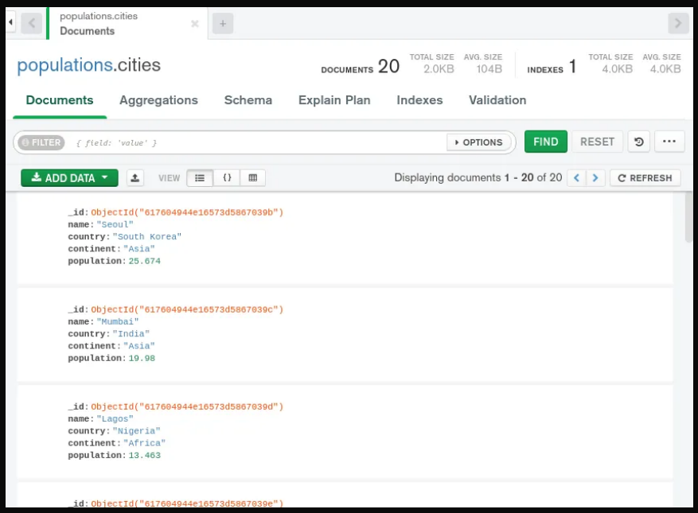
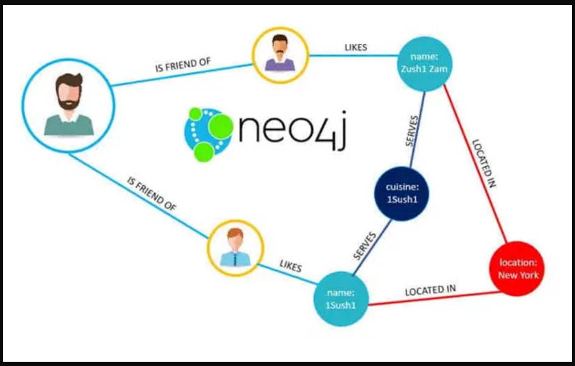
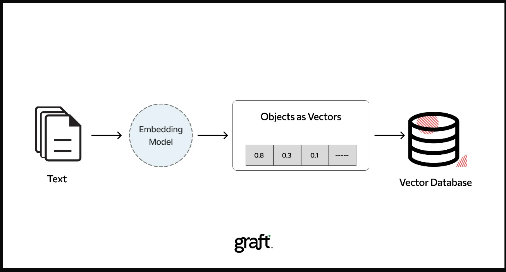
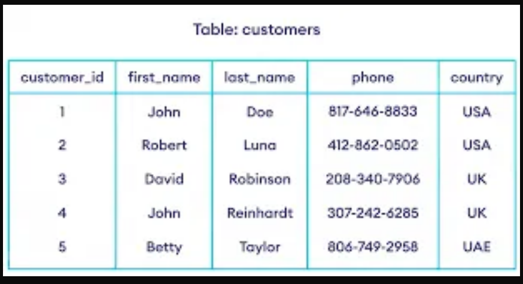
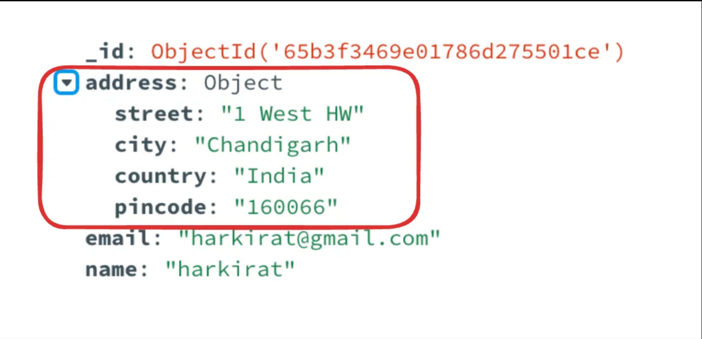
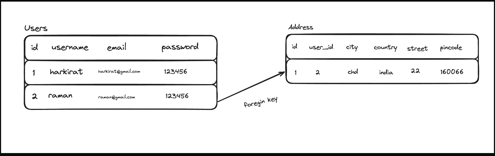

# Databases

### Types of SQL : There are a few types of databases, all have their own use-cases.

1) **NoSQL databases** :  
- Store data in a `schema-less` fashion. Extremely lean and fast way to store data. 
- Examples - MongoDB.

2) **Graph databases** : 
- Data is stored in the form of a graph. Specially useful in cases where relationships need to be stored (social networks
- Examples - Neo4j

3) **Vector databases** :
- Stores data in the form of vectors
- Useful in Machine learning
- Examples - Pinecone

4) **SQL databases** : 
- Stores data in the form of rows
- Most full stack applications will use this
- Examples - MySQL, Postgres 

### Why SQL database is preferred over the NoSQL database ?

- You might’ve used MongoDB 
- It’s schemaless(Different rows can have different schema) properties make it ideal to for bootstraping a project fast.
- But as your app grows, this property makes it very easy for data to get curropted

### Con's of NoSQL databases
- Can lead to inconsistent database.
- Can cause runtime errors. 
- Is too flexible for an app that needs strictness.

### Pro's of NoSQL database
- Can move very fast.
- Can change schema very easily.

**NOTE :** You might think that mongoose does add strictness to the codebase because we used to define a schema there. 
That strictness is present at the Node.js level, not at the DB level. You can still put in erroneous data in the database that doesn’t follow that schema.

### SQL databases have a strict schema. They require you to
- Define your schema.
- Put in data that follows that schema.
- Update the schema as your app changes and perform migrations.

### So there are 4 parts when using an SQL database (not connecting it to Node.js, just running it and putting data in it)

1) Running the database.
2) Using a library that let’s you connect and put data in it.
3) Creating a table and defining it’s schema.
4) Run queries on the database to interact with the data (Insert/Update/Delete).

## Relationships

    Relationships let you store data in different tables and relate it with each other.

### Relationships in Mongodb

- Since mongodb is a NoSQL database, you can store any shape of data in it. 
- If I ask you to store a users details along with their address, you can store it in an object that has the address details.

### Relationships in SQL
- Since SQL can not store objects as such, we need to define two different tables to store this data in.

- This is called a relationship , which means that the Address table is related to the Users table.

- Postgres[P]
- NodeJs[N]
- ExpressJs[E]
- NextJs[N]
- ReactJs[R]    