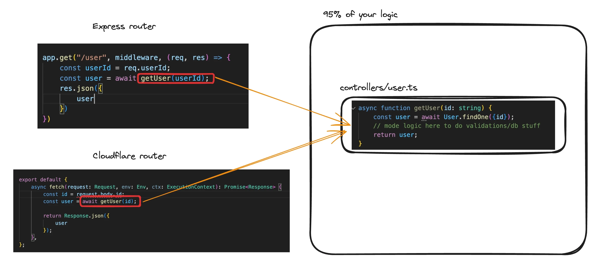

# Serverless Backends

    "Serverless" is a backend deployment in which the cloud provider dynamically manages the allocation and provisioning of servers. The term "serverless" doesn't mean there are no servers involved. Instead, it means that developers and operators do not have to worry about the servers.

### Easier defination
    What if you could just write your express routes and run a command. The app would automatically :

    1) Deploy
    2) Autoscale
    3) Charge you on a per request basis (rather than you paying for VMs)

### Problems with this approach

1) **More expensive at scale**
2) **Cold start problem** : when a serverless function takes longer than expected to start up and respond to a reques

### Famous serverless providers

1) AWS Lambda
2) Google Cloud Functions
3) Cloudflare Worker, etc

### The most impportant question : When should you use a serverless architecture ?

- When you have to get off the ground fast and don’t want to worry about deployments.

- When you can’t anticipate the traffic and don’t want to worry about autoscaling.

- If you have very low traffic and want to optimise for costs.

### Cloudflare workers setup :  

**Workers & Pages** are the serverless offerings from the cloudflare

**Workers** are the names given to the "serverles" service, because we're sort of starting a worker(Mini NodeJs process) in one of their data centers.

<!-- _______________________________________________ -->

# Initializing a worker

#### To create and deploy your application, you can take the following steps : 

**Step 1 :** Create a new Worker project
```bash
npm create cloudflare@latest -- my-first-worker
```
**NOTE :** For setup, select the following options:

- For What would you like to start with?, choose Hello World example.
- For Which template would you like to use?, choose Hello World Worker.
- For Which language do you want to use?, choose JavaScript.
- For Do you want to use git for version control?, choose Yes.
- For Do you want to deploy your application?, choose No (we will be making some changes before deploying).

Now, you have a new project set up. Move into that project folder :
```bash
cd my-first-worker
```

**Step 2 :** Explore package.json dependencies and other files created.
```javascript
"wrangler": "^3.0.0"
```
**NOTE :** Notice express is not a dependency there.

**Step 3 :** Start the worker locally
```bash
npm run dev
```
**NOTE :** If you have never used Wrangler before, it will open your web browser so you can login to your Cloudflare account.

**Step 4 :** How to return JSON ?
```javascript
export default {
	async fetch(request: Request, env: Env, ctx: ExecutionContext): Promise<Response> {
		return Response.json({
			message: "hi"
		});
	},
};
```

Official Documentation : [Click here](https://developers.cloudflare.com/workers/get-started/guide/)

**Step 5 :** Before deploying, login to cloudflare account through the CLI(Wrangler)
```bash
npx wrangler login
```

To ensure you've loggedin successfully or not :
```bash
npx wrangler whoami
```

**Step 6 :** Deploy your project

```bash
npx wrangler deploy

OR

npm run deploy
```

Once deployed you can logout of clodflare through wrangler :
```bash
npx wrangler logout
```

### Question - Where is the express code? HTTP Server?

**Ans** : Cloudflare expects you to just write the logic to handle a request. 
Creating an HTTP server on top is handled by cloudflare

### Question - How can I do routing ? 
In express, routing is done as follows - 
```javascript
import express from "express"
const app = express();

app.get("/route", (req, res) => {
	// handles a get request to /route
});
```

### How can you do the same in the Cloudflare environment?
```javascript
export default {
	async fetch(request: Request, env: Env, ctx: ExecutionContext): Promise<Response> {
		console.log(request.body);
		console.log(request.headers);
		
		if (request.method === "GET") {
			return Response.json({
				message: "you sent a get request"
			});
		} else {
			return Response.json({
				message: "you did not send a get request"
			});
		}
	},
};
```
**NOTE :** Cloudflare does not expect a routing library/http server out of the box. You can write a full application with just the constructs available above.


### The reason why express can't be used :

1) Express heavily relies on Node.js

**Solution :** 
1) You can split all your handlers in a file 


2) You can use a library called Hono

### Steps for using Hono library :

**Step 1 :** Initialize a new app
```bash
npm create hono@latest my-app
```

**Step 2 :** Move to my-app and install the dependencies.
```bash
cd my-app
npm i
```

**Step 3 :** Hello World
```typescript
import { Hono } from 'hono'
const app = new Hono()

app.get('/', (c) => c.text('Hello Cloudflare Workers!'))

export default app
```

**Step 4 :** Getting inputs from user
```typescript
import { Hono } from 'hono'

const app = new Hono()

app.get('/', async (c) => {
  const body = await c.req.json()
  console.log(body);
  console.log(c.req.header("Authorization"));
  console.log(c.req.query("param"));

  return c.text('Hello Hono!')
})

export default app
```