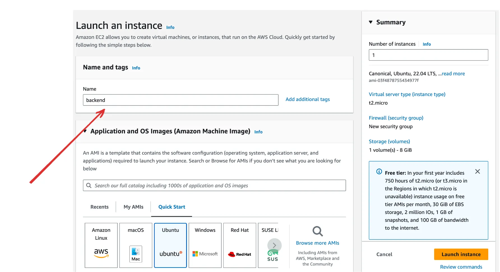
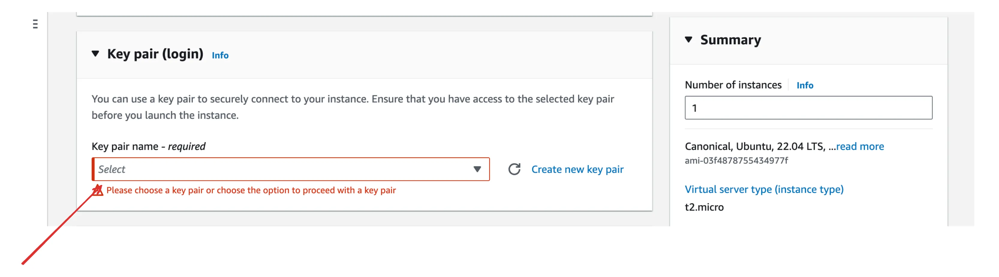
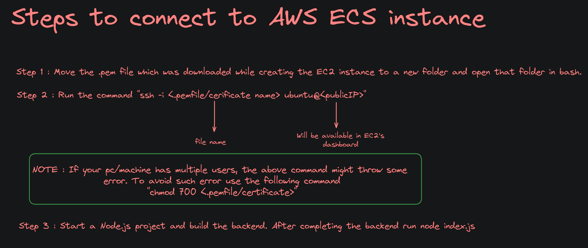
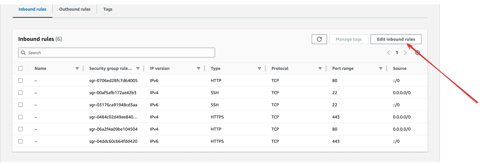
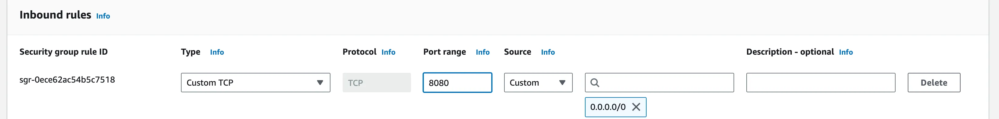
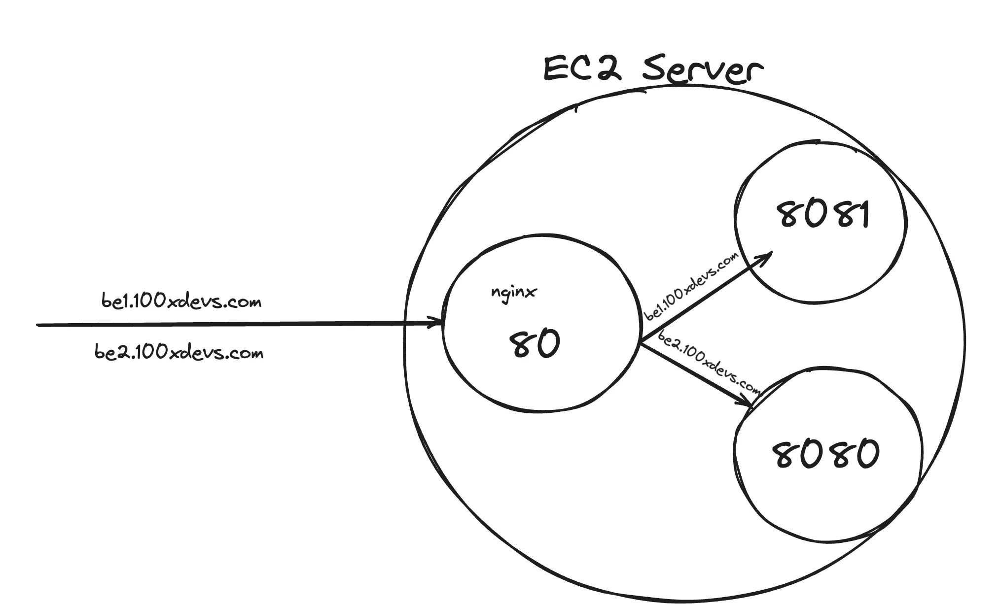
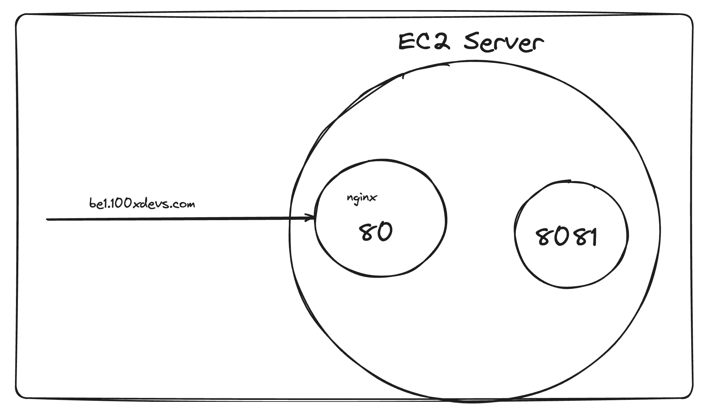

# Amazon Web Services(AWS)

### It let's you do bunch of things like : 
1) Renting servers
2) Manage domains
3) Upload objects (mp4 files, jpgs, mp3s …)
4) Autoscale servers
5) Create k8s clusters
....etc

## 1) Renting Servers : 

**NOTE :** Virtual Machine's (VM's) on AWS is called as EC2 Servers.

**EC2** stands for Elastic Compute Version 2.
 - **Elastic** :  Can increase/decrease the size of the machine
 - **Compute** - It is a machine(if you can get some space, hard-drive, etc on someone else's computer).

 **Key-Pair :** Let's you connect to the server that has been started somewhere 

 **SSH :** Secure Shell : It's a protocol just like HTTP. This protocol allows you to connect securely to a shell on the different machine.

 **NOTE :** ONLY .pem file/certificate has the access to the EC2 instance that was created eralier. 

 ### Steps to create and launch an EC2 instance.

 **Step 1 :** Click on Launch a `new instance`
 

 **Step 2 :** Give a name
 

 **Step 3 :** Select an OS
 

 **Step 4 :** Select size
 

 **Step 5 :** Create a new Key pair


**NOTE :** After the completion of step 5, a file with a .pem extension will be downloaded.

 **Step 6 :** Select Size
 

 **Step 7 :** Allow traffic on http/https
 

 ### SSH into server
 

 **NOTE 1 :** After step 2, if you come accross issues like, "If your aws machine shows you the following error, your aws machine doesn’t have access to the internet", refer [this](https://www.tecmint.com/resolve-temporary-failure-in-name-resolution/) article.

 **NOTE 2 :** Before starting a node js project, we need to install Node.js on ubuntu OS. [Click here](https://www.digitalocean.com/community/tutorials/how-to-install-node-js-on-ubuntu-20-04) for more details.

 **NOTE 3 :** To keep the index.js file keep running even after shutting the pc, run the following command
 ```bash
npm i -g pm2

# Then,

pm2 start index.js
 ```
 where pm stands fro Process Manager.

 ### After SSHing into the server, Try hitting the server

 You have an ip/DNS that you can hit to access your ec2 server
 

 Try visiting the backend
 ```txt
your_domain:8080
 ```
 Notice you can’t visit the website during this time
 

 ### Solution : Security group


You can either open port 8080, or process on port 80



Now try hitting the backend 
```txt
http://your_domain:8080
``` 

## Nginx

    NGINX is open source software for web serving, reverse proxying, caching, load balancing, media streaming, and more. 
    
    It started out as a web server designed for maximum performance and stability. 
    
    In addition to its HTTP server capabilities, NGINX can also function as a proxy server for email (IMAP, POP3, and SMTP) and a reverse proxy and load balancer for HTTP, TCP, and UDP servers.

Resources : https://www.nginx.com/resources/glossary/nginx/

### What is a reverse proxy?


### Installing nginx
```bash
sudo apt update
sudo apt install nginx
```
Resources : https://ubuntu.com/tutorials/install-and-configure-nginx#1-overview

This should start a nginx server on port 80

Try visiting the website


# Analogy of today's class :

    EC2 is like a hotel, and ports are like rooms in the hotel. A reverse proxy acts as the hotel manager, directing guests (requests) to their respective rooms (ports).

    In this analogy, Nginx is the hotel manager, handling requests and directing them to the right room (port). The manager (Nginx) also hides the specific room number (port) under the hotel name (domain name), so guests only need the hotel name to find their way. When a guest arrives with just the hotel name (domain), the hotel manager (Nginx) automatically redirects them to the correct room (port) without revealing the room number itself.