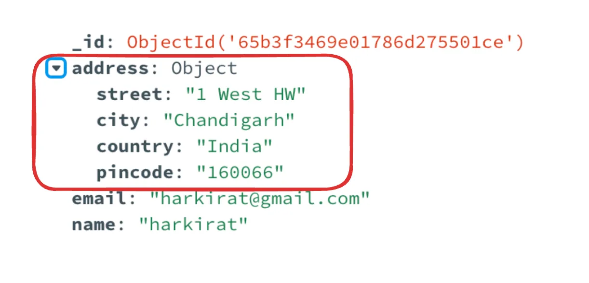
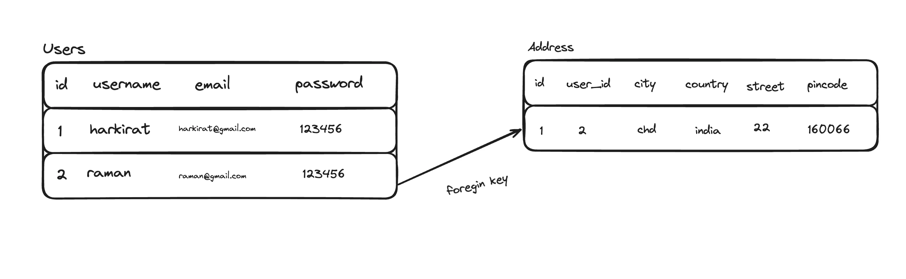

# Relationship, transaction and Joins

## Relationship : 
    Relationships let you store data in different tables and relate it with each other.

#### Relationships in Mongodb
    Since mongodb is a NoSQL database, you can store any shape of data in it. 

    If I ask you to store a users details along with their address, you can store it in an object that has the address details.



#### Relationships in SQL
    Since SQL can not store objects as such, we need to define two different tables to store this data in.



This is called a relationship , which means that the Address table is related to the Users table.

When defining the table, you need to define the relationship 

```sql
CREATE TABLE users (
    id SERIAL PRIMARY KEY,
    username VARCHAR(50) UNIQUE NOT NULL,
    email VARCHAR(255) UNIQUE NOT NULL,
    password VARCHAR(255) NOT NULL,
    created_at TIMESTAMP WITH TIME ZONE DEFAULT CURRENT_TIMESTAMP
);

CREATE TABLE addresses (
    id SERIAL PRIMARY KEY,
    user_id INTEGER NOT NULL,
    city VARCHAR(100) NOT NULL,
    country VARCHAR(100) NOT NULL,
    street VARCHAR(255) NOT NULL,
    pincode VARCHAR(20),
    created_at TIMESTAMP WITH TIME ZONE DEFAULT CURRENT_TIMESTAMP,
    FOREIGN KEY (user_id) REFERENCES users(id) ON DELETE CASCADE
);
```
**NOTE :** 
1) `ON DELETE CASCADE` : If a user from `users` table is deleted, the corresponding row in the `addresses` table that are related to the `users` table will also be deleted.

2) `ON DELETE RESTRICT` : Postgres won't allow you to deleted a user from `users` table directly. First you have to delete the rows in `addresses` table that are related to the `users` table.

## Transactions : 
    
    Good question to have at this point is what queries are run when the user signs up and sends both their information and their address in a single request.

    Do we send two SQL queries into the database? What if one of the queries (address query for example) fails?

    This would require "transactions"  in SQL to ensure either both the user information and address goes in, or neither does

### SQL Query :
```sql
BEGIN; -- Start transaction

INSERT INTO users (username, email, password)
VALUES ('john_doe', 'john_doe1@example.com', 'securepassword123');

INSERT INTO addresses (user_id, city, country, street, pincode)
VALUES (currval('users_id_seq'), 'New York', 'USA', '123 Broadway St', '10001');

COMMIT;
```

### NodeJs Code : 
```javascript
import { Client } from 'pg';

async function insertUserAndAddress(
    username: string, 
    email: string, 
    password: string, 
    city: string, 
    country: string, 
    street: string, 
    pincode: string
) {
    const client = new Client({
        host: 'localhost',
        port: 5432,
        database: 'postgres',
        user: 'postgres',
        password: 'mysecretpassword',
    });

    try {
        await client.connect();

        // Start transaction
        await client.query('BEGIN');

        // Insert user
        const insertUserText = `
            INSERT INTO users (username, email, password)
            VALUES ($1, $2, $3)
            RETURNING id;
        `;
        const userRes = await client.query(insertUserText, [username, email, password]);
        const userId = userRes.rows[0].id;

        // Insert address using the returned user ID
        const insertAddressText = `
            INSERT INTO addresses (user_id, city, country, street, pincode)
            VALUES ($1, $2, $3, $4, $5);
        `;
        await client.query(insertAddressText, [userId, city, country, street, pincode]);

        // Commit transaction
        await client.query('COMMIT');

        console.log('User and address inserted successfully');
    } catch (err) {
        await client.query('ROLLBACK'); // Roll back the transaction on error
        console.error('Error during transaction, rolled back.', err);
        throw err;
    } finally {
        await client.end(); // Close the client connection
    }
}

// Example usage
insertUserAndAddress(
    'johndoe', 
    'john.doe@example.com', 
    'securepassword123', 
    'New York', 
    'USA', 
    '123 Broadway St', 
    '10001'
);
```

## Joins : 
    Defining relationships is easy.

    What’s hard is joining  data from two (or more) tables together.

For example, if I ask you to fetch me a users details and  their address, what SQL would you run?

**Approach 1 :** Bad approach
```sql
-- Query 1: Fetch user's details
SELECT id, username, email
FROM users
WHERE id = YOUR_USER_ID;

-- Query 2: Fetch user's address
SELECT city, country, street, pincode
FROM addresses
WHERE user_id = YOUR_USER_ID;
```

**Approach 2 :** Using JOINS
```sql
SELECT users.id, users.username, users.email, addresses.city, addresses.country, addresses.street, addresses.pincode
FROM users
JOIN addresses ON users.id = addresses.user_id
WHERE users.id = '1';

-- OR

SELECT u.id, u.username, u.email, a.city, a.country, a.street, a.pincode
FROM users u
JOIN addresses a ON u.id = a.user_id
WHERE u.id = YOUR_USER_ID;
```

### Types of JOINS : 
1) **INNER JOIN** : Returns rows when there is at least one match in both tables. If there is no match, the rows are not returned. It's the most common type of join.

**Use Case:** Find All Users With Their Addresses. If a user hasn’t filled their address, that user shouldn’t be returned

```sql
SELECT users.username, addresses.city, addresses.country, addresses.street, addresses.pincode
FROM users
INNER JOIN addresses ON users.id = addresses.user_id;
```

2) **LEFT JOIN** : Returns all rows from the left table, and the matched rows from the right table.

**Use case** - To list all users from your database along with their address information (if they've provided it), you'd use a LEFT JOIN. Users without an address will still appear in your query result, but the address fields will be NULL for them.

```sql
SELECT users.username, addresses.city, addresses.country, addresses.street, addresses.pincode
FROM users
LEFT JOIN addresses ON users.id = addresses.user_id;
```

3) **RIGHT JOIN** : Returns all rows from the right table, and the matched rows from the left table.

**Use case** - Given the structure of the database, a RIGHT JOIN would be less common since the addresses table is unlikely to have entries not linked to a user due to the foreign key constraint. However, if you had a situation where you start with the addresses table and optionally include user information, this would be the theoretical use case.

```sql
SELECT users.username, addresses.city, addresses.country, addresses.street, addresses.pincode
FROM users
RIGHT JOIN addresses ON users.id = addresses.user_id;
```

4) **FULL JOIN** : Returns rows when there is a match in one of the tables. It effectively combines the results of both LEFT JOIN and RIGHT JOIN.

**Use case** - A FULL JOIN would combine all records from both users and addresses, showing the relationship where it exists. Given the constraints, this might not be as relevant because every address should be linked to a user, but if there were somehow orphaned records on either side, this query would reveal them.

```sql
SELECT users.username, addresses.city, addresses.country, addresses.street, addresses.pincode
FROM users
FULL JOIN addresses ON users.id = addresses.user_id;
```