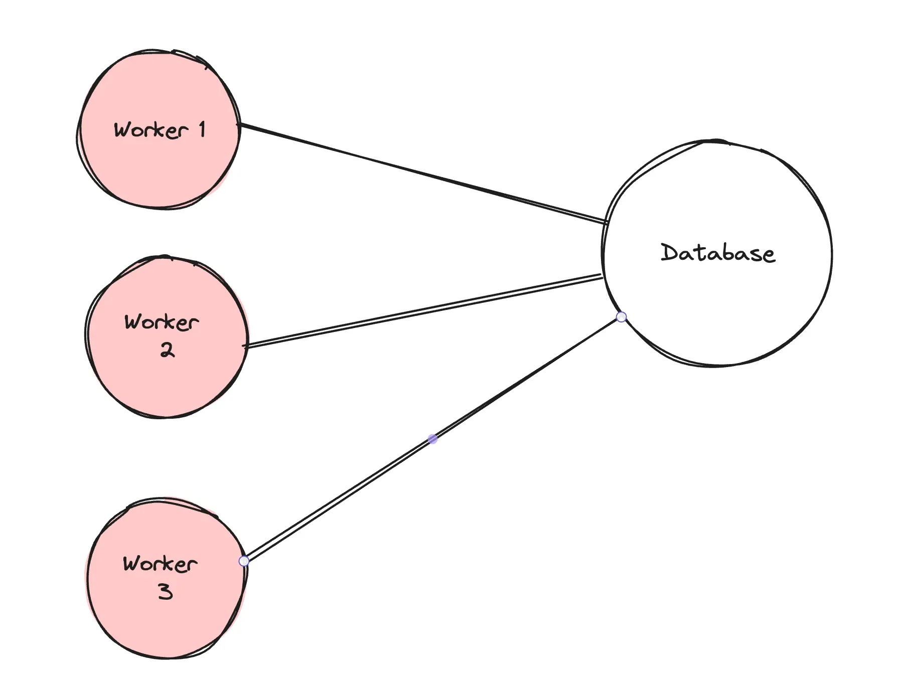
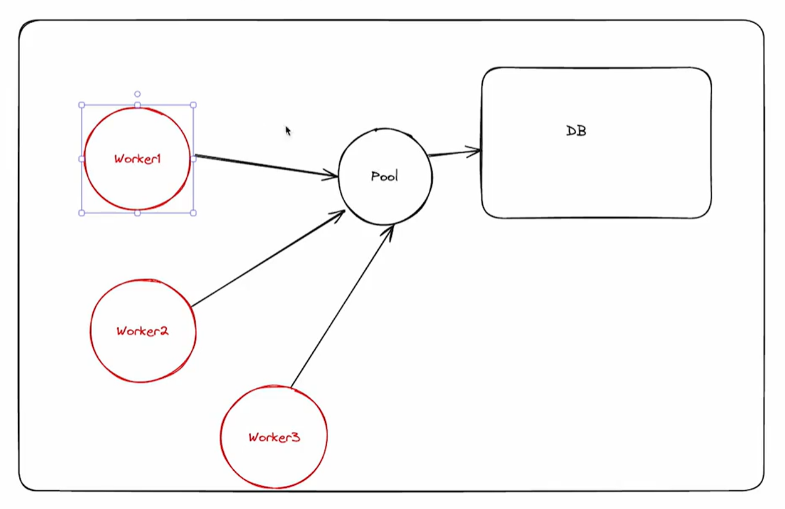

# Connecting to DB

### Serverless environments have one big problem when dealing with databases. 

1) There can be many connections open to the DB since there can be multiple workers open in various regions.

**NOTE :** There is a limit, on number of open connection a database cah have.

2) `Prisma` the library has dependencies that the cloudflare runtime doesn’t understand.

### Solution : 
