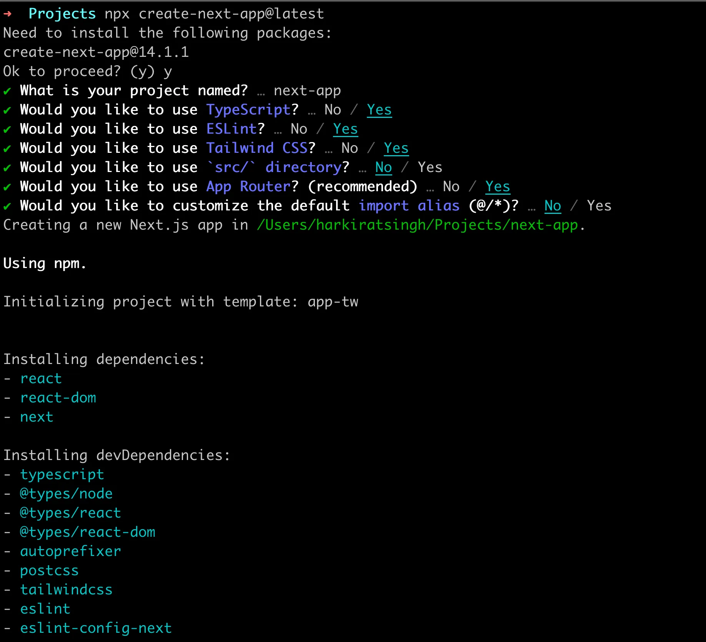

# Intro into NextJs

### Pre-requisites
You need to understand basic Frontend before proceeding to this track.
You need to know what React is and how you can create a simple application in it.

### NextJS Intro
NextJS was a framework that was introduced because of some minor inconviniences in React, such as : 

1. In a React project, you have to maintain a separate Backend project for your API routes.

2. React does not provide out of the box routing (you have to use react-router-dom).

3. React is not SEO Optimised. 
   - not exactly true today because of React Server components
   - we’ll discuss soon why

4. Waterfalling problem

## Search Engine Optimization : 

- Google/Bing has a bunch of crawlers that hit websites and figure out what the website does. 

- It ranks it on Google based on the HTML it gets back.

- The crawlers DONT usually run your JS and render your page to see the final output. 

**NOTE :** 
While Googlebot can run JavaScript, dynamically generated content is harder for the scraper to index.

### What does the Googlebot get back when they visit a website written in react?

Try visiting : https://blog-six-tan-47.vercel.app/signup


- Googlebot has no idea on what the project is. It only sees Vite + React + TS in the original HTML response.

- Ofcourse when the JS file loads eventually, things get rendered but the Googlebot doesn’t discover this content very well.

## Waterfalling problem : 

Let’s say you built a blogging website in react, what steps do you think the request cycle takes?


1. Fetching the index.html from the CDN.

2. Fetching script.js from CDN.

3. Checking if user is logged in (if not, redirect them to /login page).

4. Fetching the actual blogs.

There are 4 round trips that happen one after the other (sequentially)

**NOTE :** 
The "waterfalling problem" in React, and more broadly in web development, refers to a scenario where data fetching operations are chained or dependent on each other in a way that leads to inefficient loading behavior.

### What does nextjs provide you?


## Next.js offerings : 

Next.js provides you the following upsides over React

1. Server side rendering - Get’s rid of SEO problems

2. API routes - Single codebase with frontend and backend

3. File based routing (no need for react-router-dom)

4. Bundle size optimisations, Static site generation

5. Maintained by the Vercel team

### Downsides - 

1. Can’t be distributed via a CDN, always needs a server running that does server side rendering and hence is expensive.

2. Very opinionated, very hard to move out of it

## bootstraping a simple Next app :

```bash
npx create-next-app@latest
```



### File structure : 


## Routing in Next.js :

- Next.js has a file based router (https://nextjs.org/docs/app/building-your-application/routing/defining-routes).

- This means that the way you create your files, describes what renders on a route.

### Creating rouets : 

- Let’s add a new folder in app called signup. 

- Let’s add a file called page.tsx inside app/signup.

```ts
export default function Signup() {
   return (
      <div>
        hi from the signup page
      </div>
   );
}
```

Now, Start the application locally :

```bash
npm run dev
```

## Server Side Rendering : 

Let’s try exploring the response from the server on the /signup route

1. Run `npm run dev`.
2. Visit http://localhost:3000/signup
3. Notice the response you get back in your HTML file.


Now if `GoogleBot` tries to scrape your page, it’ll understand that this is a signup page without running any Javascript.

The first `index.html` file it get’s back will have context about the page since it was `server side rendered`.

## Layouts : 

You’ll notice a file in your app folder called layout.tsx

Let’s see what this does (Ref https://nextjs.org/docs/app/building-your-application/routing/pages-and-layouts).


**What are layouts?**

Layouts let you wrap all child pages inside some logic.

**Let’s explore layout.tsx** : 


### React equivalent to NextJs :


## Layouts in sub routes : 

What if you wan’t all routes that start with /signin  to have a banner that says Login now to get 20% off

