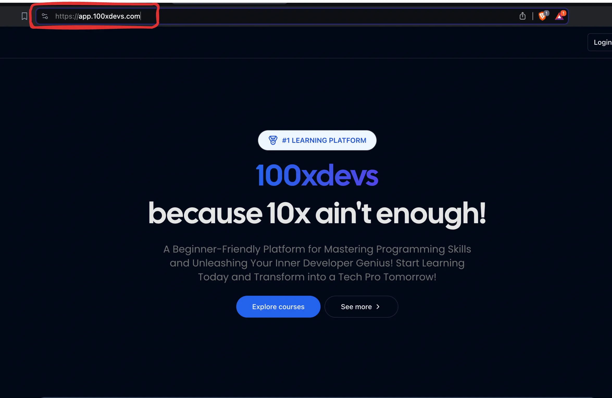

# Backend in NextJs

## Next.js is a full stack framework


This means the same process can handle frontend and backend code.




**Why?**

- Single codebase for all your codebase.
- No cors issues, single domain name for your FE and BE.
- Ease of deployment, deploy a single codebase.

## Recap of Data fetching in React : 

Let’s do a quick recap of how data fetching works in React

    💡 We’re not building backend yet Assume you already have this backend route - https://week-13-offline.kirattechnologies.workers.dev/api/v1/user/details

**Code** - https://github.com/100xdevs-cohort-2/week-14-2.1

**Website** - https://week-14-2-1.vercel.app/

**User card website** : Build a website that let’s a user see their name and email from the given endpoint.


**UserCard component** :


**Data fetching happens on the client** :


## Data fetching in Next : 

Ref - https://nextjs.org/docs/app/building-your-application/data-fetching/fetching-caching-and-revalidating

    💡 You can do the same thing as the last slide in Next.js, but then you lose the benefits of server side rendering

You should fetch the user details on the server side and pre-render the page before returning it to the user.


### Let’s try to build this : 

1. Initialise an empty next project
```bash
npx create-next-app@latest
```

2. Install axios 
```bash
npm i axios
```
**Note :** Clean up `page.tsx` and `global.css`.

3. In the root page.tsx, write a function to fetch the users details.
```ts
async function getUserDetails() {
  const response = await axios.get("https://week-13-offline.kirattechnologies.workers.dev/api/v1/user/details")
	return response.data;
}
```

4. Convert the default export to be an async function (yes, nextjs now supports async components).
```ts
import axios from "axios";

async function getUserDetails() {
  const response = await axios.get("https://week-13-offline.kirattechnologies.workers.dev/api/v1/user/details")
	return response.data;
}

export default async function Home() {
  const userData = await getUserDetails();

  return (
    <div className="flex flex-col justify-center h-screen">
        <div className="flex justify-center">
            <div className="border p-8 rounded">
                <div>
                    Name: {userData?.name}
                </div>
                
                {userData?.email}
            </div>
        </div>
    </div>
  );
}
```

**Note :** This is only possible in `server components` and not in `client component`.

5. Check the network tab, make sure there is no waterfalling


## Loaders in Next :

What if the getUserDetails call takes 5s to finish (lets say the backend is slow). You should show the user a loader during this time.

```ts
import axios from "axios";

async function getUserDetails() {
  const response = await axios.get(
    "https://week-13-offline.kirattechnologies.workers.dev/api/v1/user/details"
  );
  return response.data;
}

export default async function Home() {
  await new Promise((r) => setTimeout(r, 5000));
  const userData = await getUserDetails();

  return (
    <div className="flex flex-col justify-center h-screen bg-slate-600">
      <div className="flex justify-center">
        <div className="border p-8 rounded">
          <div>Name: {userData?.name}</div>

          {userData?.email}
        </div>
      </div>
    </div>
  );
}
```

### Solution : Add a loading.tsx file to the root folder.

Just like `page.tsx` and `layout.tsx` , you can define a `skeleton.tsx` file that will render until all the async operations finish.

#### Create a `loading.tsx` file in the root folder and a Custom loader : 
```tsx
export default function Loading() {
    return <div className="flex flex-col justify-center h-screen">
        <div className="flex justify-center">
            Loading...
        </div>
    </div>
  }
```

## Introducing api routes in Next.js : 

NextJS lets you write backend routes, just like express does. This is why Next is considered to be a full stack framework.

**The benefits of using NextJS for backend includes -**

1. Code in a single repo.

2. All standard things you get in a backend framework like express.

3. Server components can directly talk to the backend.

# Let’s move the backend into our own app : 

We want to introduce a route that returns hardcoded values for a user’s details (email, name, id) :

1. Introduce a new folder called `api`.

2. Add a folder inside called `user`.

3. Add a file inside called `route.ts`.

4. Initialize a `GET` route inside it.

**Note :** Timestamp : `1:25:00` to `1:18:00` => Important lessons taught -> About hosting a React and NextJs application.