# Introduction to Docker

## Why Docker?

1. Kubernetes/Container orchestration.

2. Running processes in isolated environments.

3. Starting projects/auxilary services locally.

**What are Containers?**

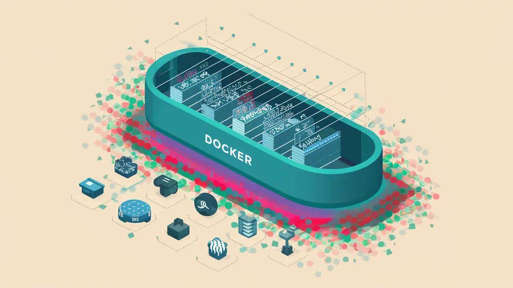

Containers are a way to package and distribute software applications in a way that makes them easy to deploy and run consistently across different environments. They allow you to package an application, along with all its dependencies and libraries, into a single unit that can be run on any machine with a container runtime, such as Docker.

**Why Containers?**

1. Everyone has different Operating systems.

2. Steps to run a project can vary based on OS.

3. Extremely harder to keep track of dependencies as project grows.

**Benefits of using containers :**

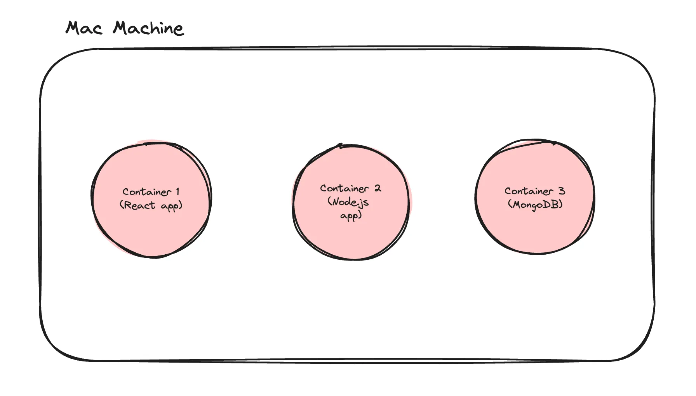

1. Let you describe your configuration in a single file.

2. Can run in isolated environments.

3. Makes Local setup of OS projects a breeze.

4. Makes installing auxiliary services/DBs easy.

## History of Docker : 

- Docker is a YC backed company, started in ~2014.

- They envisioned a world where containers would become mainstream and people would deploy their applications using them. That is mostly true today.

- Most projects that you open on Github will/should have docker files in them (a way to create docker containers).

## Installing docker : 

Ref - https://docs.docker.com/engine/install/

## Inside docker : 

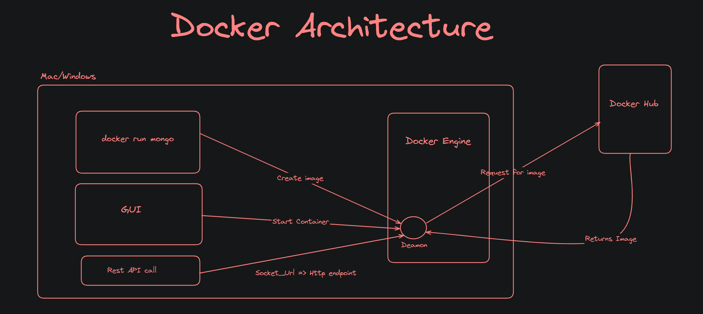
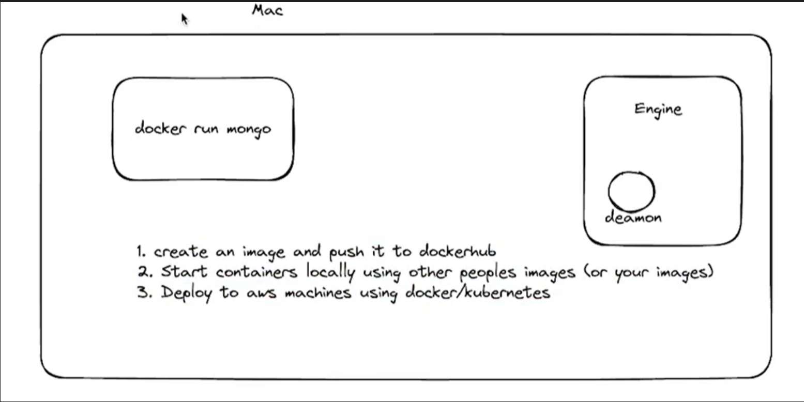
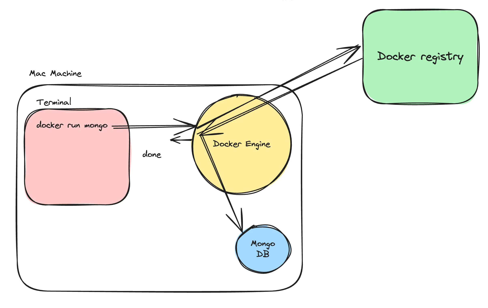

As an application/full stack developer, you need to be comfortable with the following terminologies -

- **Docker Engine :** Docker Engine is an open-source containerization technology that allows developers to package applications into container.
Containers are standardized executable components combining application source code with the operating system (OS) libraries and dependencies required to run that code in any environment.

- **Docker CLI - Command line interface :** The command line interface lets you talk to the docker engine and lets you start/stop/list containers.

        💡 Docker cli is not the only way to talk to a docker engine. You can hit the docker REST API to do the same things

- **Docker registry :** The docker registry is how Docker makes money. It is similar to github, but it lets you push images rather than sourcecode.

Docker’s main registry - https://dockerhub.com/

Mongo image on docker registry - https://hub.docker.com/_/mongo

## Images Vs Containers : 

**Docker Image** : 
A Docker image is a lightweight, standalone, executable package that includes everything needed to run a piece of software, including the code, a runtime, libraries, environment variables, and config files.

    💡A good mental model for an image is Your codebase on github

**Docker Container** : 
A container is a running instance of an image. It encapsulates the application or service and its dependencies, running in an isolated environment.

    💡A good mental model for a container is when you run node index.js on your machine from some source code you got from github.

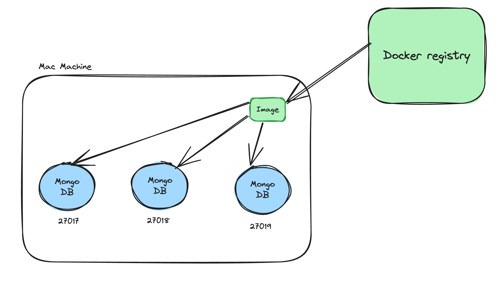

## Port mapping : 

```bash
docker run -d -p 27018:27017 mongo
```
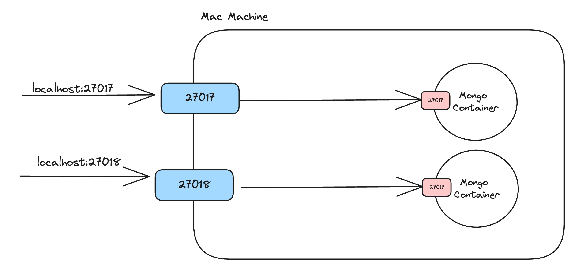

## Common docker commands : 

1. **docker images** : Shows you all the images that you have on your machine

2. **docker ps** : Shows you all the containers you are running on your machine

3. **docker run** :
Lets you start a container -
- `-p` ⇒ let’s you create a port mapping.
- `-d` ⇒ Let’s you run it in detatched mode docker build.

4. **docker build** : 
Lets you build an image. We will see this after we understand how to create your own `Dockerfile`.

5. **docker push** : 
Lets you push your image to a registry(Docker hub).

6. **Extra commands** :
- `docker kill <container Id>`
- `docker exec`
- `docker rmi <image name> --force`

## Dockerfile : 

**What is a Dockerfile ?**

If you want to create an image from your own code, that you can push to dockerhub, you need to create a Dockerfile for your application.

A Dockerfile is a text document that contains all the commands a user could call on the command line to create an image.

**How to write a dockerfile** : A dockerfile has 2 parts

1. Base image

2. Bunch of commands that you run on the base image (to install dependencies like Node.js)

### Let’s write our own Dockerfile

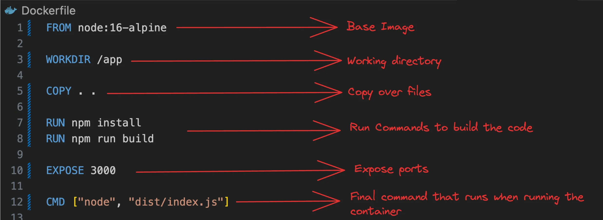

**Note :** This is not the most optimal way to write a docker file.

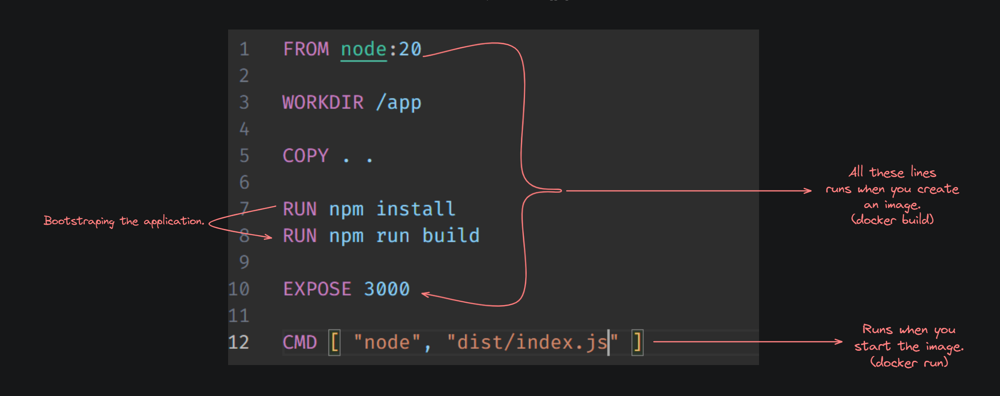

<br />

**Common commands** :

- `WORKDIR` : Sets the working directory for any RUN, CMD, ENTRYPOINT, COPYinstructions that follow it.

- `RUN` : Executes any commands in a new layer on top of the current image and commits the results.

- `CMD` : Provides defaults for executing a container. There can only be one CMD instruction in a Dockerfile.

- `EXPOSE` : Informs Docker that the container listens on the specified network ports at runtime.

- `ENV` : Sets the environment variable.

- `COPY` : Allow files from the Docker host to be added to the Docker image.

##  Building images : 

Now that you have a dockerfile in your project, try building a docker image from it.

```bash
docker build -t image_name .
```

**Note :** `-t` => tag

Now if you try to look at your images, you should notice a new image created

```bash
docker images
```

    💡 Add a .dockerignore so that node_modules don’t get copied over. 

## Running images : 

```bash
docker run -p 3000:3000 image_name
```

Try visiting localhost:3000

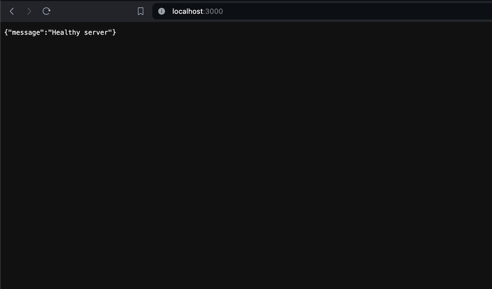

## Passing in env variables : 

```bash
docker run -p 3000:3000 -e DATABASE_URL="" image_name
```

The `-e` argument let’s you send in environment variables to your node.js app.

## More commands : 

1. `docker kill <container id>` - to kill a container.

2. `docker exec` - to exectue a command inside a container.

3. `docker rmi <image_name --force>` : To delete a specific image.

**Example :**

1. List all contents of a container folder

```bash
docker exec <container_name_or_id> ls
```

2. Running an Interactive Shell

```bash
docker exec -it <container_name_or_id> /bin/bash
```

**NOTE :** Injecting an environment variable inside a nodejs application :

```bash
DATABASE_URL="" node dist/index.js
```

## Pushing to dockerhub : 

Once you’ve created your image, you can push it to dockerhub to share it with the world.

1. Signup to [dockerhub](https://hub.docker.com/).

2. Create a new repository.
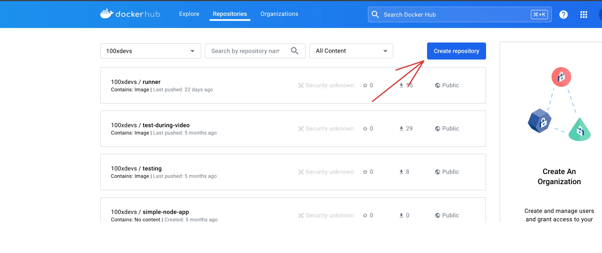

3. Give the relevent name to the repository.
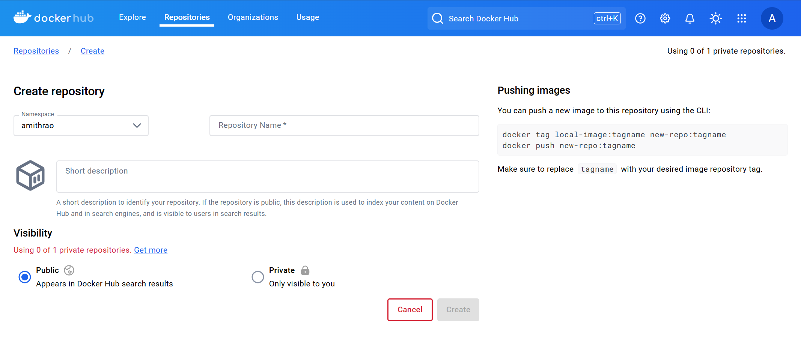

**Note :** The username of your account will be prefixed to the repository's name.

4. Now keep the code ready and run the build command inside the terminal

```bash
docker build -t your_username/your_reponame:tagname .
``` 

**Note :** The image created now can be pushed into our newly created repository in the docker hub.

`:tagname` can be anything, but by default it'll be `latest`.

5. Login to docker cli

    - docker login
    - you might have to create an access token - https://docs.docker.com/security/for-developers/access-tokens/

6. Push to the repository

```bash
docker push your_username/your_reponame:tagname
```

**Note :** The repository name and the image name should be same.