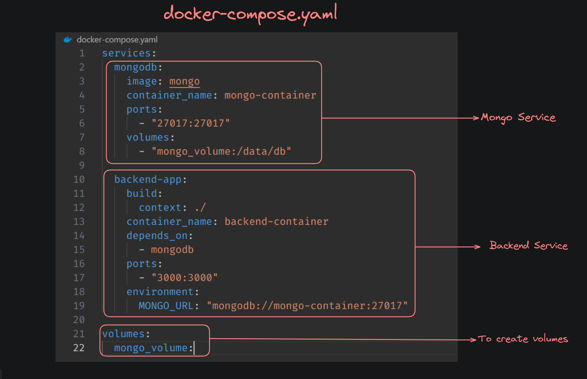

## Docker-Compose : 

- Docker Compose is a tool designed to help you define and run multi-container Docker applications.

- With Compose, you use a YAML file to configure your application's services(containers), networks, and volumes.

- Then, with a single command, you can create and start all the services from your configuration.



**NOTE :** By default docker compose creates a network

### Before Docker-Compose :

1. Create a network : 
```bash
docker network create <network_name>
```
- To check if the network was created or not :
```bash
docker network ls
```

2. Create a volume : 
```bash
docker volume create <volume_name>
```

- To check if the volume was created or not :
```bash
docker volume ls
```

3. Start mongo container
```bash
docker run -d -v <volume_name>:/data/db --name <Container name> --network <Network_name> -p 27017:27017 mongo
```

4. Before building an image out of the source code update the database url form `localhost` to `container_name` of the database container.

5. Build the image
```bash
docker build -t <image_name> .
```

6. Start backend container
```bash
docker run -d -p 3000:3000 --name <Container_name> --network <Network_name> <image_name>
```

### After docker-compose : 

1. Install docker-compose - https://docs.docker.com/compose/install/

2. Create a yaml file describing all your containers and volumes (by default all containers in a docker-compose run on the same network)

3. Start the compose
```bash
docker-compose up
```

4. Stop everything (including volumes)
```bash
docker-compose down --volumes
```