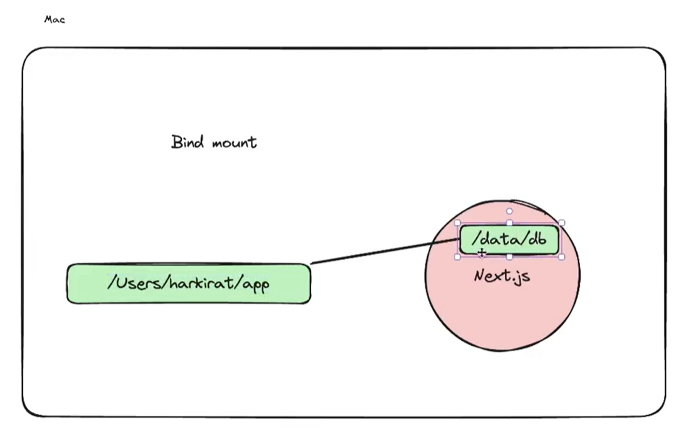

# Bind Mounts

- In volumes, we mount the database folder(/data/db) present inside a container on to the volume contruct created by us.


- But in Bind mounts, we mount the folder(/data/db) present inside a container to a folder present on the host machine. 



### Bind mount command : 

```bash
docker run -p 3000:3000 -v <folderName in host machine>:/working dir/app <image_name>
```

### Pictorial representation of what Bind mounts does : 


Ref : https://docs.docker.com/engine/storage/bind-mounts/