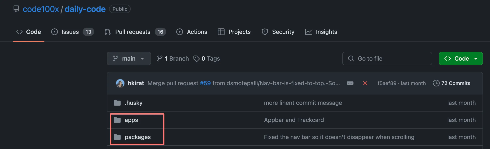

# Monorepos Part-1

## What are monorepos

As the name suggests, a single repository (on github lets say) that holds all your frontend, backend, devops code.

Few repos that use monorepos are - 

1. https://github.com/code100x/daily-code



2. https://github.com/calcom/cal.com


**Do you need to know them very well as a full stack engineer?**

- Not exactly. Most of the times they are setup in the project already by the dev tools guy and you just need to follow the right practises.

- Good to know how to set one up from scratch though.

## Why Monorepos?

**Why not Simple folders?**

Why cant I just store services (backend, frontend etc) in various top level folders?

You can, and you should if your

1. Services are highly decoupled (dont share any code)

2. Services don’t depend on each other.

For eg - A codebase which has a Golang service and a JS service


**Pro's :**

1. Shared Code Reuse.

2. Enhanced Collaboration.

3. **Optimized Builds and CI/CD** : Tools like TurboRepo offer smart caching and task execution strategies that can significantly reduce build and testing times.

4. **Centralized Tooling and Configuration** : Managing build tools, linters, formatters, and other configurations is simpler in a monorepo because you can have a single set of tools for the entire project. 

### Without Monorepos : 


### With Monorepos : 


## Common monorepo framework in Node.js

1. Lerna - https://lerna.js.org/

2. nx - https://github.com/nrwl/nx

3. Turborepo - https://turbo.build/ — Not exactly a monorepo framework

4. Yarn/npm workspaces - https://classic.yarnpkg.com/lang/en/docs/workspaces/

## History of Turborepo

1. Created by Jared Palmer

2. In December 2021 Acquired/aqui-hired by Vercel

3. Mild speculation/came from a random source - Pretty hefty dealp

4. They’ve built a bunch of products, Turborepo is the most used one

## Build system vs Build system orchestrator vs Monorepo framework

**Build System** : 

- A build system automates the process of transforming source code written by developers into binary code that can be executed by a computer. 

- For JavaScript and TypeScript projects, this process can include transpilation (converting TS to JS), bundling (combining multiple files into fewer files), minification (reducing file size), and more. 

- A build system might also handle running tests, linting, and deploying applications.

#### Bundling : Eg : Vite and tsc -b


**Monorepo Framework** : 

- A monorepo framework provides tools and conventions for managing projects that contain multiple packages or applications within a single repository (monorepo). 

- This includes dependency management between packages, workspace configuration.

- Monorepo framework makes the imports slightly cleaner.

**Build System Orchestrator** : 

- TurboRepo acts more like a `build system orchestrator` rather than a direct `build system` itself.

- It doesn't directly perform tasks like transpilation, bundling, minification, or running tests.

- Instead, TurboRepo allows you to define tasks in your monorepo that call other tools (which are the actual build systems) to perform these actions. 

- These tools can include anything from tsc, vite etc

### Without Turborepo


### With Turborepo


## Turborepo as a build system orchestrator

Turborepo is a `build system orchestrator` . The key feature of TurboRepo is its ability to manage and optimize the execution of these tasks across your monorepo. It does this through:

1. `Caching`: TurboRepo caches the outputs of tasks, so if you run a task and then run it again without changing any of the inputs (source files, dependencies, configuration), TurboRepo can skip the actual execution and provide the output from the cache. This can significantly speed up build times, especially in continuous integration environments.

2. `Parallelization`: It can run independent tasks in parallel, making efficient use of your machine's resources. This reduces the overall time needed to complete all tasks in your project.

3. `Dependency Graph Awareness`: TurboRepo understands the dependency graph of your monorepo. This means it knows which packages depend on each other and can ensure tasks are run in the correct order.

## Let’s initialize a simple Turborepo 

Ref https://turbo.build/repo/docs

1. Initialize a Turborepo.

```bash
npx create-turbo@latest
```

2. Select `npm workspaces` as the monorepo framework.

By the end, you will notice a folder structure that looks like this - 


## Explore the folder structure : 

There are 5 modules in our project -

**End user apps(website/core backend)** : 

1. `apps/web` - A Next.js website.

2. `apps/docs` - A Docs website that has all the documentation related to your project.

**Helper packages** : 

1. `packages/ui` - UI packages 

2. `packages/typescript-config` - Shareable TS configuration.

3. `packages/eslint-config` - Shareable ESLine configuration.


## Let’s try to run the project :

In the root folder, run 
```bash
npm run dev
```

You will notice two websites running on : 

1. localhost:3000

2. localhost:3001
 
This means we have a single `repo`, which has multiple projects, which share code from `packages/ui`.

## Exploring root package.json : 


**scripts** : 

This represents what command runs when you run : 

1. npm run build

2. npm run dev

3. npm run lint

`turbo build` goes into all packages and apps and runs npm run build inside them (provided they have it).

Same for `dev` and `lint`.

## Exploring packages/ui : 

1. Package.json


2. src/button.tsx


3. `turbo` folder

This is an interesting folder that was introduced recently. 

More details here - https://turbo.build/repo/docs/core-concepts/monorepos/code-generation

## Exploring apps/web : 

1. Dependencies

- It is a simple next.js app. But it uses some `UI components` from the `packages/ui` module.


2. Exploring package.json

- If you explore package.json of `apps/web`, you will notice `@repo/ui` as a dependency.


3. Exploring page.tsx

- This is a very big page, let’s try to see the import and usage of the Button component.


**Note :** The same Button component can be used by the apps/docs website as well.

<span style="color:orange">**NOTE :** HAVING YOUR CODE IN ONE PLACE DOESN'T NECESSARILY MEAN THAT IT NEEDS TO BE DEPLOYED IN ONE PLACE.
</span>

<span style="color:orange">**NOTE :** HAVING THE MULTIPLE REPO's IN ONE REPOSITORY GIVES YOU THE BENIFIT OF CODE SHARING.
</span>