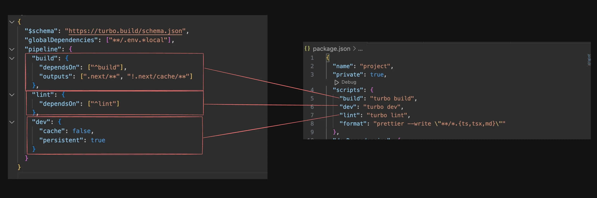

# Monorepos Part-2

## Let’s add a new page

1. Try adding a new page to `/admin` to the `apps/web` next.js website.

2. It should use a simple `Admin` component from `packages/ui`.

**Steps to follow -**

- Create a new file admin.tsx inside `packages/ui/src`.

- Export a simple React component.

- Add the component to exports in `packages/ui/package.json`.

- Create `apps/web/app/admin/page.tsx`.

- Export a default component that uses the  `@repo/ui/admin` component.

- Run npm run dev (either in root or in apps/web ) and try to see the website.

Go to http://localhost:3000/admin

    💡You can also use the packages/ui/turbo/generators to quickly bootstrap a new component. Try running npx gen react-component and notice it’ll do step 1, 2, 3 for you in one cli call.

## Exploring turbo.json : 



Ref - https://turbo.build/repo/docs/getting-started/create-new#3-understanding-turbojson

References - https://turbo.build/repo/docs/reference/configuration#globaldependencies

## Adding React project : 

1. Go to the apps folder :
```bash
cd apps
```

2. Create a fresh vite app :
```bash
npm create vite@latest 
```

3. Update package.json to include @repo/ui as a dependency : 
```bash
"@repo/ui": "*",
```

4. Run `npm install` in the root folder : 
```bash
cd ..
npm install
```

5. Run npm run dev
```bash
npm run dev
```

- Try importing something from the ui package and rendering it.

- Add a `turbo.json` to the react folder to override the outputs object of this module.

Ref : https://turbo.build/repo/docs/core-concepts/monorepos/configuring-workspaces

```json
{
  "extends": ["//"],
  "tasks": {
    "build": {
      "outputs": ["dist/**"]
    }
  }
}
```

## Caching in Turborepo : 

Ref - https://turbo.build/repo/docs/getting-started/create-new#using-the-cache

- One of the big things that make turborepo fast and efficient is caching

- It watches your files across builds and returns the cached response of builds if no files have changed.

- Try running npm run build more than once and you’ll see the second times it happens extremely fast.

- You can also explore the node_modules/.cache/turbo folder to see the zipped cache files and unzip them using.

```bash
tar --use-compress-program=unzstd -xvf name.tar.zst
```

## Adding a Node.js app : 

- Everything else remains the same (Create a new project, add typescript, add express…)

- The only thing that’s different is that tsc doesn’t perform great with turborepo.

- You can use either tsup or esbuild for building your backend application.

### Steps : 

1. Create `apps/backend`.
```bash
cd apps
mkdir backend
cd backend
```

2. Initialize empty typescript repo :
```bash
npm init -y
npx tsc --init
```

3. Use base tsconfig inside `tsconfig.json` file : 

Ref - https://github.com/vercel/turbo/blob/main/examples/kitchen-sink/apps/api/tsconfig.json 

```ts
tsconfig.json : 

{
  "extends": "@repo/typescript-config/base.json",
  "compilerOptions": {
    "lib": ["ES2015"],
    "module": "NodeNext",
    "outDir": "./dist",
    "rootDir": "./src"
  },
  "exclude": ["node_modules"],
  "include": ["."]
}
```

4. Add dependencies : 
```bash
npm i express @types/express
```

5. Add `src/index.ts` :
```bash
import express from "express";

const app = express()

app.get("/", (req, res) => {
    res.json({
        message: "hello world"
    });
})
```

6. Update turbo.json
```ts
{
  "extends": ["//"],
  "tasks": {
    "build": {
      "outputs": ["dist/**"]
    }
  }
}
```

7. Install esbuild : 
```bash
npm install esbuild
```

8. Add build script to `package.json` :
```bash
"build": "esbuild ./src/index.ts --bundle --platform=node --outdir=dist/index.js"
``` 

## Adding a common module

A lot of times you need a module that can be shared by both frontend and backend apps.

1. Initialize a packages/common module : 
```bash
cd packages
mkdir common
```

2. Initialize an empty node.js project : 
```bash
npm init -y
npx tsc --init
```

3. Change the name to @repo/common and exports as config:"./src/index.ts" inside `package.json` :
```json
{
    "name": "@repo/common",
    "exports": {
        "config": "./src/index.ts"
    }
}
```

4. Changes in `tsconfig.json` file : 
```json
{
    "extends": "@repo/typescript-config/base.json"
}
```

5. Export a few things from `src/index.ts` :
```bash
export const BACKEND_URL = "api.google.com";
```

6. Add it to the `package.json` of various apps (next app/react app/node app
```bash
"@repo/common": "*",
```

- Import it in there and try to use it.

- Run npm install in root folder and see if it works as expected.