# Authentication Using Cookies

## What is authentication?

Authentication is the process of letting users signup/signin into websites via username / password or using SSO (single sign on).


## Authentication using jwt + localstorage

### Signup :
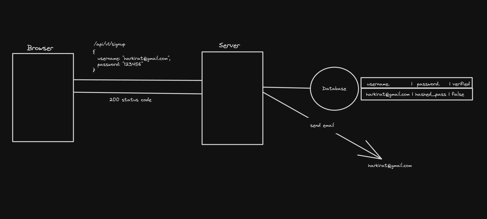

### Signin : 
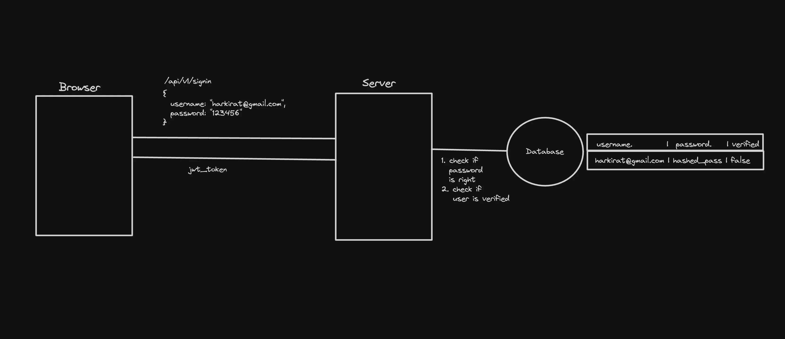

### Auth requests : 
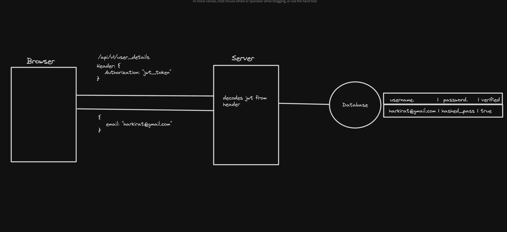

## Authentication using cookies (Part 1) : 

**What are cookies :**

Cookies in web development are small pieces of data sent from a website and stored on the user's computer by the user's web browser while the user is browsing. They are designed to be a reliable mechanism for websites to remember things (very similar to local storage)

1. `Session Management` : Cookies allow websites to identify users and track their individual session states across multiple pages or visits.

2. `Personalization` : Websites use cookies to personalize content and ads. For instance, cookies might store information about a user's preferences, allowing the site to tailor content or advertisements to those interests.

3. `Tracking` : Cookies can track users across websites, providing insights into browsing behavior. This information can be used for analytics purposes, to improve website functionality, or for advertising targeting.

4. `Authentication` : Secure cookies can be used to enhance the security of a website by ensuring that the transmission of information is only done over an encrypted connection, helping to prevent unauthorized access to user data.

**Why not local storage?**

Cookies and LocalStorage both provide ways to store data on the client-side, but they serve different purposes and have different characteristics.

1. Cookies are sent by default with every request to the website (by the browser) (you don’t have to explicitly add a header to the fetch call)
This point becomes super important in Next.js, we’ll see later why.

💡Ref - https://github.com/100xdevs-cohort-2/paytm/blob/complete-solution/frontend/src/pages/SendMoney.jsx#L45

2. Cookies can have an expiry attached to them.

3. Cookies can be be restricted to only https and to certain domains.

4. It's not possible to have a local storage in NextJs because of Server Side Rendering.

### SSR in NextJs : 
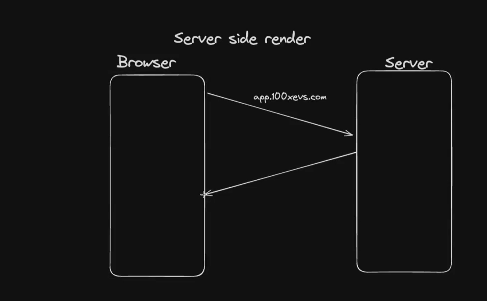

**Note :** NextJs has already populated the users data and has sent the HTML, CSS and Js to the browser.

## Authentication with cookies (Part 2) : 

### Signup : 
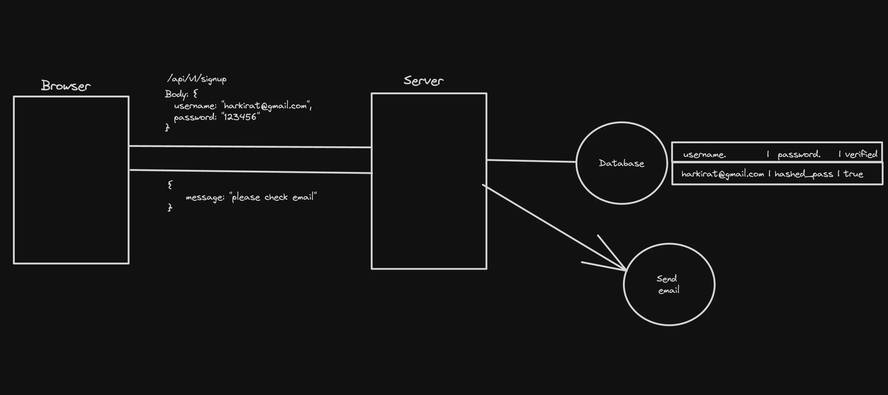

### Signin : 
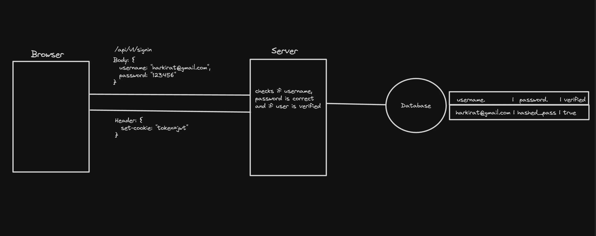

### Auth endpoints : 
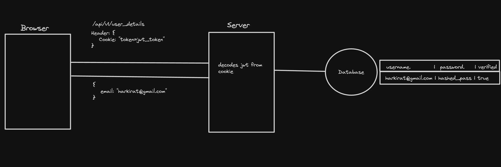

**Note :** You don’t need to explicitly set the cookie header in the browser. It’s automatically set by the browser in every request.

## Properties of cookies : 

**Types of cookies :**

1. Persistent - Stays even if you close the window.

2. Session - Go away after the window closes.

3. Secure - Sent only over secure, encrypted connections (HTTPS).

**Properties of cookies :**

- `HttpOnly` - Cannot be accessed by client side scripts(writing js inside browser).

- `SameSite` - Ensures cookies are not send on cross origin requests.

    - Strict
    - Lax - Only GET requests and on `top level navigation` : Used when other websites links up to your website.
    - None

Ref - https://portswigger.net/web-security/csrf/bypassing-samesite-restrictions#:~:text=SameSite

- `Domains` - You can also specify what all domains should the cookie be sent from
 
### CSRF attacks : 

Cross site request forgery attacks were super common because of cookies and hence the `SameSite` attribute was introduced.

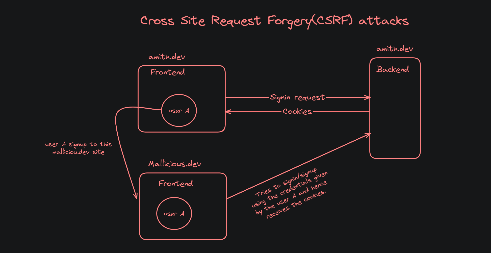

### Setting SameSite to :

**SameSite: none** 
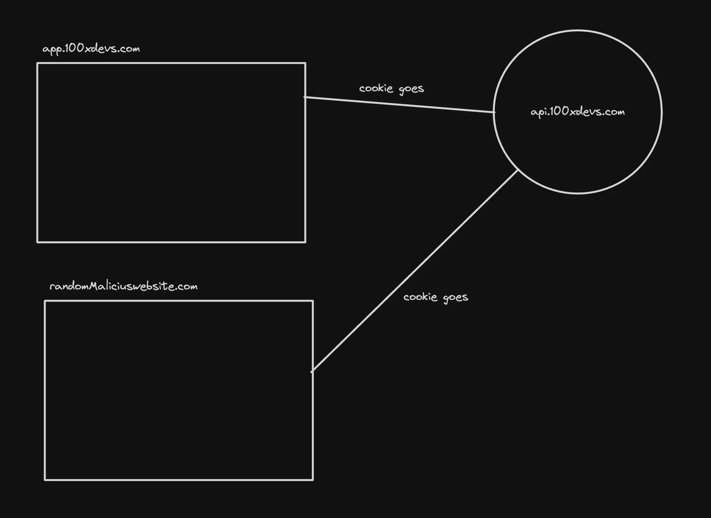

**Note :** Never use this, this will not prevent CSRF attacks.

**SameSite: Strict**
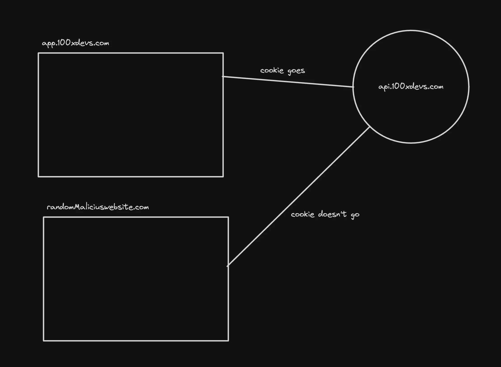

**But there’s a problem -** 
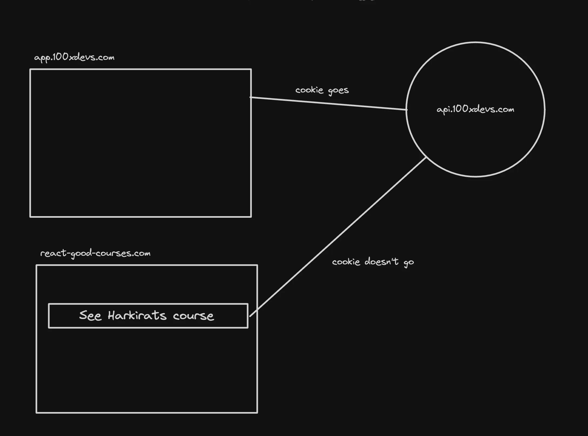

**SameSite: Lax**
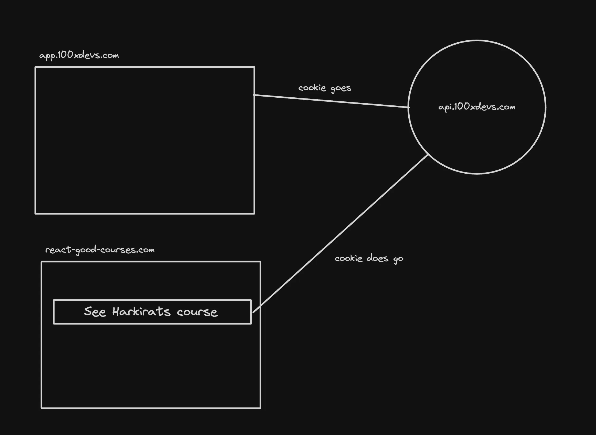

## Example in express (Backend) : 

1. Initialize an empty TS project :
```bash
npm init -y
npx tsc --init
```

2. Update rootDir and outDir : 
```bash
"roodDir": "./src"
"outDir": "./dist"
```

3. Add required libraries : 
```ts
import express from "express";
import cookieParser from "cookie-parser";
import cors from "cors";
import jwt, { JwtPayload } from "jsonwebtoken";
import path from "path";
```

4. Initialize express app, add middlewares :
```ts
const app = express();
app.use(cookieParser());
app.use(express.json());
app.use(cors({
    credentials: true,
    origin: "http://localhost:5173"
}));
```

5. Add a dummy signin endpoint
```ts
app.post("/signin", (req, res) => {
    const email = req.body.email;
    const password = req.body.password;
    // do db validations, fetch id of user from db
    const token = jwt.sign({
        id: 1
    }, JWT_SECRET);
    res.cookie("token", token);
    res.send("Logged in!");
});
```

6. Add a protected backend route
```ts
app.get("/user", (req, res) => {
    const token = req.cookies.token;
    const decoded = jwt.verify(token, JWT_SECRET) as JwtPayload;
    // Get email of the user from the database
    res.send({
        userId: decoded.id
    })
});
```

7. Add a logout route
```ts
app.post("/logout", (req, res) => {
    res.cookie("token", "ads");
    res.json({
        message: "Logged out!"
    })
});
```

8. Listen on port 3000
```ts
app.listen(3000);
```
 
Code - https://github.com/100xdevs-cohort-2/week-16-auth-1

## Frontend in React : 

- Initialize an empty react project

- Add a signin page :
```ts
import { useState } from "react"
import { BACKEND_URL } from "../config"
import axios from "axios"

export const Signin = () => {
    const [username, setUsername] = useState("")
    const [password, setPassword] = useState("")

    return <div>
        <input onChange={(e) => {
            setUsername(e.target.value);
        }} type="text" placeholder="username" />
        <input onChange={(e) => {
            setPassword(e.target.value);
        }} type="password" placeholder="password" />
        <button onClick={async () => {
            await axios.post(`${BACKEND_URL}/signin`, {
                username,
                password
            }, {
                withCredentials: true,
            });
            alert("you are logged in")
        }}>Submit</button>
    </div>
}
```

- Add a user page :
```ts
import axios from "axios";
import { useEffect, useState } from "react"
import { BACKEND_URL } from "../config";

export const User = () => {
    const [userData, setUserData] = useState();

    useEffect(() => {
        axios.get(`${BACKEND_URL}/user`, {
            withCredentials: true,
          })
            .then(res => {
                setUserData(res.data);
            })
    }, []);

    return <div>
        You're id is {userData?.userId}
        <br /><br />
        <button onClick={() => {
            axios.post(`${BACKEND_URL}/logout`, {}, {
                withCredentials: true,
            })
        }}>Logout</button>
    </div>
}
```

- Add routing
```ts
import './App.css'

import { BrowserRouter, Route, Routes } from "react-router-dom";
import { Signup } from './components/Signup';
import { Signin } from './components/Signin';
import { User } from './components/User';

function App() {
  return (
    <BrowserRouter>
      <Routes>
        <Route path={"/signup"} element={<Signup />} />
        <Route path={"/signin"} element={<Signin />} />
        <Route path={"/user"} element={<User />} />
      </Routes>
    </BrowserRouter>
  )
}

export default App
```

Code - https://github.com/100xdevs-cohort-2/week-16-auth-1

## Frontend from express

1. Add an index.html file in src folder of backend
```html
<!DOCTYPE html>
<html lang="en">
<head>
    <meta charset="UTF-8">
    <meta name="viewport" content="width=device-width, initial-scale=1.0">
    <title>Login Page</title>
    <script src="https://cdn.jsdelivr.net/npm/axios/dist/axios.min.js"></script>
</head>
<body>

<input id="username" type="text" placeholder="username" />
<input id="password" type="password" placeholder="password" />
<button id="loginButton">Submit</button>
<button id="logoutButton">Logout</button>
<div id="userData"></div>


<script>

    document.getElementById('loginButton').addEventListener('click', async () => {
        const username = document.getElementById('username').value;
        const password = document.getElementById('password').value;
        
        try {
            await axios.post(`/signin`, {
                username,
                password
            });
            alert("You are logged in");
        } catch (error) {
            console.error('Login failed:', error);
            alert("Login failed");
        }
    });

    document.getElementById('logoutButton').addEventListener('click', () => {
        axios.post(`/logout`, {}, {
            withCredentials: true,
        }).then(() => {
            console.log('Logged out successfully.');
        }).catch(error => {
            console.error('Logout failed:', error);
        });
    });

    function fetchUserData() {
        axios.get(`/user`, {
            withCredentials: true,
        }).then(response => {
            const userData = response.data;
            displayUserData(userData);
        }).catch(error => {
            console.error('Failed to fetch user data:', error);
        });
    }

    function displayUserData(userData) {
        const userDataDiv = document.getElementById('userData');
        // Example: Assumes userData contains a 'name' and 'email'. Adapt based on your actual user data structure.
        userDataDiv.innerHTML = `<p>Your id is: ${userData.userId}</p>`;
    }
    fetchUserData();
</script>

</body>
</html>
```

2. Add a route that sends this html file :
```ts
app.get("/", (req, res) => {
    res.sendFile(path.join(__dirname, "../src/index.html"))
});
```

3. Remove credentials from cors :
```ts
app.use(cors());
```

Link - https://github.com/100xdevs-cohort-2/week-16-auth-1