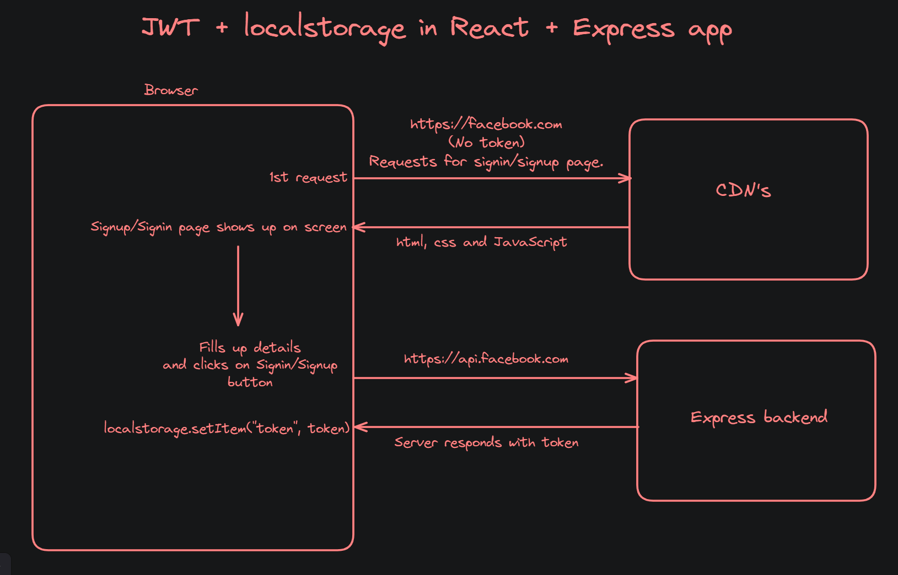
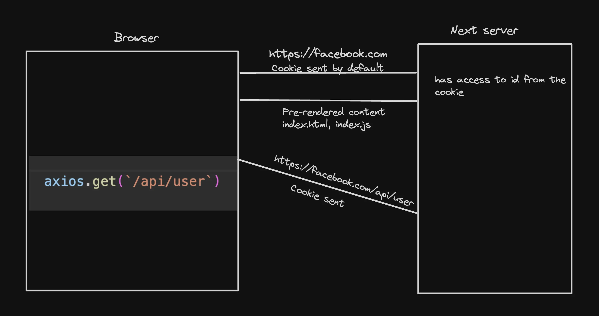
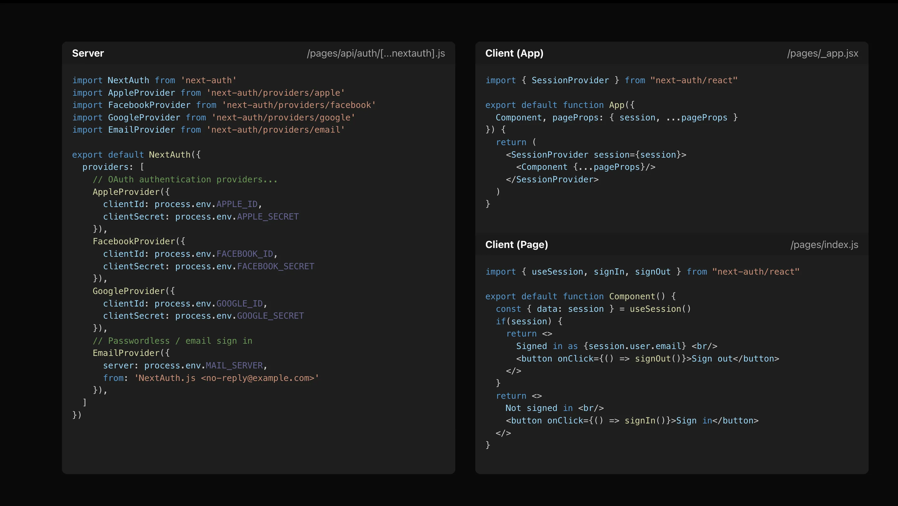

# NextAuth

## What is next auth?

1. NextAuth is a library that lets you do authentication in Next.js

2. Can you do it w/o next-auth - Yes

3. Should you - Probably not!

**Popoular choices while doing auth include -**

- External provider 
    - https://auth0.com/
    - https://clerk.com/
    - Firebase auth

- In house using cookies

- NextAuth

## Why not use JWT + localstorage?

Next.js is slightly different from React + Express apps

**Express app :**


**NOTE :** In subsiquent requests, the token is sent to the backend server by using localStorage.getItem("token")

**NextJS app :** 


## NextAuth : 

- NextAuth library lets you add authentication to your Next.js app. It supports various providers -

    - Login with email
    - Login with google
    - Login with facebook
    - etc



## Catch all routes : 

If you want to add a single route handler for 

1. `/api/auth/user`

2. `/api/auth/random`

3. `/api/auth/123`

4. `/api/auth/...`

### You can create a catch all route : 

1. Create a simple next.js app : 
```bash
npx create-next-app@latest
```

2. Create `app/api/auth/[...nextauth]/route.ts` :
```ts
import { NextRequest, NextResponse } from "next/server"

export function GET(req: NextRequest) {
    return NextResponse.json({
        message: "Handler"
    })
}
```

**Note :** [...nextauth] = catch all handler

3. Try going to a few endpoints : 

    - http://localhost:3000/api/auth/signin
    - http://localhost:3000/api/auth/123
    - http://localhost:3000/api/auth/random/random2

4. Try logging the sub-route you’re at :
```ts
import { NextRequest, NextResponse } from "next/server"

export function GET(req: NextRequest, { params }: { params: { nextauth: string[] } }) {
    console.log(params.nextauth[0])
    return NextResponse.json({
        message: "Handler"
    })
}
```

## Give NextAuth access to a catch-all : 

Ref https://next-auth.js.org/configuration/initialization#route-handlers-app

1. Create `/api/auth/[…nextauth]/route.ts`.

2. Install next-auth
```bash
npm install next-auth
```

3. Updated handler : 
```ts
import NextAuth from "next-auth"

const handler = NextAuth({
  ...
})

export { handler as GET, handler as POST }
```

4. Adding providers - Broadly there are 3 types of providers :

    - Credentials Provider(your own strategy)
    - OAuth Provider(Login with google, facebook, twitter,..etc)
    - Email Provider(Passwordless Email login via email OTP).

## Credentials provider : 

This lets you create your own authentication strategy. For example : 

1. Email + Password
2. Phone number
3. Login with Metamask

**Steps to follow :**

1. Add a credentials provider
```ts
import NextAuth from "next-auth"
import CredentialsProvider from 'next-auth/providers/credentials';

const handler = NextAuth({
  providers: [
    CredentialsProvider({
        name: 'Credentials',
        credentials: {
          username: { label: 'email', type: 'text', placeholder: '' },
          password: { label: 'password', type: 'password', placeholder: '' },
        },
        async authorize(credentials: any) {
            
            return {
                id: "user1"
            };
        },
      })
  ],
  secret: process.env.NEXTAUTH_SECRET
})

export { handler as GET, handler as POST }
```

2. Add NEXTAUTH_URL to `.env` : 
```env
NEXTAUTH_URL=http://localhost:3000
NEXTAUTH_SECRET=password_nextauth
```

3. Update App.tsx to have a simple Appbar : 
```ts
"use client";
import { signIn, signOut } from "next-auth/react"

export const Appbar = () => {
    return <div>
    <button onClick={() => signIn()}>Signin</button>
    <button onClick={() => signOut()}>Sign out</button>
  </div>
}
```

4. Add `providers.tsx` :
```ts
'use client';
import React from 'react';
import { SessionProvider } from 'next-auth/react';

export const Providers = ({ children }: { children: React.ReactNode }) => {
  return (
    <SessionProvider>
      {children}
    </SessionProvider>
  );
};
```

5. Wrap `layout.tsx` with Providers : 
```ts
import { Providers } from "./provider";

export default function RootLayout({
  children,
}: Readonly<{
  children: React.ReactNode;
}>) {
  return (
    <html lang="en">
      <body className={inter.className}>
        <Providers>
          {children}
        </Providers>
      </body>
    </html>
  );
}
```

6. Get the user details in the top level `page.tsx` (client component) : 
```ts
"use client"

import { useSession } from "next-auth/react";

export default function Home() {
  const session = useSession();
  return (
    <div>
      {JSON.stringify(session.data?.user)}
    </div>
  );
}
```

7. Get the user details on the server (server component) :
```ts
import { getServerSession } from "next-auth"

async function getUser() {
  const session = await getServerSession();
  return session;
}

export default async function Home() {
  const session = await getUser();

  return (
    <div>
      {JSON.stringify(session?.user?.name)}
    </div>
  );
}
```

8. Get user in an api route (/api/user) : 
```ts
import { getServerSession } from "next-auth"
import { NextResponse } from "next/server";

export async function GET() {
    const session = await getServerSession();

    return NextResponse.json({
        name: session?.user?.name
    })
}
```

Persist more data (user id) (Ref https://next-auth.js.org/getting-started/example#using-nextauthjs-callbacks) (Ref https://next-auth.js.org/configuration/callbacks)

```ts
callbacks: {
    jwt: async ({ user, token }: any) => {
        if (user) {
            token.uid = user.id;
        }
        return token;
    },
session: ({ session, token, user }: any) => {
    if (session.user) {
        session.user.id = token.uid
    }
    return session
}
},
```

Move auth config to lib/auth.ts https://github.com/nextauthjs/next-auth/issues/7658#issuecomment-1683225019

```ts
import CredentialsProvider from 'next-auth/providers/credentials';

export const NEXT_AUTH_CONFIG = {
providers: [
    CredentialsProvider({
        name: 'Credentials',
        credentials: {
        username: { label: 'email', type: 'text', placeholder: '' },
        password: { label: 'password', type: 'password', placeholder: '' },
        },
        async authorize(credentials: any) {

            return {
                id: "user1",
                name: "asd",
                userId: "asd",
                email: "ramdomEmail"
            };
        },
    }),
],
secret: process.env.NEXTAUTH_SECRET,
callbacks: {
    jwt: async ({ user, token }: any) => {
    if (user) {
        token.uid = user.id;
    }
    return token;
    },
    session: ({ session, token, user }: any) => {
        if (session.user) {
            session.user.id = token.uid
        }
        return session
    }
},
}
```

Final code - 
https://github.com/100xdevs-cohort-2/week-16-auth-2

**NOTE** : next-auth will only helps us to create signin page, we have to build signup page by ourselves.

Next-Auth is a session management library.

## Adding Google Provider : 

Ref https://next-auth.js.org/providers/google

## Adding Github provider :
Ref - https://next-auth.js.org/providers/github

## Custom Signup page

What if you want to change how your signup page looks :

1. Add pages to next auth :

Ref - https://github.com/code100x/cms/blob/main/src/lib/auth.ts#L207

2. Add app/signin/page.tsx :

Ref - https://github.com/code100x/cms/blob/main/src/app/signin/page.tsx

Ref - https://github.com/code100x/cms/blob/main/src/components/Signin.tsx#L39

```ts
"use client"
import { signIn } from 'next-auth/react';
import { useRouter } from 'next/navigation';

export default function() {
    const router = useRouter();
    
    return <div>
        <button onClick={async () => {
            await signIn("google");
        }}>Login with google</button>

        <br />
        <button onClick={async () => {
            await signIn("github");
        }}>Login with Github</button>
        <br />
        <button onClick={async () => {
            const res = await signIn("credentials", {
                username: "",
                password: "",
                redirect: false,
            });
            console.log(res);
            router.push("/")
        }}>Login with email</button>
    </div>
}
```
 
Final code - 
https://github.com/100xdevs-cohort-2/week-16-live-4