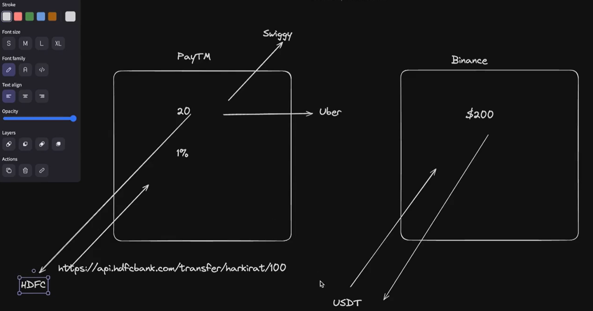
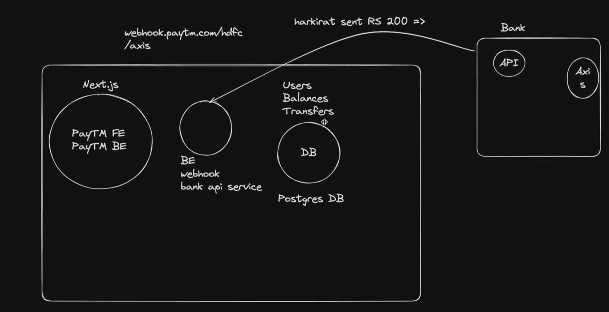
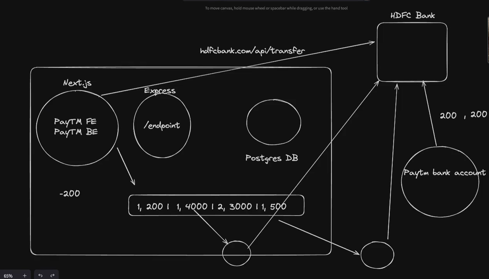

# VaultSync - A web based money transfer service 

### WebHooks : 

- A `webhook` is a communication method that automatically sends data between applications using `HTTP`. 

- `Webhooks` are triggered by specific events and can be used to: 
    - Connect applications and share data in real time. 
    - Activate workflows. 
    - Launch event-driven automation. 
    - Receive data as it happens.

### Withdrawl Queue : 
 