# VaultSync  

Building any project : 

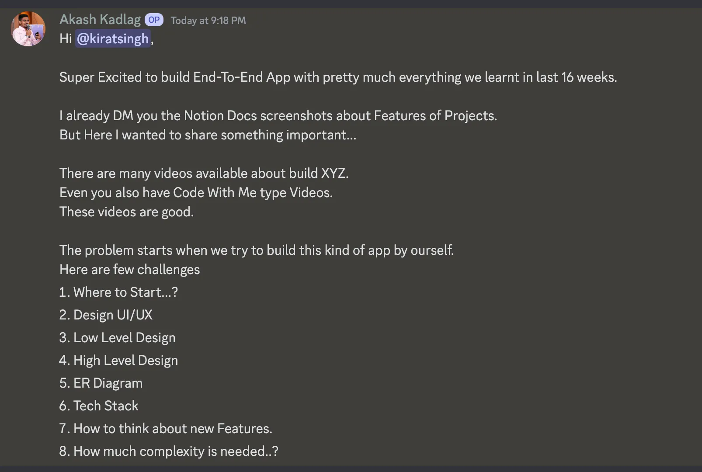

## Points : 

1. **Where to start** : Feature planning

2. **Design UI/UX** : 

    - `UX` - First principles/Copy the biggest website out there.
    - `UI` - Designer. Today there are tools but havent found any good one.

3. **High level Design** :

    - Auth provider
    - Database
    - Backend Stack
    - Frontend stack
    - Modules you’ll have (common/ui/backend)
    - Cloud to deploy to

4. **Low Level Design** :

    - Schema
    - Route signatures
    - Frontend Components - debatable

5. **ER Diagrams** :

    - We can build these today, but usually not needed unless you’re a very visual person.

6. **How to think about features** : 

    - Usually come from product
    - If you’re a founder, then just whatever you think is right.

7. **How much complexity is needed ?**

- Depends on the size of the company. For a startup, whatever helps you move fast w/o tech debt. For a company there are a lot of layers of review to go through.

        💡 If you want a voice speaker that says Paytm Received 100 rs from someone we need to add another ws service in here We’ll also be doing DB polling in the middle which should rather be done via a queue.

## Where to start ? Feature planning : 

1. **User login** :

    - Auth (In this case, probably email/phone)
    - On ramp from bank, off ramp to bank
    - Support transfers via phone number/name
    - Support scanning a QR code for transferring to merchants.

2. **Merchant login** :

    - Login with google
    - Generate a QR Code for acceptance
    - Merchants get an alert/notification on payment
    - Merchant gets money offramped to bank every 2 days

## Design UI/UX : 

- End User
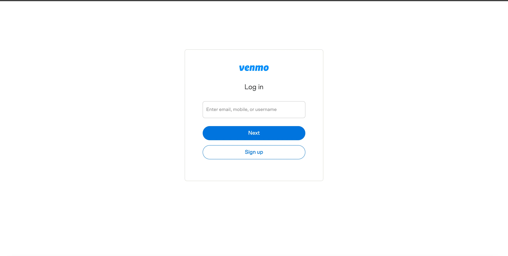
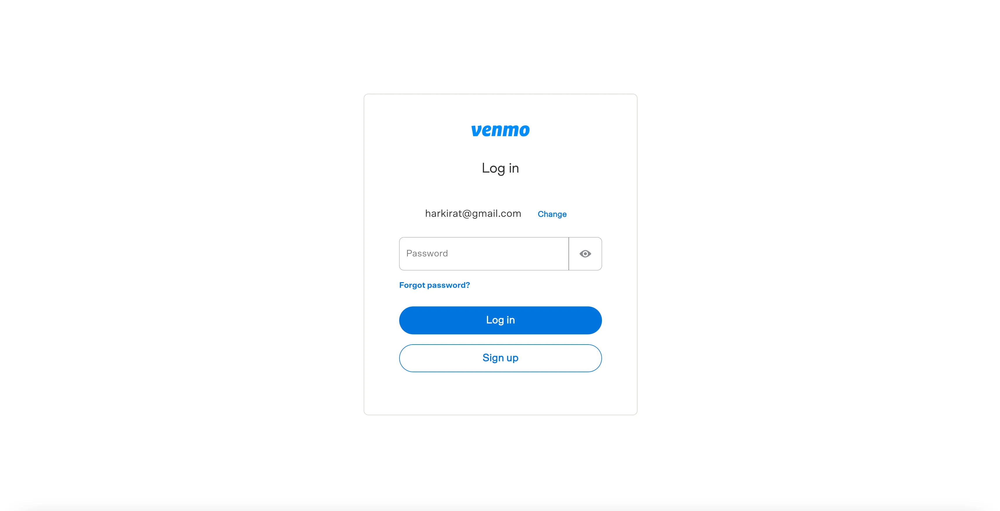
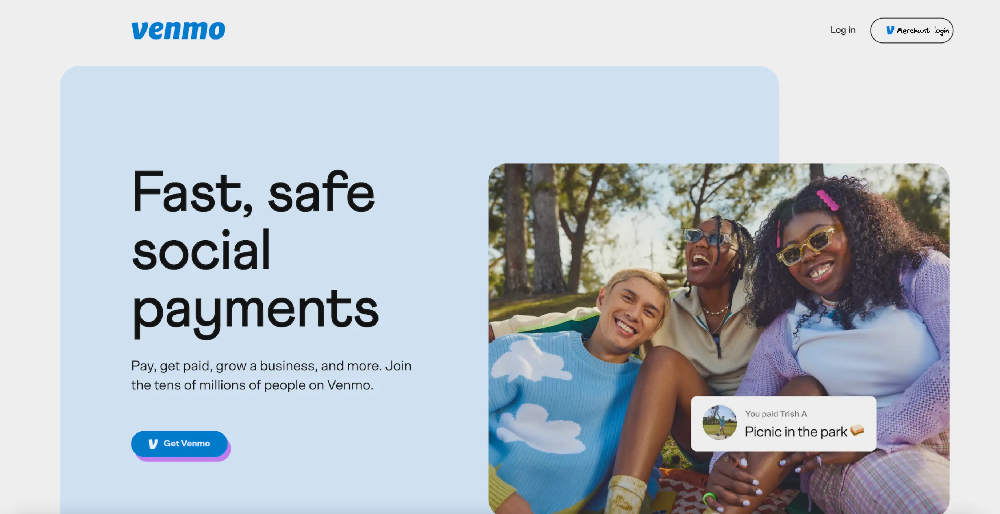
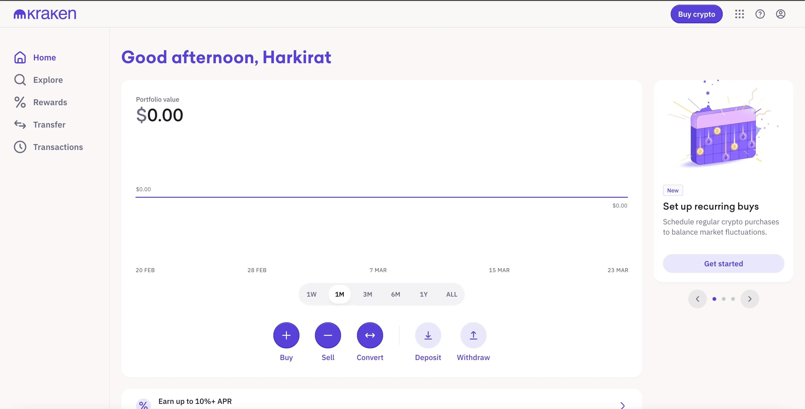
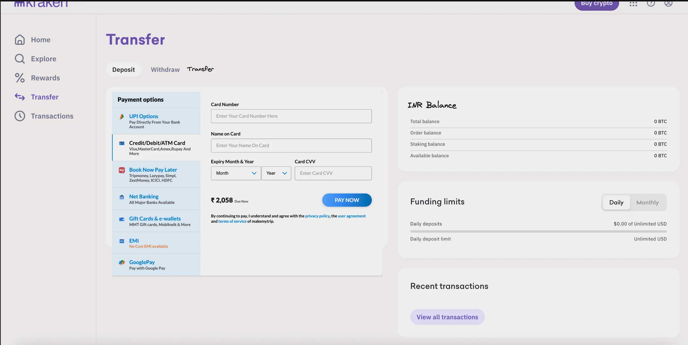
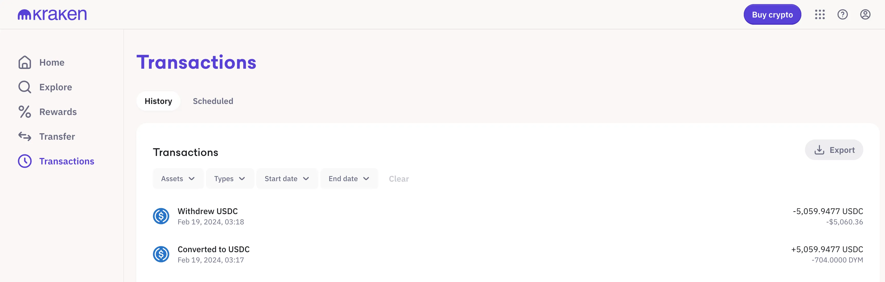
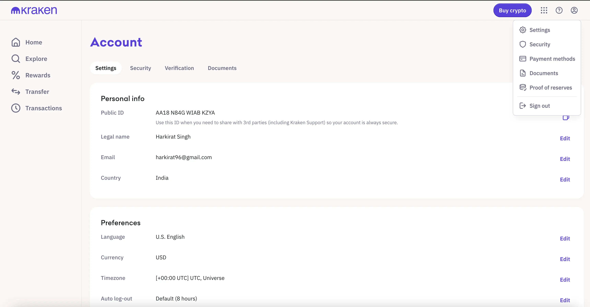

- Merchant
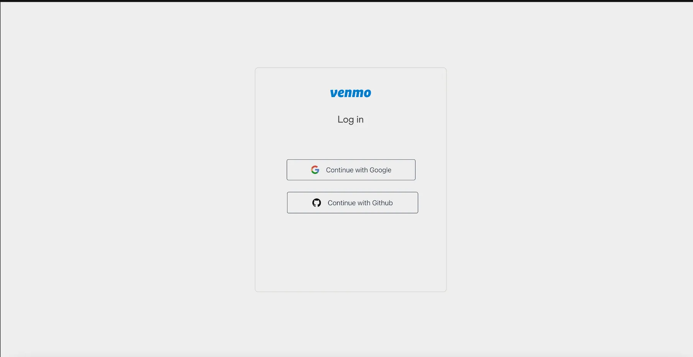
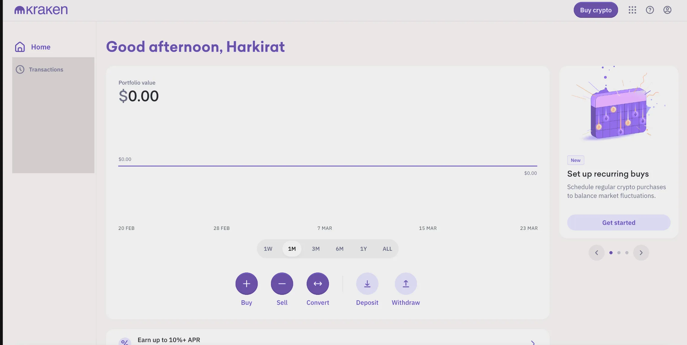


## Architecture : 

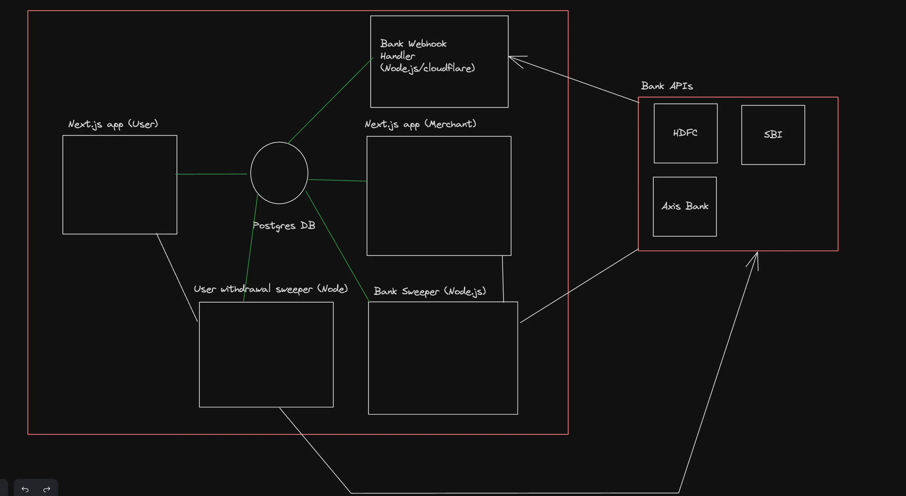

**Hot paths** :

1. Send money to someone
2. Withdraw balance of merchant
3. Withdraw balance of user back to bank
4. Webhooks from banks to transfer in money
 
**This is ~1 month job for a 2 engineer team.**
We can cut scope in either

1. UI
2. Number of features we support (remove merchant altogether)
3. Number of services we need (merge bank server, do withdrawals directly and not in a queue assuming banks are always up)

## Stack : 

1. Frontend and Backend - Next.js (or Backend)

2. Express - Auxilary backends

3. Turborepo

4. Postgres Database

5. Prisma ORM

6. Tailwind

NOTE : 
<span style="background-color: green" style="">
    Steps taken to bootstrap the app from now on will be project independent. Basically same steps can be used in bootstrapping multiple projects.
</span>

# Bootstrapping the app : 

## Getting started with Turborepo :

1. Initializing an empty Turborepo project :
```bash
 npx create-turbo@latest
```

2. Rename the two Next-apps to the following(This step is only for this project) :

    - user-app
    - merchant-app

## 3. Adding TailwindCSS to the project :
```bash
cd apps/user-app
npm install -D tailwindcss postcss autoprefixer
npx tailwindcss init -p

cd ../merchant-app
npm install -D tailwindcss postcss autoprefixer
npx tailwindcss init -p
```

    💡You can also use https://github.com/vercel/turbo/tree/main/examples/with-tailwind

4. Updating the `tailwind.config.js` :
```ts
/** @type {import('tailwindcss').Config} */
module.exports = {
  content: [
    "./app/**/*.{js,ts,jsx,tsx,mdx}",
    "./pages/**/*.{js,ts,jsx,tsx,mdx}",
    "./components/**/*.{js,ts,jsx,tsx,mdx}",
    
    // Extra added :  
    "../../packages/ui/**/*.{js,ts,jsx,tsx,mdx}"
  ],
  theme: {
    extend: {},
  },
  plugins: [],
}
```

5. Updating the `global.css` : 
```css
@tailwind base;
@tailwind components;
@tailwind utilities;
```

    💡Ensure tailwind is working as expected.

## Adding prisma : 

Ref - https://turbo.build/repo/docs/handbook/tools/prisma

1. Create a new `db` folder.

2. Initialise `package.json` and `tsconfig.json` :
```bash
npm init -y
npx tsc --init
```

3. Update `package.json` :
```json
{
    "name": "@repo/db",
    "version": "0.0.0",
    "dependencies": {
        "@prisma/client": "^5.11.0"
    },
    "devDependencies": {
        "prisma": "5.11.0"
    },
    "exports": {
        "./client": "./index.ts"
    }
}
```

4. Update `tsconfig.json` :
```json
{
    "extends": "@repo/typescript-config/react-library.json",
    "compilerOptions": {
      "outDir": "dist"
    },
    "include": ["src"],
    "exclude": ["node_modules", "dist"]
}
```

5. Install and Initialize prisma : 
```bash
npm install prisma
npx prisma init
```

6. Start DB locally/on neon.db/on aiven.

7. Update `.env` with the new database URL.

8. Add a basic schema : 
```ts
model User {
  id    Int     @id @default(autoincrement())
  email String  @unique
  name  String?
}
```

9. Migrate DB : 
```bash
npx prisma migrate dev --name init
```

10. Generate prisma client : 
```bash
npx prisma generate
```

11. Create a `src/index.ts` file and update it with the following : 
```ts
export * from '@prisma/client';
```

12. Try adding `api/user/route.ts` :
```ts
import { NextResponse } from "next/server"
import { PrismaClient } from "@repo/db/client";

const client = new PrismaClient();

export const GET = async () => {
    await client.user.create({
        data: {
            email: "asd",
            name: "adsads"
        }
    })
    return NextResponse.json({
        message: "hi there"
    })
}
```