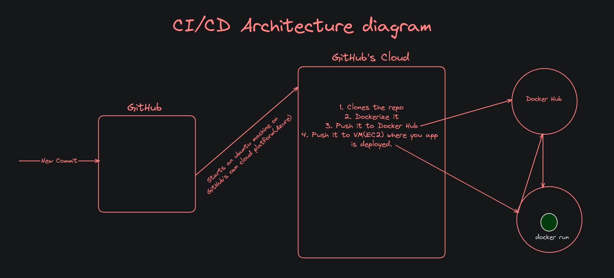
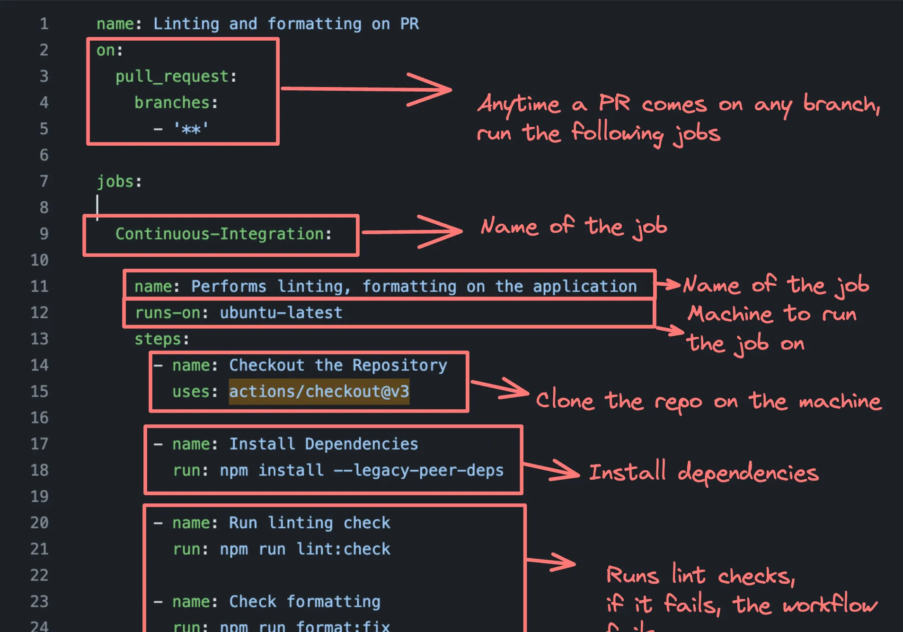
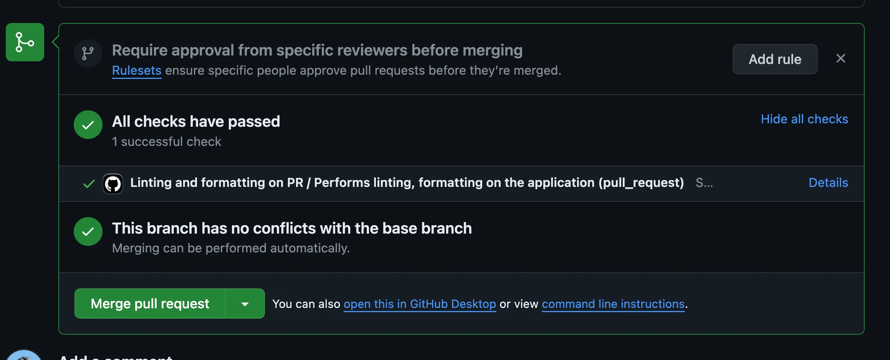
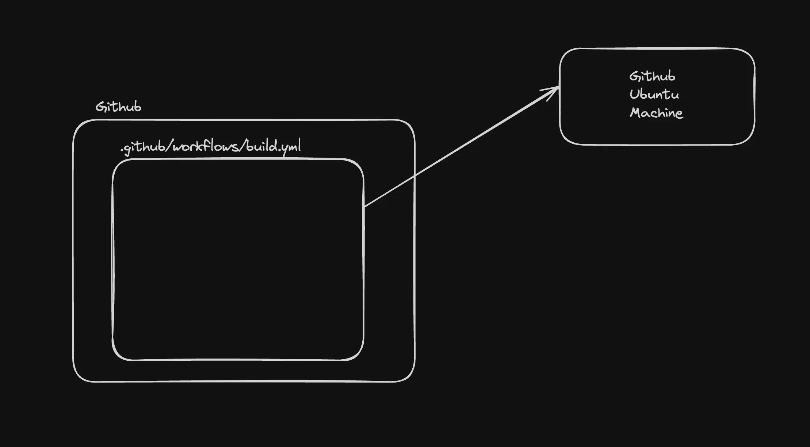
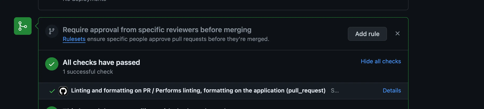
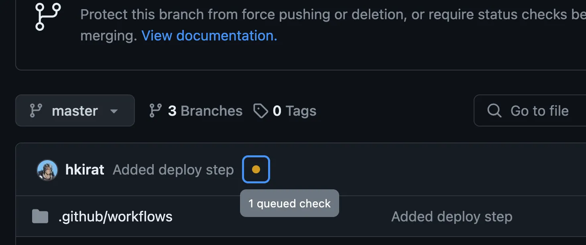
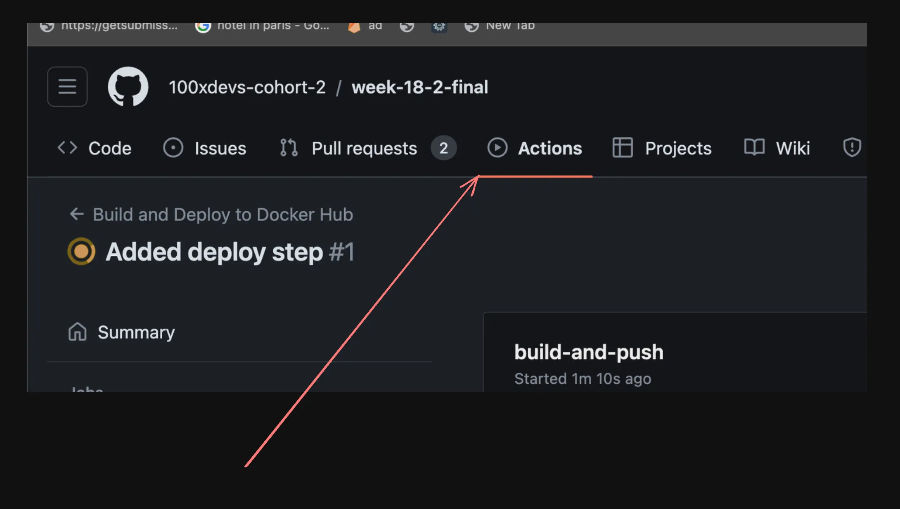
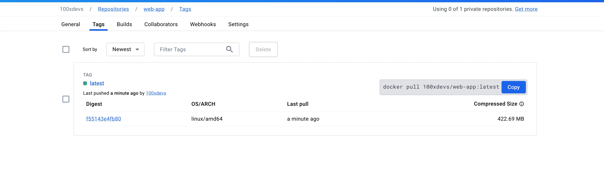

# Continuous Integration / Continuous Deployment 


### Continuous Integration : 

Continuous Integration (CI) is a development practice where developers frequently integrate their code changes into a shared repository, preferably several times a day. Each integration is automatically verified by 

1. Building the project and 
2. Running automated tests.

This process allows teams to detect problems early, improve software quality, and reduce the time it takes to validate and release new software updates.

### Continuous Deployment : 

As the name suggests, deploying your code continuously to various environments (dev/stage/prod).

## Continuous Deployment in Github : 

We’ll be deploying a next.js app to EC2 servers via Docker.

    💡You don’t really need Docker here, since it’s deploying on a simple EC2 server. If you deploy to 
    1. GCP App runner
    2. ECS
    3. Kubernetes
    then it makes more sense to deploy a dockerised

**Architecture diagram :**



    💡Last step keeps changing based on where you’re pushing your image.

## Monorepo we’re dealing with today :

Ref - https://github.com/100xdevs-cohort-2/week-18-2-ci-cd

This monorepo has 3 apps inside - 

- bank-webhook
- merchant-app
- user-app

We’ll be deploying all three to the same ec2 instance

## How to create a CI/CD pipeline?

For Github, you can add all your pipelines to .github/workflows.

For eg - https://github.com/code100x/cms/blob/main/.github/workflows/lint.yml



**CD pipelines look like this finally -**



**NOTE :** Hint - Use https://onlineyamltools.com/convert-yaml-to-json to see the pipeline in json.

## Step 1 - Create the CI pipeline :

- Make sure that whenever someone tries to create a PR, we build the project and make sure that it builds as expected.



## Lets add a CI/build pipeline for our repo :

**NOTE :** Anytime a user creates a PR, we need to run npm run build and only if it succeeds should the workflow succeed.

- Since I'm building a pipeline for the previously built project, I will use the VaultPay repo.

- Add `.github/workflows/build.yml`  in the root folder.

- Create the workflow

```yml
name: Build on PR

on:
  pull_request:
    branches:
      - master

jobs:
  build:
    runs-on: ubuntu-latest
    steps:
      - uses: actions/checkout@v3
      - name: Use Node.js
        uses: actions/setup-node@v3
        with:
          node-version: '20'
      
      - name: Install Dependencies
        run: npm install
        
      - name: Run Build
        run: npm run build
```

- Push this to master branch.

- Create a new branch with some minimal changes and create a PR from it.

- You should see the workflow run.



## Let’s add a deploy step

- Create dockerfiles for the apps you have.

- Create `docker/Dockerfile.user` : 

```dockerfile
FROM node:20.12.0-alpine3.19

WORKDIR /usr/src/app

COPY package.json package-lock.json turbo.json tsconfig.json ./

COPY apps ./apps
COPY packages ./packages

# Install dependencies
RUN npm install
# Can you add a script to the global package.json that does this?
RUN cd packages/db && npx prisma generate && cd ../..

# Can you filter the build down to just one app?
RUN npm run build

CMD ["npm", "run", "start-user-app"]
```

- Add start-user-app script to the root `package.json` :
```bash
"start-user-app": "cd ./apps/user-app && npm run start"
```

- Build the image :
```bash
docker build -t image_name -f docker/Dockerfile.user .
```

- Create the CD pipeline that : 

  - Clones the repo
  - Builds the docker image
  - Pushes the docker image

```yml
name: Build and Deploy to Docker Hub

on:
  push:
    branches:
      - main

jobs:
  build-and-push:
    runs-on: ubuntu-latest
    steps:
    - name: Check Out Repo
      uses: actions/checkout@v2

    - name: Log in to Docker Hub
      uses: docker/login-action@v1
      with:
        username: ${{ secrets.DOCKER_USERNAME }}
        password: ${{ secrets.DOCKER_PASSWORD }}

    - name: Build and Push Docker image
      uses: docker/build-push-action@v2
      with:
        context: .
        file: ./docker/Dockerfile.user
        push: true
        tags: amithrao/vaultpay_user:latest  # Replace with your Docker Hub username and repository

    - name: Verify Pushed Image
      run: docker pull amithrao/vaultpay_user:latest  # Replace with your Docker Hub username and repository
```

- Make sure to add the dockerhub secrets to github secrets  of the repo (DOCKER_USERNAME, DOCKER_PASSWORD)

- You should see a workflow running




### Check dockerhub to ensure the image has indeed reached there



    💡 You might have to inject more environment variables (like DB URL) in there for the build to work as expected.

## Let’s pull the docker image : 

Ref - https://github.com/appleboy/ssh-action

- Create an ec2 server
  - Download its keypair file
  - Allow http/https traffic
  - Ubuntu base image

- Download docker on the machine
  - https://docs.docker.com/engine/install/ubuntu/
  - sudo docker run hello-world

- Update workflow to pull the latest image on the ec2 machine 

```yml
name: Build and Deploy to Docker Hub

on:
  push:
    branches:
      - master  # Adjusted to trigger on pushes to master

jobs:
  build-and-push:
    runs-on: ubuntu-latest
    steps:
    - name: Check Out Repo
      uses: actions/checkout@v2

    - name: Prepare Dockerfile
      run: cp ./docker/Dockerfile.user ./Dockerfile

    - name: Log in to Docker Hub
      uses: docker/login-action@v1
      with:
        username: ${{ secrets.DOCKER_USERNAME }}
        password: ${{ secrets.DOCKER_PASSWORD }}

    - name: Build and Push Docker image
      uses: docker/build-push-action@v2
      with:
        context: .
        file: ./Dockerfile
        push: true
        tags: 100xdevs/web-app:latest

    - name: Verify Pushed Image
      run: docker pull 100xdevs/web-app:latest

    - name: Deploy to EC2
      uses: appleboy/ssh-action@master
      with:
        host: ${{ secrets.SSH_HOST }}
        username: ${{ secrets.SSH_USERNAME }}
        key: ${{ secrets.SSH_KEY }}
        script: |
          sudo docker pull 100xdevs/web-app:latest
          sudo docker stop web-app || true
          sudo docker rm web-app || true
          sudo docker run -d --name web-app -p 3005:3000 100xdevs/web-app:latest
```

- Point userapp.your_domain.com to the IP of the server.

- Add nginx reverse proxy to forward requests from userapp.your_domain.com to port on which the app is running.

```nginx

server {
        server_name userapp.100xdevs.com;

        location / {
            proxy_pass http://localhost:3005;
            proxy_http_version 1.1;
            proxy_set_header Upgrade $http_upgrade;
            proxy_set_header Connection 'upgrade';
            proxy_set_header Host $host;
            proxy_cache_bypass $http_upgrade;


                # Basic Authentication
                auth_basic "Restricted Content";
                auth_basic_user_file /etc/nginx/.htpasswd;
        }

    listen 443 ssl; # managed by Certbot
    ssl_certificate /etc/letsencrypt/live/userapp.100xdevs.com/fullchain.pem; # managed by Certbot
    ssl_certificate_key /etc/letsencrypt/live/userapp.100xdevs.com/privkey.pem; # managed by Certbot
    include /etc/letsencrypt/options-ssl-nginx.conf; # managed by Certbot
    ssl_dhparam /etc/letsencrypt/ssl-dhparams.pem; # managed by Certbot

}
```

- Install certbot and Refresh certificate.

```bash
sudo certbot --nginx
```

**NOTE :** Start the docker image so that it restarts if it goes down (similar to pm2).