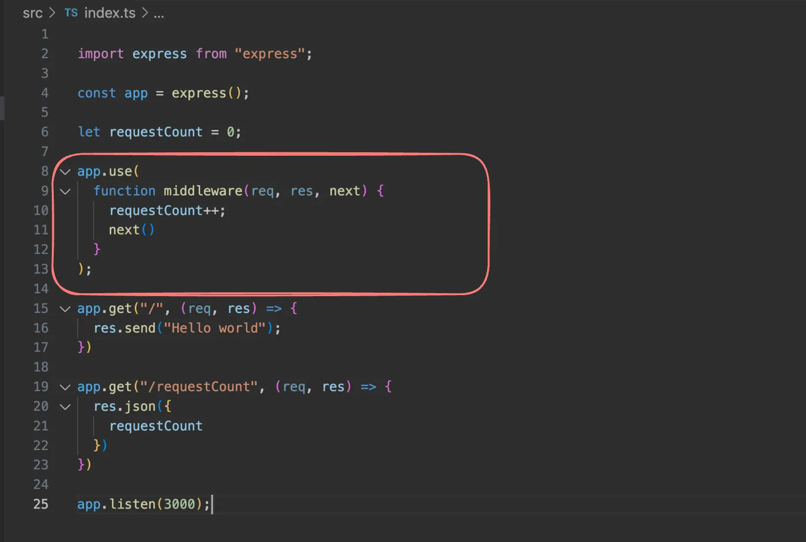

# Middlewares in NextJs

## What are middlewares?
Middlewares are code that runs before / after your request handler.
It’s commonly used for things like : 

1. Analytics : 


2. Authentication


3. Redirecting the user

## middlewares + Next
 
Ref - https://nextjs.org/docs/app/building-your-application/routing/middleware

Middleware allows you to run code before a request is completed. 

Then, based on the incoming request, you can modify the response by :

1. rewriting
2. redirecting
3. modifying the request or response headers
4. or responding directly.
 
**Use cases** :

- Authentication and Authorization: Ensure user identity and check session cookies before granting access to specific pages or API routes.

- Logging and Analytics: Capture and analyze request data for insights before processing by the page or API.

## Code #1 :

**Create a request count middleware** : 

- Create an empty NextJS project
```bash 
npx create-next-app@latest
```
- Create middleware.ts in the root folder


- Add code to track the number of requests
```ts
import { NextResponse } from 'next/server'
import type { NextRequest } from 'next/server'

let requestCount = 0;
export function middleware(request: NextRequest) {
  requestCount++;
  console.log("number of requests is " + requestCount);
  return  NextResponse.next()
}
```

- Try visiting the website

## Code #2 :
 
Create a request count middleware to track only requests that start with `/api` :

- Add a dummy API route (`api/user/route.ts`) : 
```ts
import { NextResponse } from "next/server";

export function GET() {
    return NextResponse.json({
        message: "Hi there"
    })
}
```

- Update `middleware.ts` :
```ts
import { NextResponse } from 'next/server'
import type { NextRequest } from 'next/server'

let requestCount = 0;
export function middleware(request: NextRequest) {
  requestCount++;
  console.log("number of requests is " + requestCount);
  return  NextResponse.next()
}

// See "Matching Paths" below to learn more
export const config = {
  matcher: '/api/:path*',
}
```

## Selectively running middlewares : 

```ts
import { NextResponse } from 'next/server'
import type { NextRequest } from 'next/server'
 
export function middleware(request: NextRequest) {
  console.log(request.nextUrl.pathname)
  if (request.nextUrl.pathname.startsWith('/admin')) {
    return NextResponse.redirect(new URL('/signin', request.url))
  }
 
  if (request.nextUrl.pathname.startsWith('/dashboard')) {
    return NextResponse.next()
  }
}
```

Ref - https://github.com/code100x/cms/blob/main/src/middleware.ts