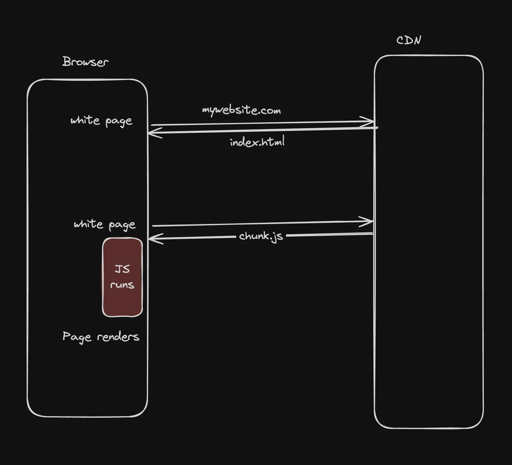
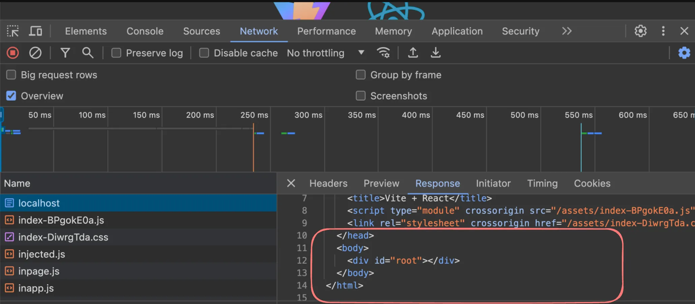
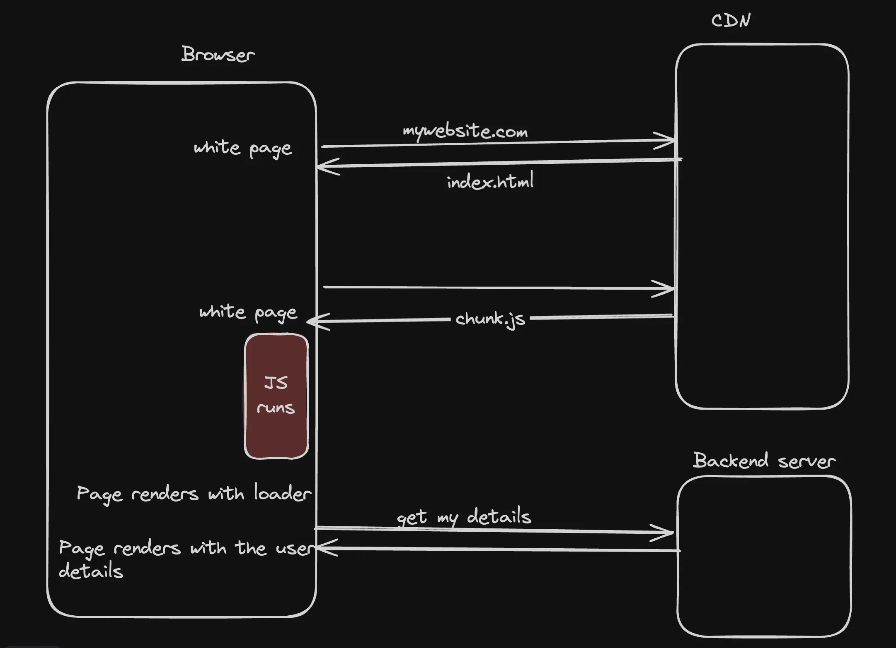
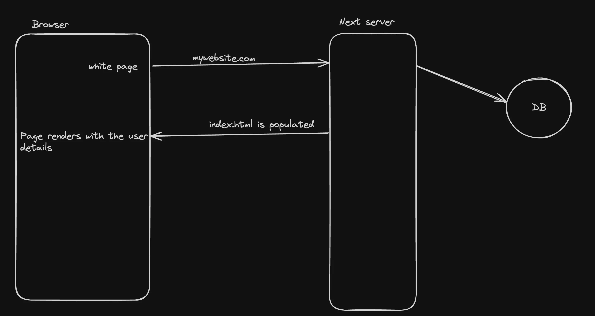
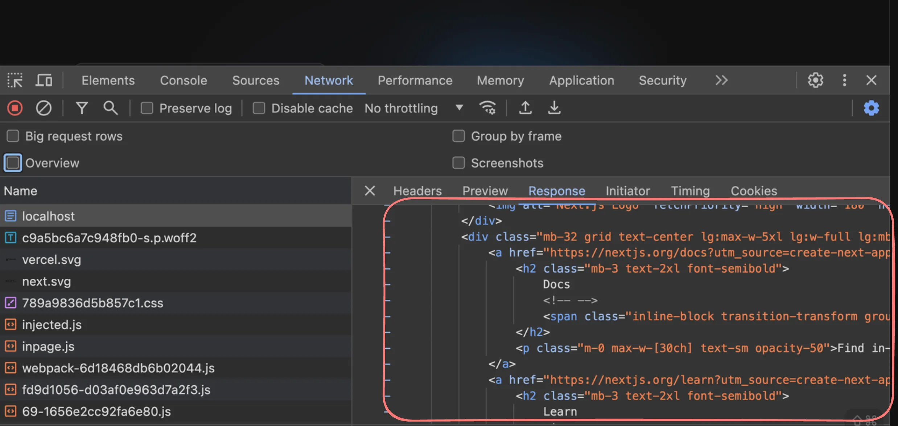

# Client Side rendering

- Client-side rendering (CSR) is a modern technique used in web development where the rendering of a webpage is performed in the browser using JavaScript. 

- Instead of the server sending a fully rendered HTML page to the client.

- Good example of CSR - React.



**Initialize an empty React project and `build` that project** :

Then open the network tab and notice how the inital HTML file deosn’t have any content



- This means that the JS runs and actually populates / renders the contents on the page.

- React (or CSR) makes your life as a developer easy. You write components, JS renders them to the DOM.

**Downsides?**

1. Not SEO optimised
2. User sees a flash before the page renders
3. Waterfalling problem



# Server side rendering

When the rendering process (converting JS components to HTML) happens on the server, it’s called SSR. 



### Why SSR?

1. SEO Optimisations
2. Gets rid of the waterfalling problem
3. No white flash before you see content

Try creating a NextJS app and notice the HTML file you receive is populated



### Downsides of SSR?

1. Expensive since every request needs to render on the server.
2. Harder to scale, you can’t cache to CDNs.

# Static site generation

Ref https://nextjs.org/docs/app/building-your-application/data-fetching/fetching-caching-and-revalidating

- If a page uses Static Generation, the page HTML is generated at build time. That means in production, the page HTML is generated when you run `next build`. 

- This HTML will then be reused on each request. 

- It can be cached by a CDN.

**Why?**

If you use static site generation, you can defer the expensive operation of rendering a page to the build time so it only happens once. 
 
**How?**

- Let’s say you have an endpoint that gives you all the global todos of an app.

- By global todos  we mean that they are the same for all users, and hence this page can be statically generated.

https://sum-server.100xdevs.com/todos
 
- Create a fresh next project

- Create `todos/page.tsx` :
```ts
export default async function Blog() {
    const res = await fetch('https://sum-server.100xdevs.com/todos')

    const data = await res.json();
    const todos = data.todos;

    console.log("todos", );
    return <div>
        {todos.map((todo: any) => <div key={todo.id}>
            {todo.title}
            {todo.description}
        </div>)}
    </div>
}
```

- Try updating the fetch requests

- **Clear cache every 10 seconds**
```ts
const res = await fetch('https://sum-server.100xdevs.com/todos', {
    next: { revalidate: 10 }
});
```

- **Clear cache in a next action**
```ts
import { revalidateTag } from 'next/cache'

const res = await fetch('https://sum-server.100xdevs.com/todos', { next: { tags: ['todos'] } })
```
 
```ts
'use server'
 
import { revalidateTag } from 'next/cache'
 
export default async function revalidate() {
  revalidateTag('todos')
}
```