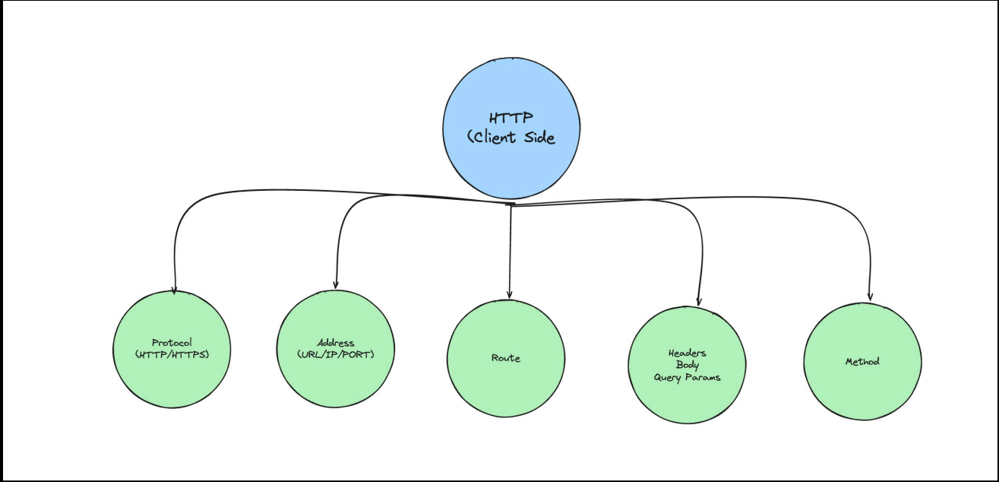
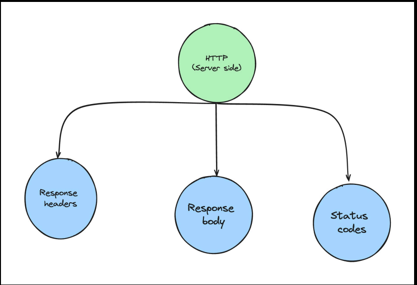
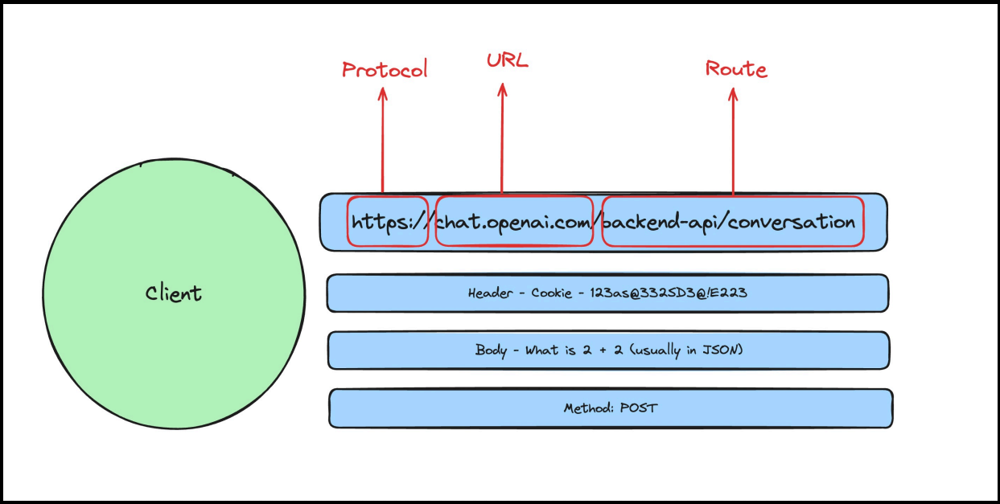
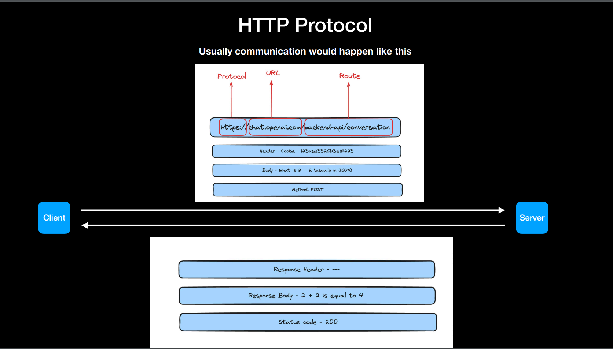

# Hyper text transfer Protocol

    1. A protocol that is defined for machines to communicate

    2. Specifically for websites, it is the most common way for your website’s frontend to talk to its backend

    3. HTTP is the protocol that allows the the frontned to communicate with the backend servers.

# What is an HTTP Server ?
    - Some code that follows the HTTP Protocol and is able to communicate with clients (browsers/mobile apps…)

    - Think of it to be similar to the call app in your phone Which lets you communicate with your friends

# Summary
    - In the end, its the client throwing some information at a server.

    - Server doing something with that information.

    - Server responding back with the final result.

# Analogy
    Think of them as functions, where Arguments are something the client sends.

    Rather than calling a function using its name, the client uses a URL.

    Rather than the function body, the server does something with the request.

    Rather than the function returning a value, the server responds with some data

# HTTP Protocol :

### Things client needs to be worried about :

### Things server needs to be worried about :

### Usually communication would happen like this : 

### Things that happen in your browser after you fire this request :
    1. Browser parses the URL
    2. Does a DNS Lookup (converts google.com to an IP)
    3. Establishes a connection to the IP (does handshake…)

### What is DNS resolution ?
    URLs are just like contacts in your phone.

    In the end, they map to an IP.

    If you ever buy a URL of your own, you will need to point it to the IP of your server.

## Things that happen on your server after the request is received
    1. You get the inputs (route, body, headers).
    2. You do some logic on the input, calculate the output.
    3. You return the output body, headers and status code. 

### Common METHODS
    1) GET
    2) POST
    3) PUT - Update
    4) DELETE

### What are the common status codes the backend responds with?
    1) 200 - Everything is ok
    2) 404 - Page/route not found
    3) 403 - Authentication issues
    4) 500 - Internal server error

NOTE : If you have multiple backend, those backends can be run on different ports`