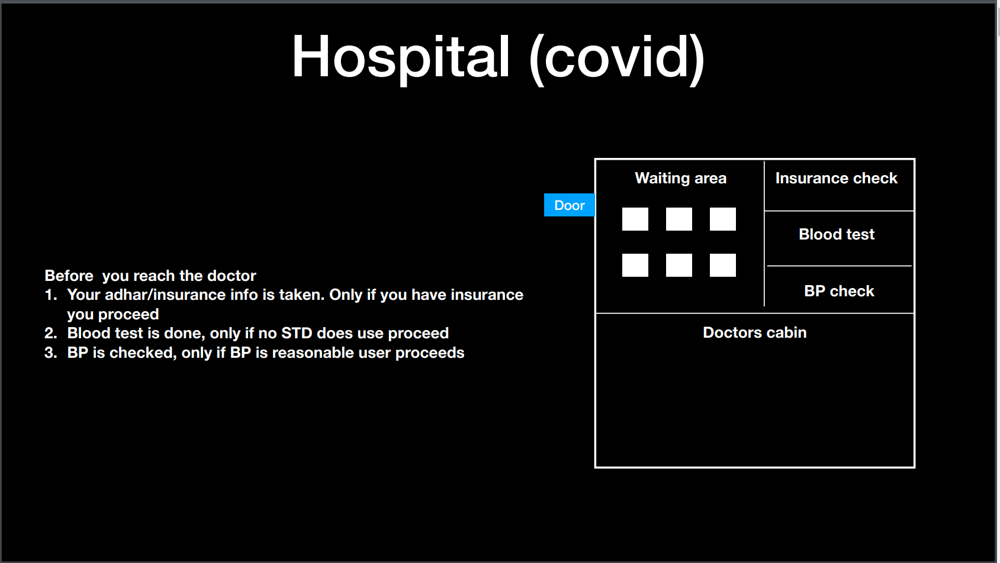
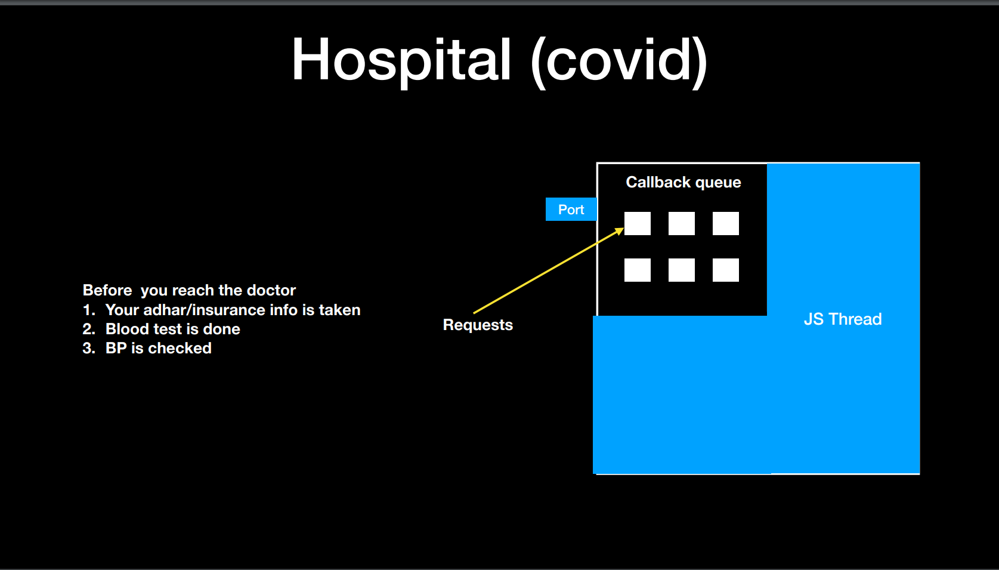
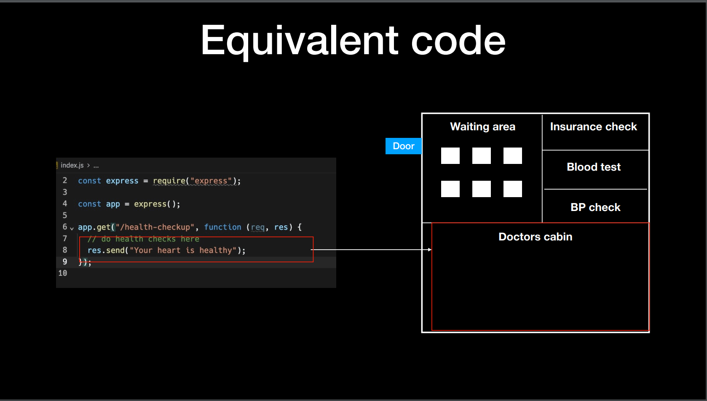
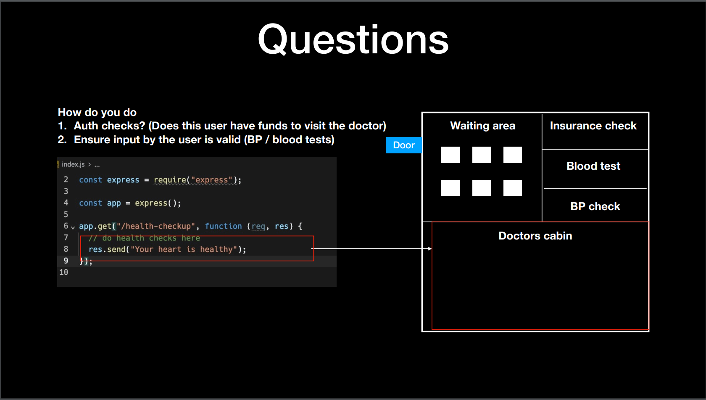
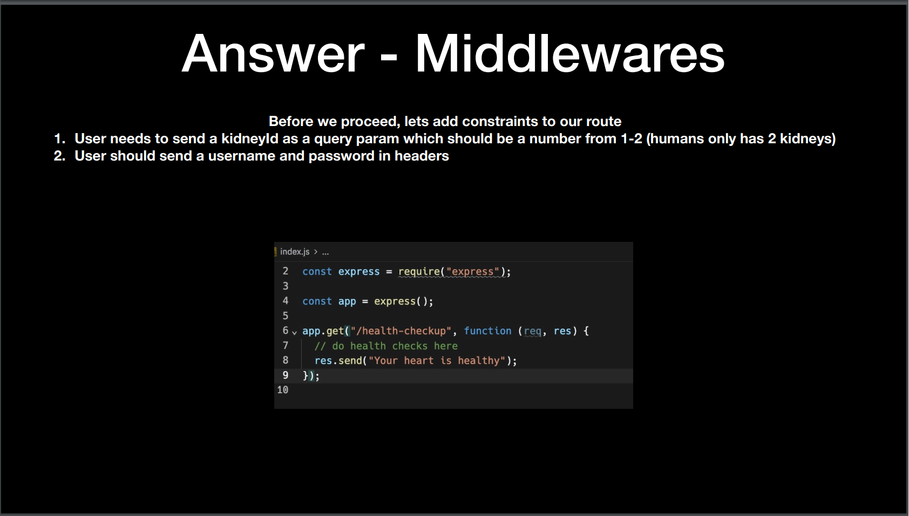
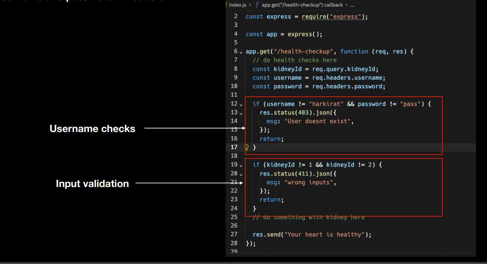
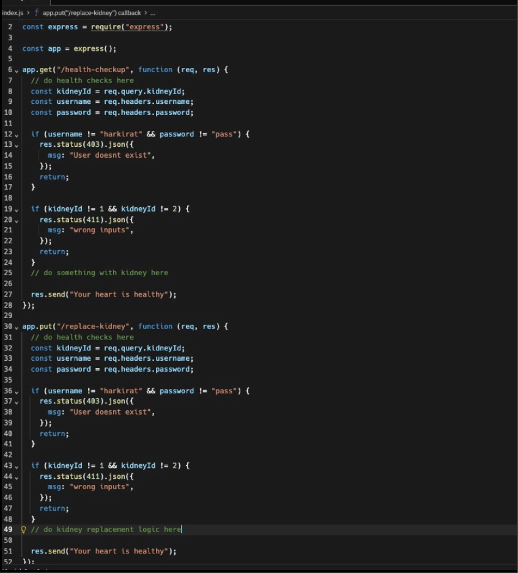
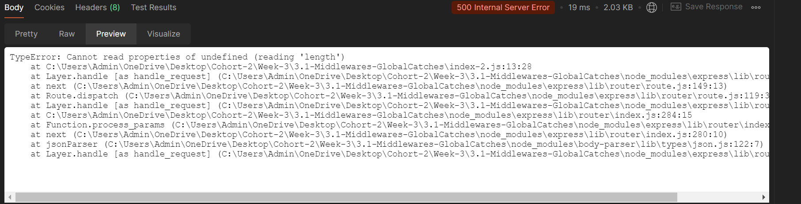

# Middlewares and Global Catches

    The middleware in node.js is a function that will have all the access for requesting an object, responding to an object, and moving to the next middleware function in the application request-response cycle.

    Middleware is a request handler that allows you to intercept and manipulate requests and responses before they reach route handlers. They are the functions that are invoked by the Express.js routing layer.

    Middleware in Express are functions that come into play after the server receives the request and before the response is sent to the client.

__NOTE__ : A real world websites needs 2 prechecks i.e if the user is Authenticated or not and the input validation. Both of which are done using middlewares.

### Middlewares are commonly used for following 2 use cases
    1) Input validation (example for num_kidneys the user must enter only 1 or 2, any other value must give error)

    2) Authentication (user must give right username and passwrd)

### Article : [Click Here](https://medium.com/@ksshravan667/14-days-of-express-day-2-middlewares-global-catches-bedac3007414)

### Understanding middlewares through a story :







 

 

### Question : 
1) User needs to send a kidneyId as a query param which should be a number from 1-2 (humans only has 2 kidneys)
2) User should send a username and password in headers

__Solution__ : Without middlewares


3) What if I tell you to introduce another route that does
Kidney replacement but inputs need to be same ?

__Solution__ : Without middlewares


### Solution : With middlewares
```javascript
const express = require("express");
const app = express();

function userMiddleware(req, res, next) {
  if (username != "harkirat" && password != "pass") {
    res.status(403).json({
      msg: "Incorrect inputs",
    });
  } else {
    next();
  }
}

function kidneyMiddleware(req, res, next) {
  if (kidneyId != 1 && kidneyId != 2) {
    res.status(403).json({
      msg: "Incorrect inputs",
    });
  } else {
    next();
  }
}

app.get("/health-checkup", userMiddleware, kidneyMiddleware, function (req, res) {
  // do something with kidney here
  res.send("Your heart is healthy");
});

app.get("/kidney-check", userMiddleware, kidneyMiddleware, function (req, res) {
  // do something with kidney here
  res.send("Your heart is healthy");
});

app.get("/heart-check", userMiddleware, function (req, res) {
  // do something with user here
  res.send("Your heart is healthy");
});

app.listen(5000);   
```

### Why do you need input validation ? Lets see with an example
```javascript
const express = require("express");
const app = express();
const port = 3001;

app.use(express.json());

app.post("/health-checkup", (req, res) => {
    const kidneys = req.body.kidneys;
    const length = kidneys.length;

    res.send("You have " + length + " Kidneys!!");
});

app.listen(port);
```
NOTE : In the above example what if the user sends an empty input ? We can see error or exception message exposed to end user like shown in the below picture



### In-order to avoid this we use GLOBAL CATCHES :
    Global Catches helps you to give the user a better error message.
```javascript
const express = require("express");
const app = express();
const port = 3001;

app.use(express.json());

app.post("/health-checkup", (req, res) => {
    const kidneys = req.body.kidneys;
    const length = kidneys.length;

    res.send("You have " + length + " Kidneys!!");
});

app.use((err, req, res, next) => {
    res.send({
        msg: "Sorry,  our server is Down!!"
    })
});

app.listen(port);
```

### How can we do better input validation ?
```javascript
// Incorrect way of validating the input
if(kidneyId != 1 && kidneyId != 2) {
    return false;
}
```
NOTE : This is very hard to scale if you expect a complicated input. This is where ZOD comes into the picture.

## ZOD Library :
```javascript
const express = require("express");
const app = express();
const zod = require("zod");
const port = 3001;

app.use(express.json());

const mySchema = zod.array(zod.number());

app.post("/health-checkup", (req, res) => {
    const kidneys = req.body.kidneys;
    const validate = mySchema.safeParse(kidneys);

    if (!validate.success) {
        // res.status(411).json({
        //     msg: "Invalid Input"
        // });
        res.send({validate})
    }

    const length = kidneys.length;
    res.send("You have " + length + " Kidneys!!");
});

app.listen(port);
```

### More examples for ZOD : 
```
{
    email : string,
    password : string,
    country: "IN", "US"
}

Zod converts the above object to :

const mySchema = zod.object({
    email:zod.string().email(),
    password: zod.string().min(8),
    country: zod.literal("IN").or(zod.literal("US)) 
})
```
__NOTE__ : ZOD is an independent library, means it can be used outside of express as well.

### General Notes : 
1) Whenever we use get request, we use Query params to extract the values.

2) Whenever we send post request, we send the info to the backend using the body