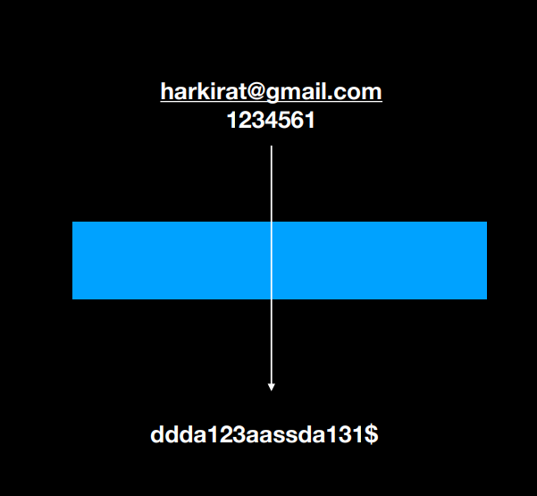
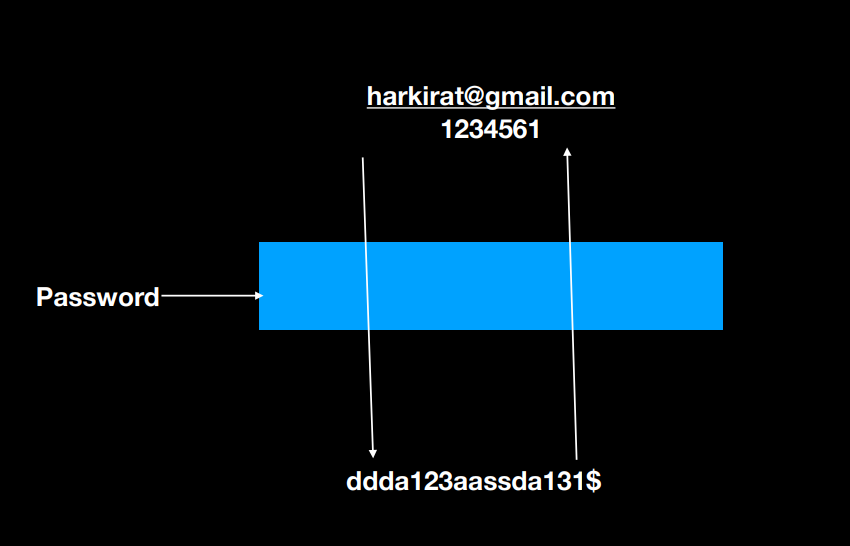
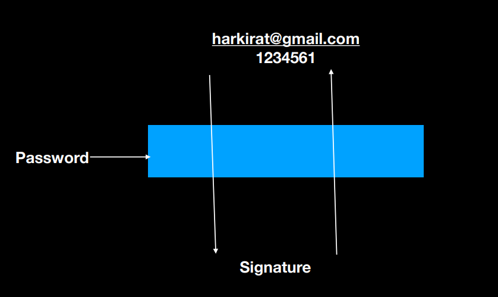
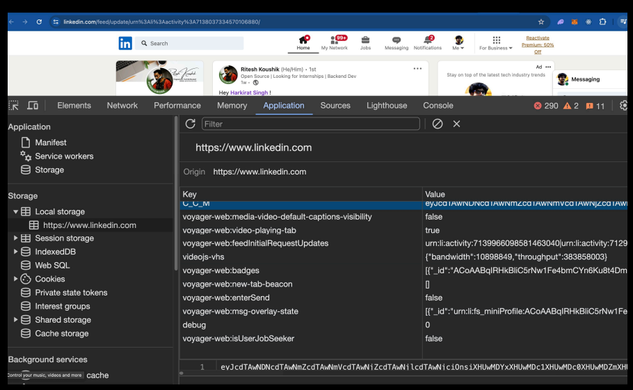
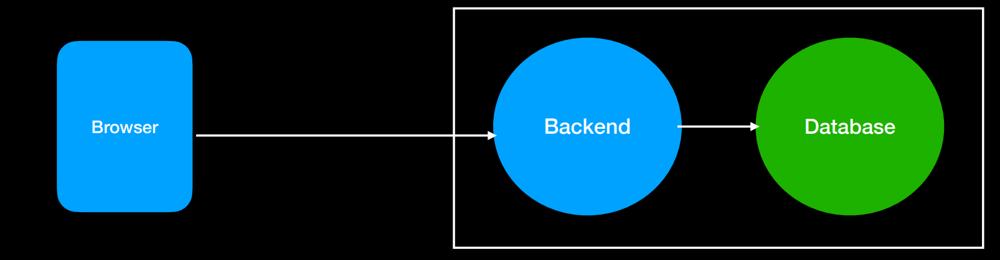

# 3.2 : Fetch, Authentication and Databases

    Until now, we've sent request in two ways :

        1) Postman
        2) Browser URL bar

### There is a third way i.e using FETCH API
```html
<!DOCTYPE html>
<html>

<head>
  <meta charset="utf-8">
  <meta name="viewport" content="width=device-width">
  <title>Fetch</title>
  <link href="style.css" rel="stylesheet" type="text/css" />
</head>

<body>
  <div id="container"></div>

  <button onclick="getAnimals()">get animals</button>

  <script>
    async function getAnimals() {
        const response = await fetch("https://fakerapi.it/api/v1/persons");
        const data = await response.json();
        document.getElementById("container").innerHTML = JSON.stringify(data.data);
    }
  </script>
</body>

</html>
```

# Authentication

    - Almost all websites have auth.

    - There are complicated ways (Login with google…) to do auth.

    - Easiest is a username password based auth.

### Before we get into authentication Lets understand some cryptography jargon :

1) __Hashing__ : Function which converts a simple string into a large random string.

    - Hashing is one way.
    - Changing the input a lil bit changes the output by a lot.
    - The output will not change even if we hash the same input mulitple times.(A single input will always give the same output)
    - Given the output, no one can find out the input.



__NOTE :__ As a standard practice, the password should not be stored in database as a plain text. Instead they will be hashed and then the hashed value will be stored in the database. 

2) __Encryption__ :

    - Encryption is two way.
    - A password is encrypted using a key i.e converted into a string.
    - String can be decrypted back to the password using a key.



3) __Json web tokens__ : Also known as JWT.

    - A technique which works only on JSON input
    - Its neither of encryption or hashing
    (its technically a digital signature).
    - Anyone can see the original output given the signature.
    - Signature can be verified only using the password.



4) __Local storage__ : A place in your browser where you can store some data.

    __Usually things that are stored include__ :

    - Authentication tokens
    - User language preference
    - User theme preference



__NOTE__ : When you signin is when you get a JSON Token.

### Authentication Recap : 
    - JWT to create tokens.
    - User gets back a token after the signin request.
    - User sends back tokens in all authenticated requests.

# Databases

### In the real world, a basic architecture looks like this

    - User hits the backend
    - Backend hits the database
    - User doesn’t have access to the database/can’t talk to the DB



### There are various types of databases

1) Graph DB's
2) Vector DB's
3) SQL DB's
4) NoSql DB's

# MongoDb - NoSQL database

1) MongoDB lets you create databases.

2) In each DB, it lets you create collections(tables).

3) In each collections, it lets you dump JSON data.

4) It is schemaless.

5) It scales well and is a decent choice for most use cases.

__NOTE :__ In-order to connect the backend to MongoDB database we use a library called "Mongoose".