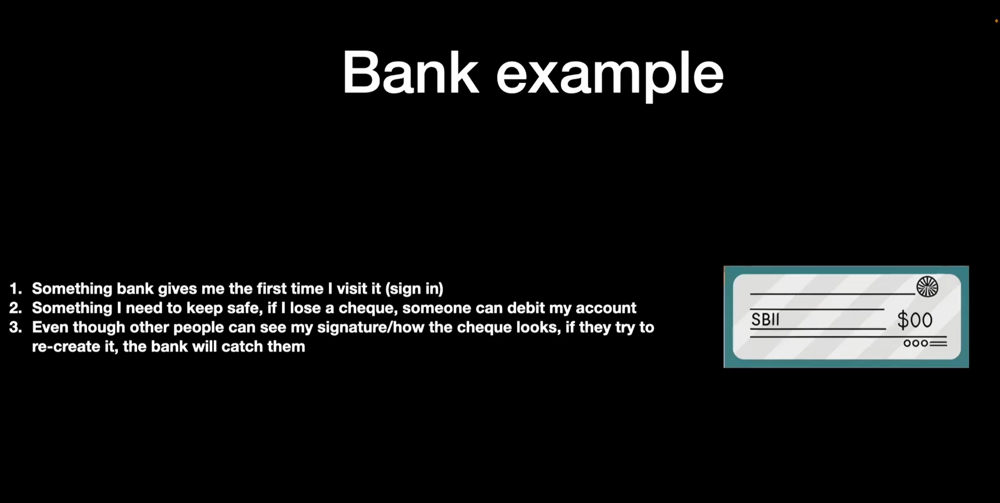
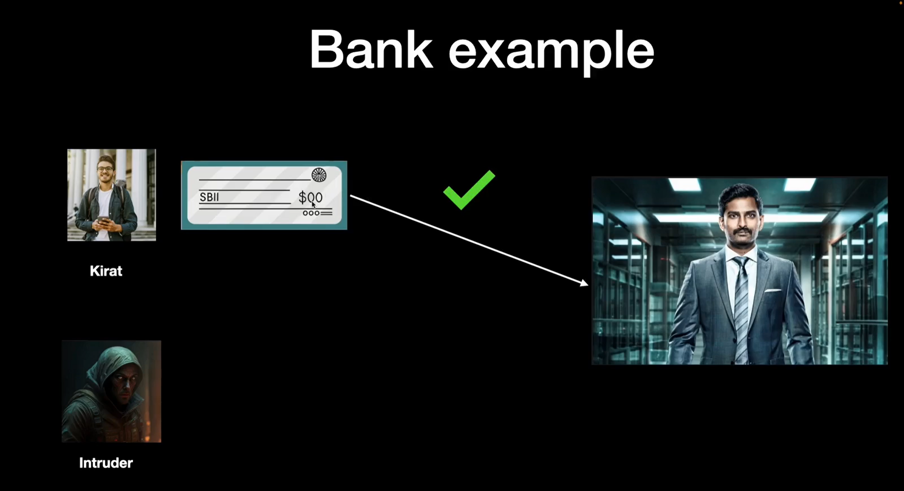
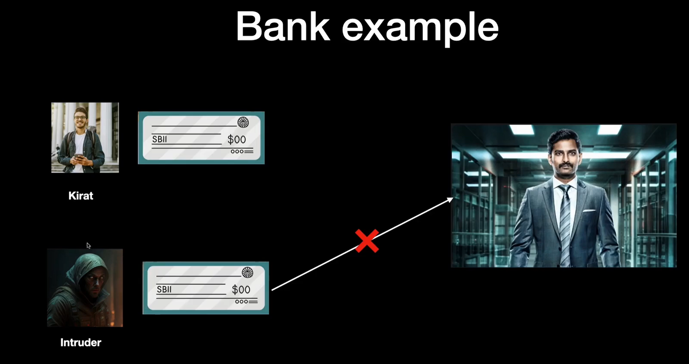
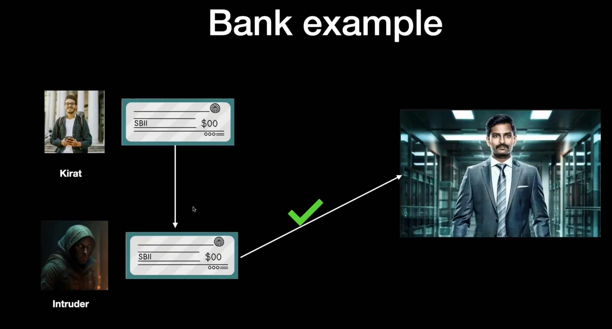
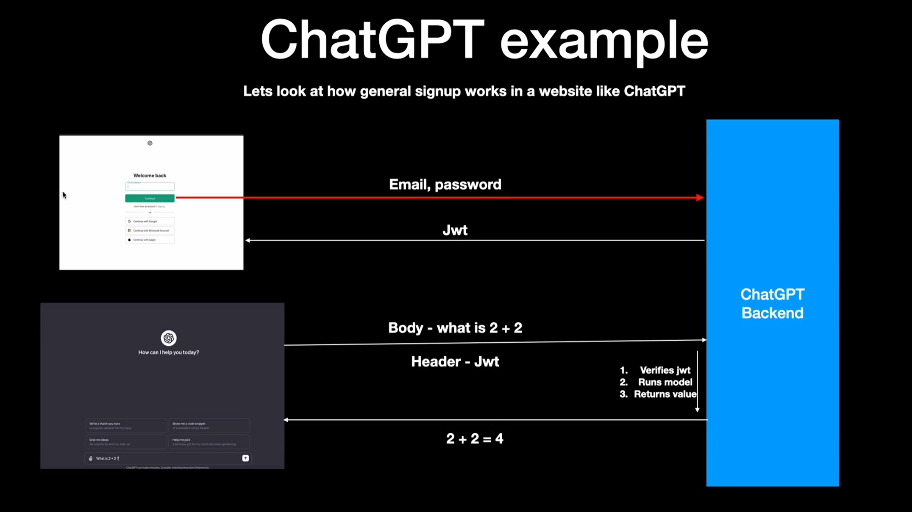
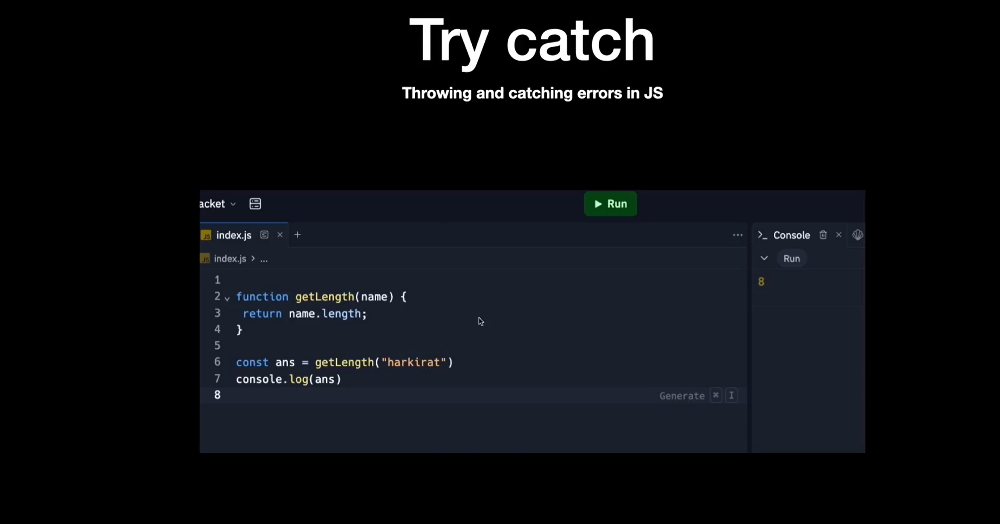
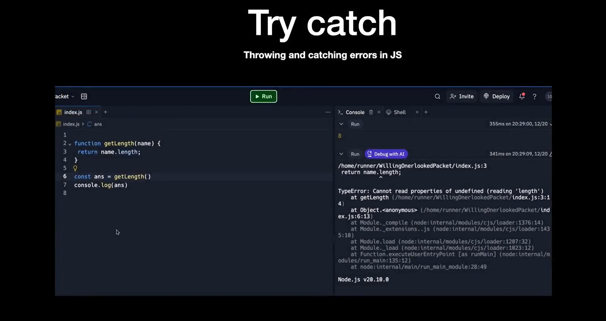
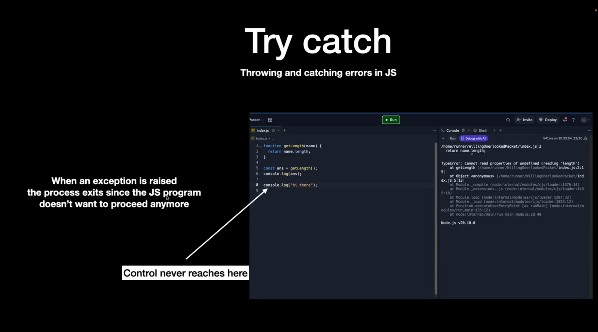
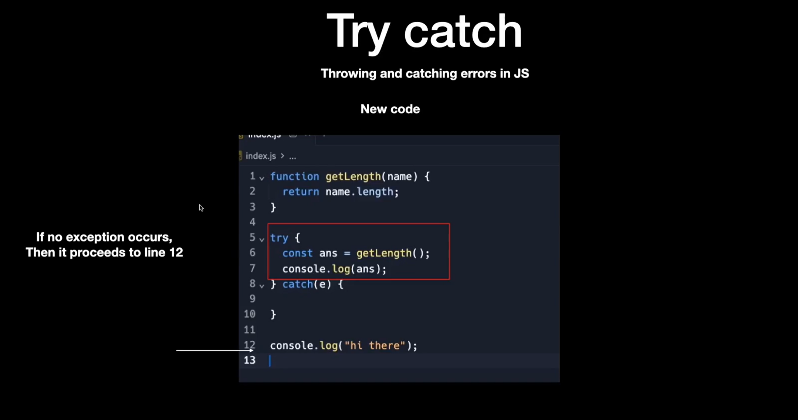

# JWT and Auth Recap 

### Understanding JWT using real world example : 

    1) You go to the bank and open an account.

    2) Now you deposit some money.

    3) And the bank gives you a checkbook.

    4) Whenever you write a check and sign it, the person whom you give it to, can go to the bank and withdraw the money.

__NOTE :__ JWT is exactly what the 4th point is doing.
__Checkbook__ === __JSON token__

### But if you give them your exact signed checkbook, then they can steal your funds.

### NOTE : 
    1) JSON Web Tokens are just like these cheques. They are issued by the backend when you sign in.

    2) Anyone can create something very similar, but the backend would reject it.

    3) If you loose the original JWT, then it's a problem.

### JWT example for ChatGPT :

## Try catch : 

__NOTE :__ But you might want the program to continue executing. That is whereyou can use "try-catch".

