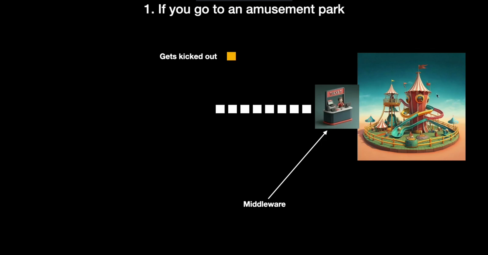
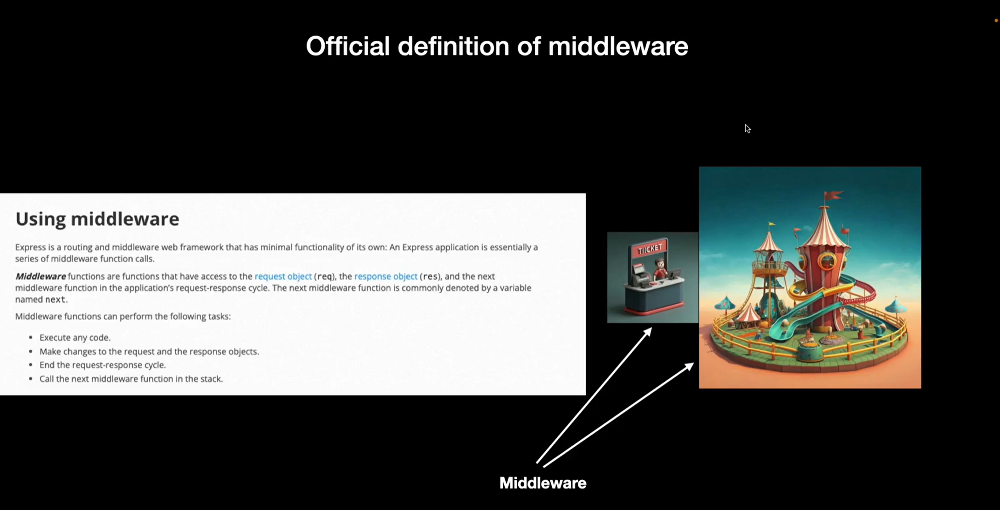
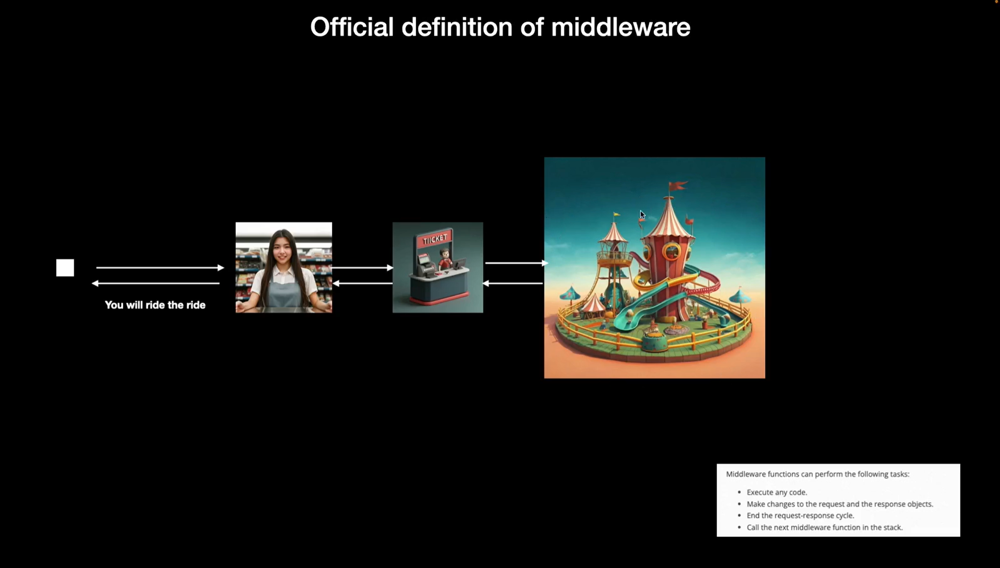
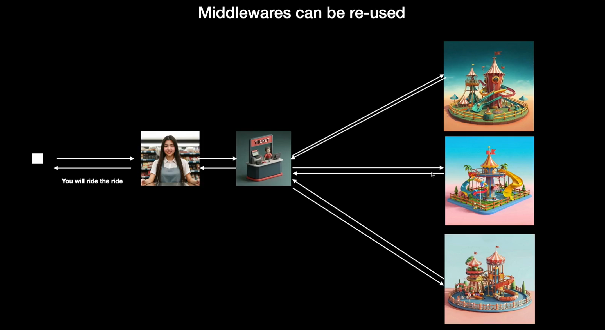
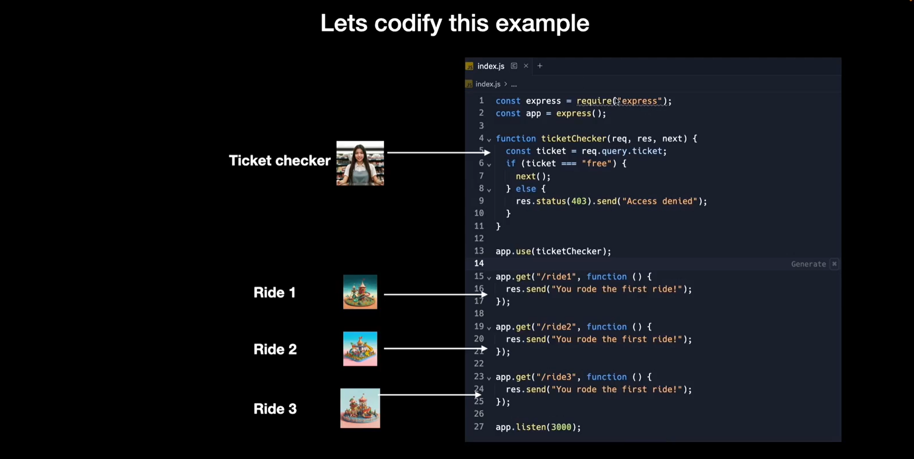

# Middlewares Recap

    Express is a routing and middleware web framework that has minimal functionality of its own: An Express application is essentially a series of middleware function calls.

### Real life example : 

### Middlewares : 
    Middleware functions are functions that have access to the request object (req), the response object (res), and the next middleware function in the application’s request-response cycle. The next middleware function is commonly denoted by a variable named next.

### Middleware functions can perform the following tasks:

1) Execute any code.

2) Make changes to the request and the response objects.

3) End the request-response cycle.

4) Call the next middleware function in the stack.

### According to the official definition : 

### The question is why do we need to mantain the middleware function in the different file ?

 

