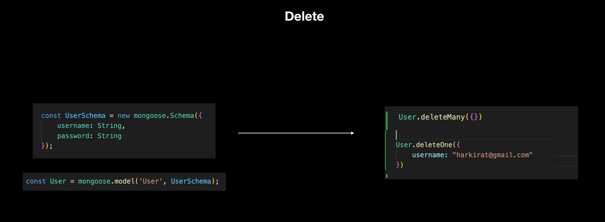
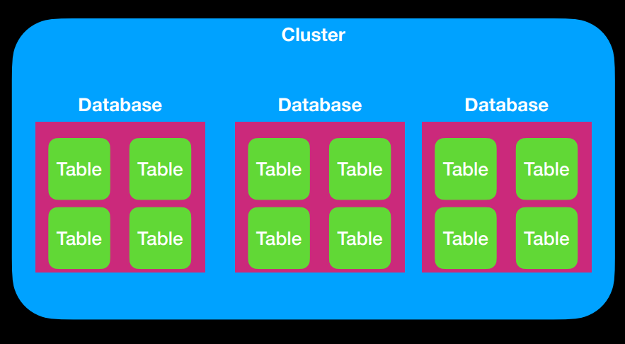

# Mongo Deep dive and Assignments

Slides link : https://100x-b-mcdn.akamai.net.in/cohort-2-slides/Week_4.3.pdf

### Databases :
    - It's a place where data is stored.

    - Since servers can autoscale, we might not hit the same backend as we hit the backend yesterday, but databases are persistent.

### Why don’t we let the user hit the database directly ? What extra does the http server provide exactly?

    1. Databases were and still are created using protocols that browsers don’t understand.

    2. Databases don’t have granual access as a first class citizen. Very hard to do user specific access in them.(if you have the password you'll have access to whole data)

    3. There are some databases (firebase) that let you get rid of the http server and try their best to provide granual access.

    4) If there is no backend, any user can have access to everything present on the database.

### Databases usually allow access to 4 primitives

    1. Create Data
    2. Read Data
    3. Update Data
    4. Delete Data

__NOTE :__ Popularly known as CRUD

### ORM : library to talk to the database

## Mongoose Introduction : 

### In mongoose, first you have to define the schema 

    Mongoose makes you define schema for things like autocompletions / Validating data before it goes in the DB to make sure you’re doing things right.

    Schemaless Dbs can be very dangerous, using schemas in mongo makes it slightly less dangerous.

    Still you can insert the data without using mongoose, in whatever format you want, through the MongoDB UI Compass directly.

    Mongoose is like the middleware that gives you some pre-checks of the data being put into DB should look like.

__FACT :__ MongoDB is like JavaScript and Mongoose is like TypeScript.

## Using MongoDB through Mongoose library : 

### Step 1 : Defining Schema 

### Step 2 : Modeling the Schema
    - Models are fancy constructors compiled from Schema definitions.

    - An instance of a model is called a document.

    - Models are responsible for creating and reading documents from the underlying MongoDB database.

    - Models are the final object on which we can call .create, .update, .delete etc

## CRUD Operations

### Create : 

### Read : 

### Update : 

### Delete : 

### Jargons to know in Databases : 
    1. Cluster - A machine(AWS) where you can run multiple databases.

    2. Database - The number of apps you create that many databases you will need. Each app will require a seperate database.

    3. Table - A table inside databases represents the actuall data stored.

### Examples : Databse structure for a simple course selling application

#### User table consisting of user info : 

#### Admin table consisting of admin info : 

#### Courses table consisting of course info : 

#### Purchases table consisting of purchase info : 
