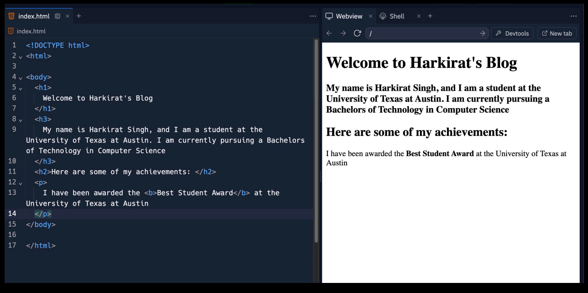

# React Foundation

### Static Websites : 
    - Websites that do not change it's content once after the website is loaded.

    - A website whose html isn't changing as time goes by.

### Dynamic Websites : 
    - Websites that changes it's content once after the website is loaded.

    - For dynamic websites, these libraries make it easier to do DOM manipulation.

## State : 
    - In React, state is a component's memory that stores data and information, and determines how the component behaves and renders.

    - The state is a built-in React object that is used to contain data or information about the component. 
    
    - A component's state can change over time; whenever it changes, the component re-renders.

## Components : 
    - A React component is a reusable piece of code that acts as a building block for a React application's user interface (UI).

    - React components are regular JavaScript functions except: Their names always begin with a capital letter. They return JSX markup.

__NOTE :__ You usually have to define all your components once And then all you have to do is update the state of your app, React takes care of re-rendering your app.