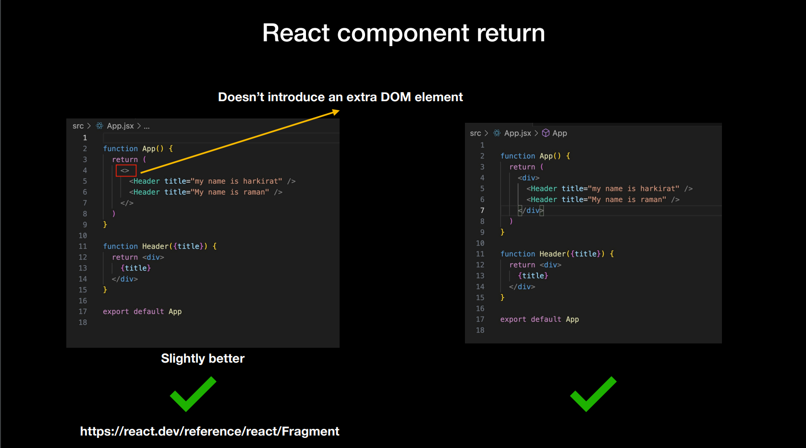
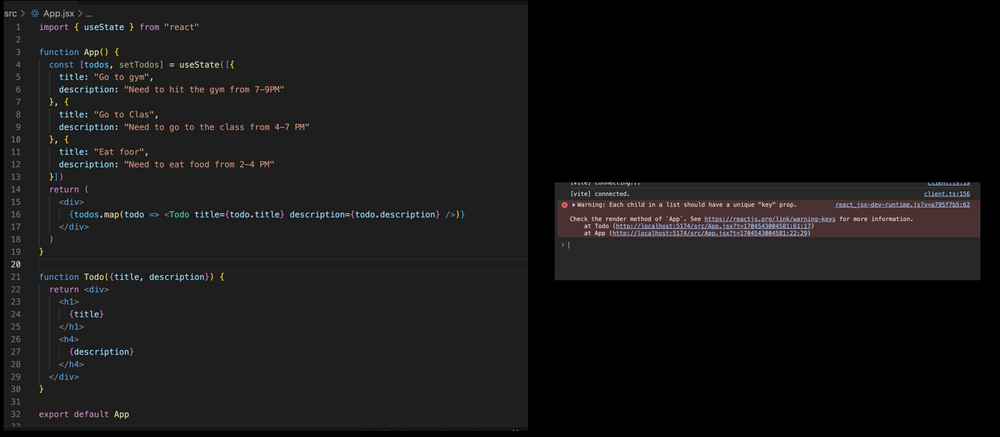
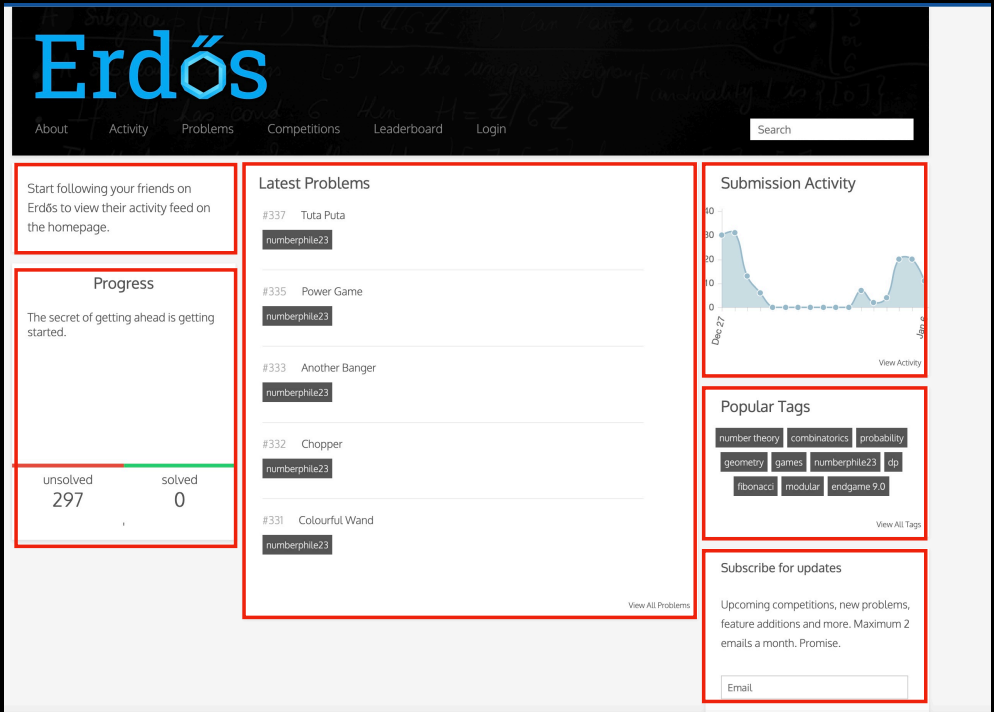

# React Deeper dive

### Key concept : 

## 1) React Component return :

    - A component can only return a single top level xml. JSX expressions must have one parent element.

    - Beacause it makes it easy to do reconciliation.



## 2) Re-rendering in react :

    - Anytime react actually updates the dom, is what considered as re-render.

    - A re-render means that, React did some work to calculate what all should update in this component.

    - The component actually got called (you can put a log to confirm this).

    - The inspector shows you a bounding box around the component.

**NOTE** : Re-render happens when a state variable that is being used inside a component changes or a parent component re-render triggers all children re-rendering.

## You want to minimise the number of re-renders to make a highly optimal react app. The more the components that are getting re-rendered, the worse. The way to minimize the re-renders :

### Way 1 : Push the state down(Push the states to lowest common ansestors)

```javascript
import { useState } from "react";

function App() {
  return (
    <div>
      <HeaderWithButton />
      <Header title="My name is raman" />
    </div>
  );
}

function HeaderWithButton() {
  const [firstTitle, setFirstTitle] = useState("my name is harkirat");

  function changeTitle() {
    setFirstTitle("My name is " + Math.random());
  }

  return (
    <>
      <button onClick={changeTitle}>Click me to change the title</button>
      <Header title={firstTitle} />
    </>
  );
}

function Header({ title }) {
  return <div>{title}</div>;
}

export default App;
```

**NOTE :** States cannot be pushed up the chain. So in-order to minimize the re-renders push the states to lowest common ansestors.

### Way 2 : Use React memo
    memo lets you skip re-rendering a component when its props are unchanged.

```javascript
import { useState } from "react"
import { memo } from 'react';

function App() {
  const [firstTitle, setFirstTitle] = useState("my name is harkirat");

  function changeTitle() {
    setFirstTitle("My name is " + Math.random())
  }

  return (
    <div>
      <button onClick={changeTitle}>Click me to change the title</button>
      <Header title={firstTitle} />
      <br />
      <Header title="My name is raman" />
      <Header title="My name is raman" />
      <Header title="My name is raman" />
      <Header title="My name is raman" />
    </div>
  )
}

const Header = memo(function ({title}) {
  return (
    <div>
    {title}
  </div>
})
  );
}
export default App
```

## 3) Keys in React : 
    - You need to give each array item a key — a string or a number that uniquely identifies it among other items in that array.

    - Keys tell React which array item each component corresponds to, so that it can match them up later. 
    
    - This becomes important if your array items can move (e.g. due to sorting), get inserted, or get deleted. 
    
    -A well-chosen key helps React infer what exactly has happened, and make the correct updates to the DOM tree.

#### Lets create a simple todo app that renders 3 todos
    1. Create a Todo component that accepts title, description as input.

    2. Initialise a state array that has 3 todos

    3. Iterate over the array to render all the TODOs

    4. A button in the top level App component to add a new TODO


### The actual solution : 
```javascript
import { useState } from "react"
let GLOBAL_ID = 4;
function App() {
  const [todos, setTodos] = useState([{
    id: 1,
    title: "Go to gym",
    description: "Need to hit the gym from 7-9PM"
  }, {
    id: 2,
    title: "Go to Clas",
    description: "Need to go to the class from 4-7 PM"
  }, {
    id: 3,
    title: "Eat foor",
    description: "Need to eat food from 2-4 PM"
  }])

  function addTodo() {
    setTodos([...todos, {
      id: GLOBAL_ID++,
      title: "new todo",
      description: "new todo desc"
    }])
  }

  return (
    <div>
      <button onClick={addTodo}>Add todo</button>
      {todos.map((todo, index) => <Todo key={todo.id} title={todo.title} description={todo.description} />)}
    </div>
  )
}

function Todo({title, description}) {
  return(
    <div>
        <h1>{title}</h1>
        <h4>{description}</h4>
  </div>
  );
}

export default App
```

## 4) Wrapper components : 


    - Lets say you want to build this,You will notice a lot of cards on the right look the same.

    - You can create a wrapper Card component that takes the inner React component as an input.
    
```javascript

function App() {
  return (
    <div style={{display: "flex"}}>
      <Card>
        hi there
      </Card>

      <Card>
        <div>
          hello from the 2nd card
        </div>
      </Card>
    </div>
  );
}

function Card({children}) {
  return(
    <div 
        style={{
            border: "1px solid black",
            padding: 10,
            margin: 10
        }}
    >
    {children}
  </div>
  );
}

export default App;
```
__NOTE :__ This is how the real wrappers are created.

#### In the above code snippet,
__Children__ means whatever is written or passed inside the component(not as a prop, but as a content).

__For example__ Whatever is written inetween the card component is children.