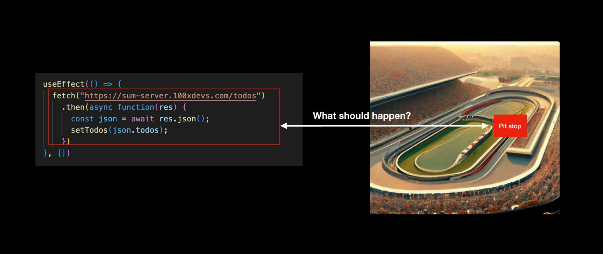
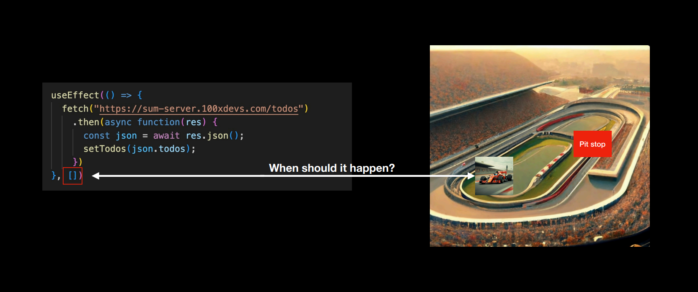
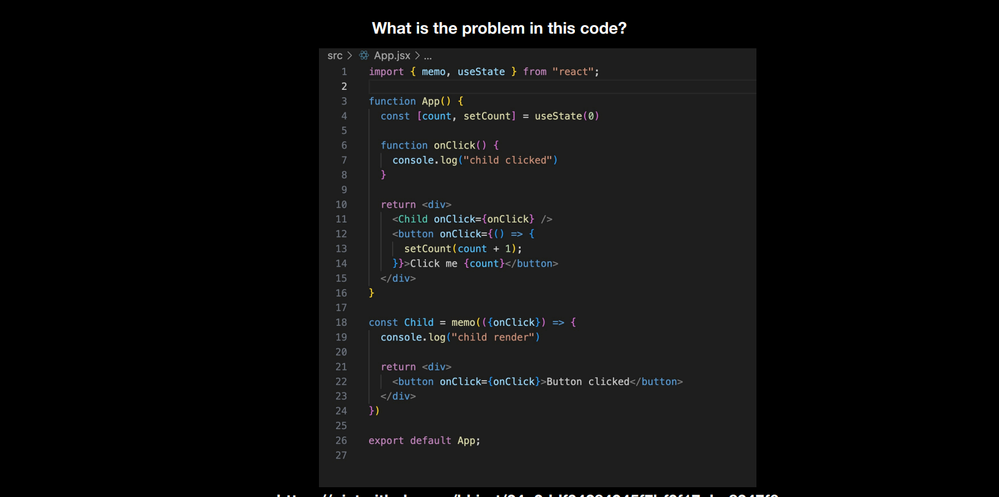
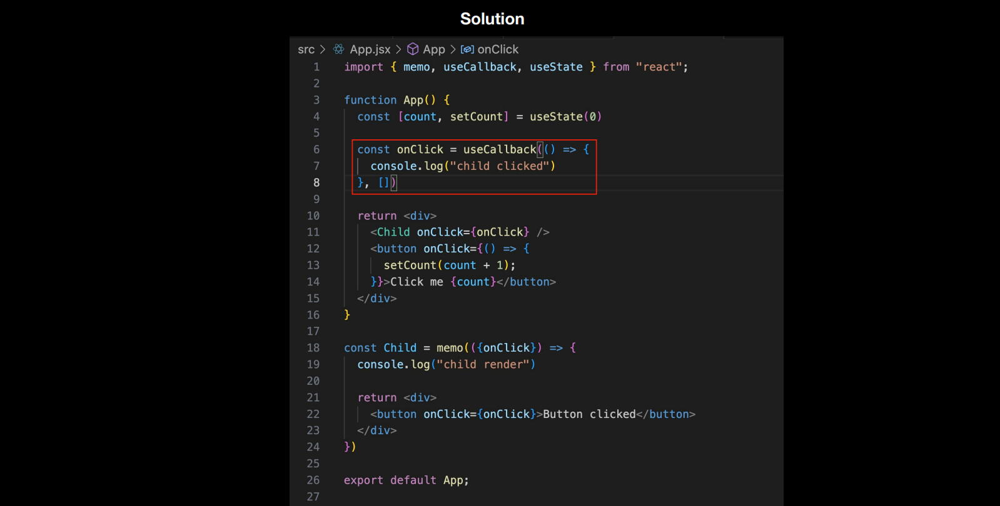

# Common hooks in react

## Side Effects : 
In React, side effects are operations that interact with the outside world and can affect the application state or user experience. These operations can include:

    - API calls: Fetching or sending data to an external server.

    - DOM manipulation: Directly manipulating the DOM using JavaScript.

    - Timers: Implementing delays or repeated actions with setTimeout or setInterval.

    - Subscriptions: Establishing connections to external data sources.

__NOTE :__ Side effects are not the part of the React's main rendering cycle.

## Hooks : 
    React Hooks are functions that allow developers to use React features within function components, without using classes. 

    Hooks don't work inside classes — they let you use React without classes.
    
    Hooks were introduced in React 16.8 and provide a number of advantages over class components. 

    Hooks are functions that let you “hook into” React state and lifecycle features from function components. 

# Commonly used hooks in react :

## 1) useState() :
    Let’s you describe the state of your app. Whenever state updates, it triggers a re-render which finally results in a DOM update.

## 2) useEffect() : 
    - The useEffect hook allows you to perform side effects in function components. 
    
    - Side effects are operations that can affect other components or can't be done during rendering, such as data fetching, subscriptions, or manually changing the DOM in React components.

    - The useEffect hook serves the same purpose as componentDidMount, componentDidUpdate, and componentWillUnmount in React class components, but unified into a single API.

__NOTE :__ 
1) Dependency array dictates when should the callback function run.

2) If the Dependency array is empty, the code inside the useEffect hook only runs once.

3) When there are state variables in the Dependency array, the code inside useEffect will runs whenever there is any changes in these state variables.




## 3) useMemo() :
    useMemo is a React Hook that lets you cache the result of a calculation between re-renders.

__Memoization :__ It means remembering some output given an input and if the input remains same through out the computation it should not compute it again.

__memo :__ `memo` lets you skip re-rendering a component, when it's props are unchanged.

#### Syntax : 
```javascript
const cachedValue = useMemo(calculateValue, dependencies)
```

## 4) useCallback() : 
    - useCallback is a React Hook that lets you cache a function definition between re-renders.
    
    - React useCallback hook returns a memoized function to reduce unnecessary callbacks. 
    
    - This useCallback hook is used when you have a component in which the child is rerendering again and again without need.




## 5) Custom Hooks : 
    - Just like useState, useEffect, you can write your own hooks.

    - Only condition is - It should start with a use (naming convention).