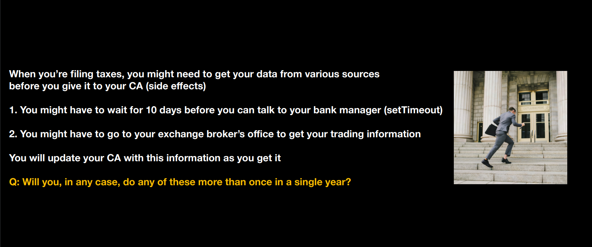

# React Recap - Everything we've studied upuntil this point.

## Reconciliation : 
Let's understand the Reconciliation through a story : 


    Reconciliation is the process of taking the current state, finding the diff from the existing state, reconciling what the DOM should look like now and putting thing into the DOM.

## States in React :
    In React, state is a JavaScript object that stores information about a component and allows it to remember data between renders


## Hooks in React : 
    React Hooks are functions that allow you to use React features like state and lifecycle from within function components.

    Hooks don't work inside classes — they let you use React without classes.

### 1) useState() :
    Let’s you describe the state of your app. Whenever state updates, it triggers a re-render which finally results in a DOM update.

### 2) useEffect() : 
    The useEffect Hook allows you to perform side effects in your components.



### 3) useMemo() :
    useMemo is a React Hook that lets you cache the result of a calculation between re-renders.


__NOTE :__ Both useEffect and useMemo hooks, lets you skip executing some logic between re-renders based on the dependency array

useEffect cannot be stored in a variable while useMemo can be stored in a variable

### 4) useCallback() : 
    useCallback is a React Hook that lets you cache a function definition between re-renders.

    isn't used too much.

    Doesn't provide you a lot of benifits.

    Whatever can be done using useCallback, same thing can be acomplished using useMemo as well.

__NOTE :__ useCallback is not about minimizing the amount of code that is run, useCallback is about not rendering a child component, if the function hasn't/doen't needs to change across the re-renders.

### 5) useRef() :
    useRef is a React Hook that lets you reference a value that’s not needed for rendering.

    Helps you in referrencing or accessing the DOM elements.
```javascript
import { useCallback, useEffect, useRef, useState } from 'react'

function App() {
  const divRef = useRef();

  useEffect(() => {
    setTimeout(() => {
      divRef.current.innerHTML = "10"
    }, 5000);
  }, [])

  const incomeTax = 20000;

  return (
    <div>
        hi there, your income tax returns are <div ref={divRef}>{incomeTax}</div>
    </div>
  )
}

export default App;
```