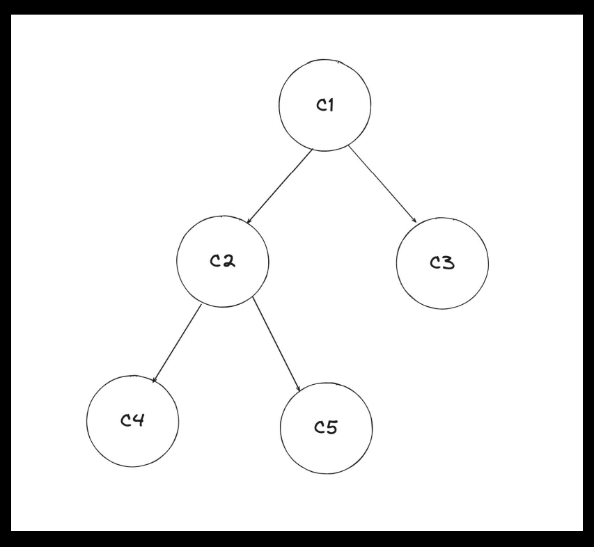
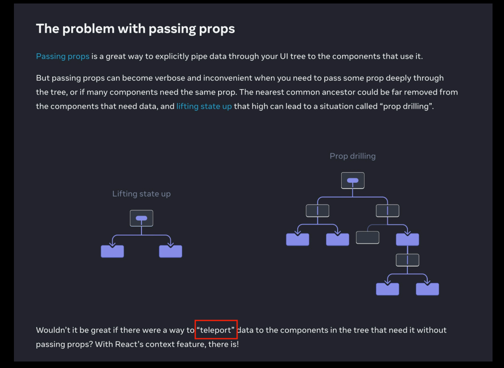
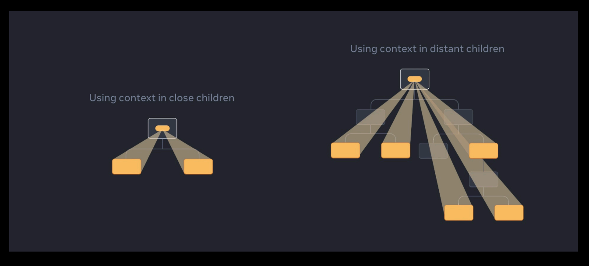

# Prop drilling 

    Passing props is a great way to explicitly pipe data through your UI tree to the components that use it.

    But passing props can become verbose and inconvenient when you need to pass some prop deeply through the tree, or if many components need the same prop.

    The nearest common ancestor could be far removed from the components that need data, and lifting state up that high can lead to a situation called “prop drilling”.

### Question : how do you think one should one manage state?

1. Keep everything in the top level component (C1)?
2. Keep everything as low as possible (at the LCA of children that need a state)?

### Answer : 
    Either way, you will need to drill props down through the Component tree.

    This gets very hard to maintain and highly verbose Makes code highly unreadable.

__NOTE :__ Prop drilling doesn’t mean that parent re-renders children, It just means the syntactic uneasiness when writing code.

# Context API

__NOTE :__ If you use the context api, you’re pushing your state management outside the core react
components.