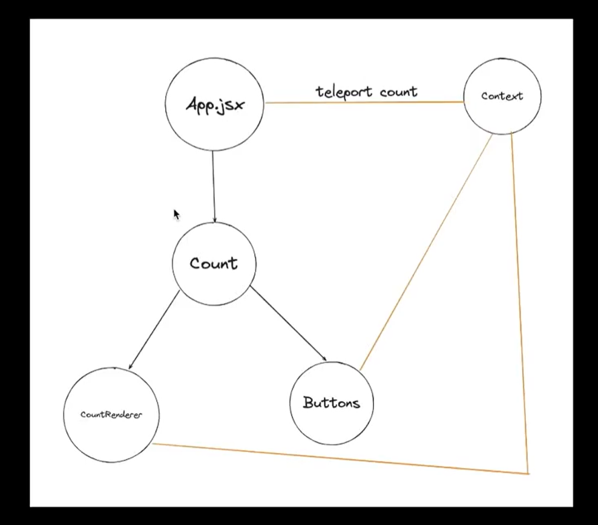
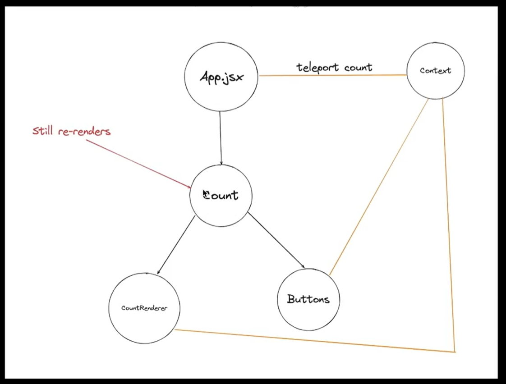

# Context API

  Context API allows data to be passed through a component tree without having to pass props manually at every level. This makes it easier to share data between components.

  Context API let's you teleport state values to distant children and helps you to get rid of prop drilling.
  
__NOTE :__ In context API, state variables are declared in a seperate file, slightly outside of the component tree.



### Why was Context API introduced ?
    - Managing state is an essential part of developing applications in React. A common way to manage state is by passing props. 
    
    - Passing props means sending data from one component to another. It's a good way to make sure that data gets to the right place in a React application.

    - But it can be annoying to pass props when you have to send the same data to lots of components or when components are far away from each other. This can make an application slower and harder to work with.

    - Fortunately, React provides a built-in feature known as the context API that helps “teleport” data to the components that need it without passing props.

__NOTE :__ Context API is used to make the syntax more cleaner and to get rid of the prop drilling

## Getting started with Context API :

### Step 1 : Create a Context Object
Create a new file named context.js in the src folder and add the following code to create a context object:
```javascript
import { createContext } from "react";

const countContext = createContext({
    count: 0, 
    setCount: () => {},
}); // Teleporter

export default countContext;
```

### Step 2 : Wrap Components with a Provider
```javascript
// Create a parent component that wraps child components with a Provider

import { useContext, useState } from "react";
import countContext from "./context";

function App() {
  const [count, setCount] = useState(0);

  // Wrap anyone who wants to use the teleported values inside a provider.
  return (
    <countContext.Provider value={{ count, setCount}}>
      <div>
        <Count />
      </div>
    </countContext.Provider>
  );
}
```

### Step 3 :Consume the Context
```javascript
// Component 1
function Count() {
  return (
    <div>
      <CountRenderer />
      <Buttons />
    </div>
  );
}

// Child Component 1 
function CountRenderer() {
  const { count } = useContext(countContext);

  return <div>{count}</div>;
}

// Child Component 1 
function Buttons() {
  const { count, setCount } = useContext(countContext);
  
  return (
    <div>
      <button
        onClick={() => {
          setCount(count - 1);
        }}
      >
        Decrease
      </button>

      <button
        onClick={() => {
          setCount(count + 1);
        }}
      >
        Increase
      </button>
    </div>
  );
}

export default App;
```

## Use Cases of Context API

1) __Theming :__

    You can use Context API to store the current theme of your application and make it available to all components. This way, whenever the user switches the theme (such as enabling dark mode), all components will be updated with the new theme.

2) __User Authentication :__

    You can also use Context API to store a user's authentication status and pass it down to all the components that need it. This way, you can easily restrict access to certain parts of your application based on the user's authentication status.

3) __Multilingual Support :__

    You can store the current language of your application in the context and pass it down to all the components that need it. This way, you can easily switch between different languages without having to pass the language down as props to all the components.

4) __Accessing data from external sources :__

     Finally, you can use the Context API to store data retrieved from external sources such as APIs or databases and make it available to all components. This can simplify your code and make it easier to manage data across your application.

## Downside of using Context API : 
  - Context API does not inherently address the re-rendering issue.

  - When using the Context API, updates to the context can trigger re-renders of all components that consume that context, even if the specific data they need hasn't changed.

  - This can potentially lead to unnecessary re-renders and impact the performance of the application.



### Solution : 
    - This is the exact problem that the state management libraires solve.

    - To mitigate this,libraries like Redux, Recoil, or Zustand provide more fine-grained control over state updates and re-renders compared to the built-in Context API.