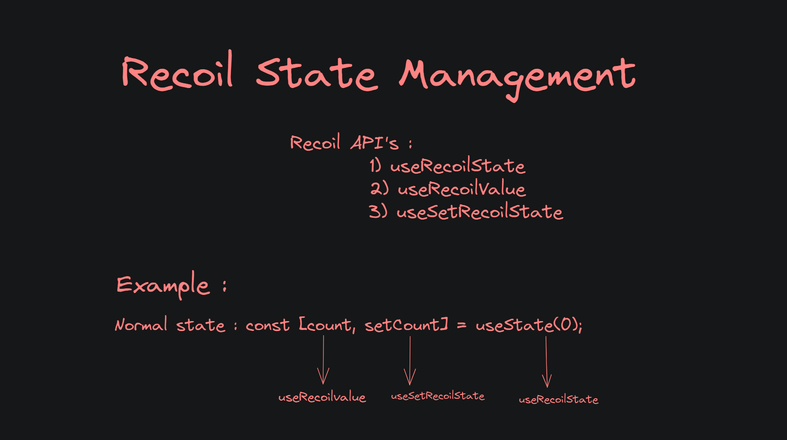

# State Management

    State management refers to the process of handling and maintaining the state or data of an application throughout its lifecycle. In frontend development, state typically represents the current condition or values of variables in an application. Effective state management is crucial for building dynamic and interactive user interfaces.

### History
    Earlier there were two types of Frontend Engineer, one engineer who is creating the components and another engineer handling or maintaining the state.

### Other State Management libraries : 
1) Redux ToolKit(RTK)
2) Zustand
3) Recoil

# Recoil

    - Recoil, developed by Facebook, is a state management library for React applications.

    - It introduces a more sophisticated approach to handling state, offering features like atoms, selectors, and a global state tree.

    - With Recoil, we can overcome some of the challenges associated with prop drilling and achieve a more scalable and organized state management solution.

# Concepts in Recoil

## 1) Recoil Root : 
    - The RecoilRoot is a component provided by Recoil that serves as the root of the Recoil state tree. 
    
    - It must be placed at the top level of your React component tree to enable the use of Recoil atoms and selectors throughout your application.

Here's a simple code snippet demonstrating the usage of RecoilRoot:
```javascript
import React from 'react';
import { RecoilRoot } from 'recoil';
import App from './App';

const RootComponent = () => {
  return (
    <RecoilRoot>
      <App />
    </RecoilRoot>
  );
};

export default RootComponent;
```
__NOTE :__ In this example, `RecoilRoot` wraps the main `App` component, providing the context needed for Recoil to manage the state. 

By placing it at the top level, you ensure that all components within the `App` have access to Recoil's global state. 

This structure allows you to define and use Recoil atoms and selectors across different parts of your application.

## 2) Atom :
    - In Recoil, an atom is a unit of state.

    - It represents a piece of state that can be read from and written to by various components in your React application.

    - Atoms act as shared pieces of state that can be used across different parts of your component tree.

Here's a simple example of defining an atom:
```javascript
import { atom } from 'recoil';

export const countState = atom({
  key: 'countState', // unique ID (with respect to other atoms/selectors)
  default: 0,         // default value (aka initial value)
});
```

## 3) Recoil Hooks : 
In Recoil, the hooks `useRecoilState`, `useRecoilValue`, and `useSetRecoilState` are provided to interact with atoms and selectors.



i) `useRecoilState` :
  - This hook returns a tuple containing the current value of the Recoil state and a function to set its new value.

  - Example :
```javascript
const [count, setCount] = useRecoilState(countState);
```

ii) `useRecoilValue` : 
  - This hook retrieves and subscribes to the current value of a Recoil state.

  - Example : 
```javascript
const count = useRecoilValue(countState);
```

iii) `useSetRecoilState` : 
  - This hook returns a function that allows you to set the value of a Recoil state without subscribing to updates.

  - Example : 
```javascript
const setCount = useSetRecoilState(countState);
```

## 4) Selectors in Recoil : 
    - In Recoil, selectors are functions that derive new pieces of state from existing ones.

    - They allow you to compute derived state based on the values of atoms or other selectors. 

__Here are some key concepts related to selectors:__

### i) Creating a Selector : 
 - You can create a selector using the `selector` function from Recoil.

 - Example:

```javascript
import { selector } from 'recoil';

const doubledCountSelector = selector({
  key: 'doubledCount',
  get: ({ get }) => {
    const count = get(countState);
    return count * 2;
  },
});
```

### ii) Using Selectors in Components:
 - You can use selectors in your components using the `useRecoilValue` hook.

 - Example:

```javascript
import { useRecoilValue } from 'recoil';

const DoubledCountComponent = () => {
  const doubledCount = useRecoilValue(doubledCountSelector);

  return <div>Doubled Count: {doubledCount}</div>;
};
```

### iii) Atom and Selector Composition :
 - Selectors can depend on atoms or other selectors, allowing you to compose more complex state logic.

 - Example:

```javascript
const totalSelector = selector({
  key: 'total',
  get: ({ get }) => {
    const count = get(countState);
    const doubledCount = get(doubledCountSelector);
    return count + doubledCount;
  },
});
```