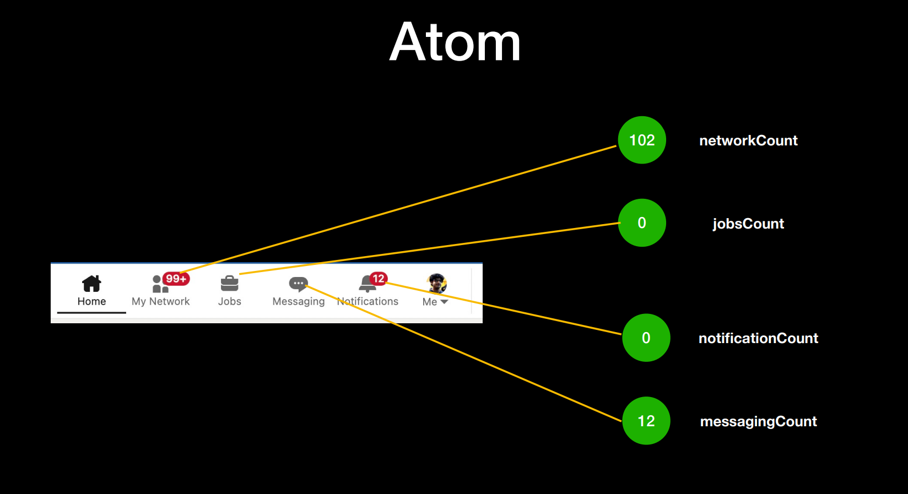
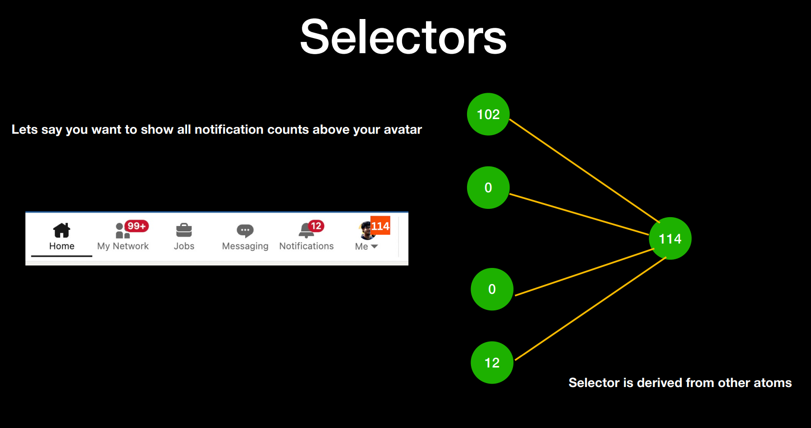

# Recoil Deep Dive - Part-1

__NOTE :__ Think of Atoms in Recoil, similar to being the useState in React, which is slightly more optimal compared to the useState hook

### Atoms :  
```javascript
import { atom } from "recoil";

export const myNetworkAtom = atom({
    key:"myNetworkAtom",
    default: 102
});

export const jobsAtom = atom({
    key:"jobsAtom",
    default: 0
});

export const messagingAtom = atom({
    key:"messagingAtom",
    default: 12
});

export const notificationsAtom = atom({
    key:"notificationsAtom",
    default: 0
});
```


### Selectors : 
```javascript
import { selector } from "recoil";
import { jobsAtom, messagingAtom, myNetworkAtom, notificationsAtom } from "./atoms";

export const totalNotificationCount = selector({
    key:"totalNotificationCount",
    get: ({get}) => {
        const network = get(myNetworkAtom);
        const jobs = get(jobsAtom);
        const message = get(messagingAtom);
        const notification = get(notificationsAtom);
        return (network + jobs + message + notification);
    }
});
```
