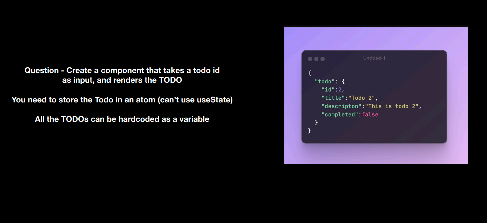
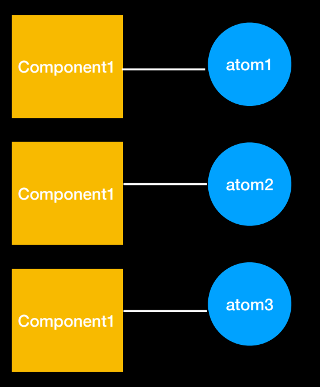
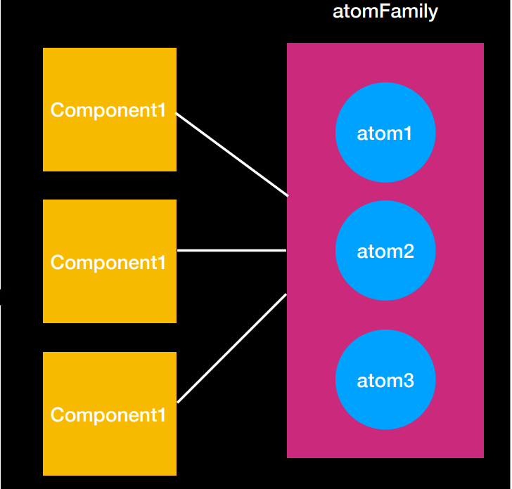

# Recoil - Atoms family

### Why do we need atoms family?
    Problem - Sometimes you need more than one atom for your use case.

### Problem statement :


### The real Question is : 
- Would you have a single atom ?
- Would you have one atom per todo?
- How would you create (and delete) todos dynamically?



### Solution : Dynamic Atoms creation


```javascript
import { atomFamily } from "recoil";
import { TODOS } from "./todos";

export const todosAtomFamily = atomFamily({
    key:"todoAtomFamily",
    default: (id) => {
        return TODOS.find((x) => x.id === id)
    }
});
```

### Atom family were able to generate a custom atom based on the input received. Basically Atom family let's you create dyncamic Atoms