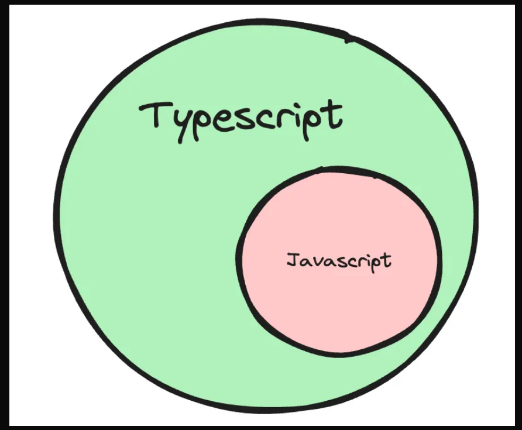
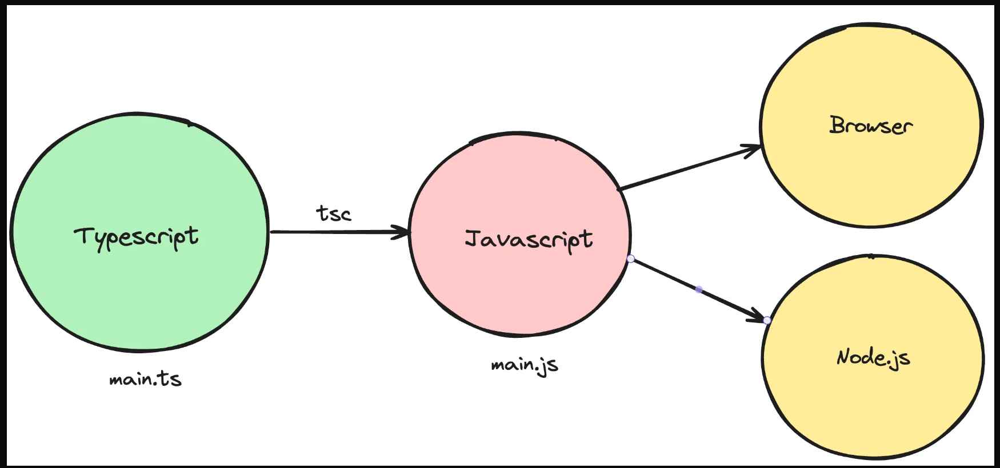

# Introduction to TypeScript

### What is typescript?

    TypeScript is a programming language developed and maintained by Microsoft. 

    It is a strict syntactical superset of JavaScript and adds optional static typing to the language.



### Where/How does typescript code run?

Typescript code never runs in your browser. Your browser can only understand javascript. 

1) Javascript is the runtime language (the thing that actually runs in your browser/nodejs runtime).

2) Typescript is something that compiles down to javascript.

3) When typescript is compiled down to javascript, you get type checking (similar to C++). If there is an error, the conversion to Javascript fails. 



### Typescript compiler

    tsc is the official typescript compiler that you can use to convert Typescript code into Javascript.

There are many other famous compilers/transpilers for converting Typescript to Javascript. Some famous ones are :

1) esbuild
2) swc

### Typescript provides you some basic types
- `number `
- `string`
- `boolean`
- `null`
- `undefined`.

## tsconfig file

### The tsconfig file has a bunch of options that you can change to change the compilation process. Some of these include : 

- **Target** : The target option in a tsconfig.json file specifies the ECMAScript target version to which the TypeScript compiler will compile the TypeScript code.

- **rootDir** : Where should the compiler look for `.ts` files. Good practise is for this to be the src folder

- **outDir** : Where should the compiler look for spit out the `.js` files.

- **noImplicitAny** : Try enabling it and see the compilation errors on the following code - 
```javascript
const greet = (name) => `Hello, ${name}!`;
```
Then try disabling it.

- **removeComments** : Weather or not to include comments in the final js file.

## Using the typescript in node : 

**Step 1** - Install tsc/typescript globally
```bash
npm install -g typescript
```

**Step 2** - Initialize an empty Node.js project with typescript
```bash
mkdir node-app
cd node-app
npm init -y
npx tsc --init
```

**Step 3** - Create two folders named `src` and `dist` or `build`

**Step 4** - Create an `index.ts` file inside `src` folder.

**Step 5** - Open tsconfig.json file and set `rootDir` to `./src` and `outDir` to `./dist`.

**Step 6** - After writing the code inside `index.ts` file, Compile the ts file to js file using the following command.
```bash
tsc -b
```

**NOTE :** After completion of step 6, an `index.js` file will be created automatically inside the `dist` folder.

**Step 7** - To run the `index.js` file, write the following command
```bash
node /dist/index.js
```